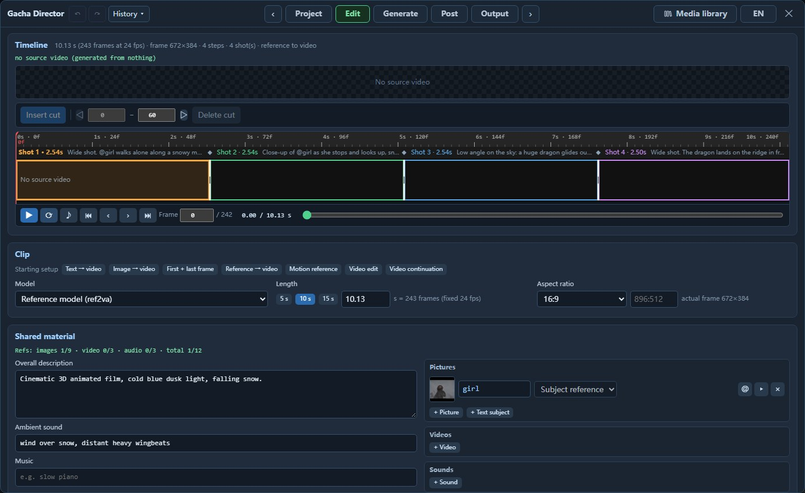
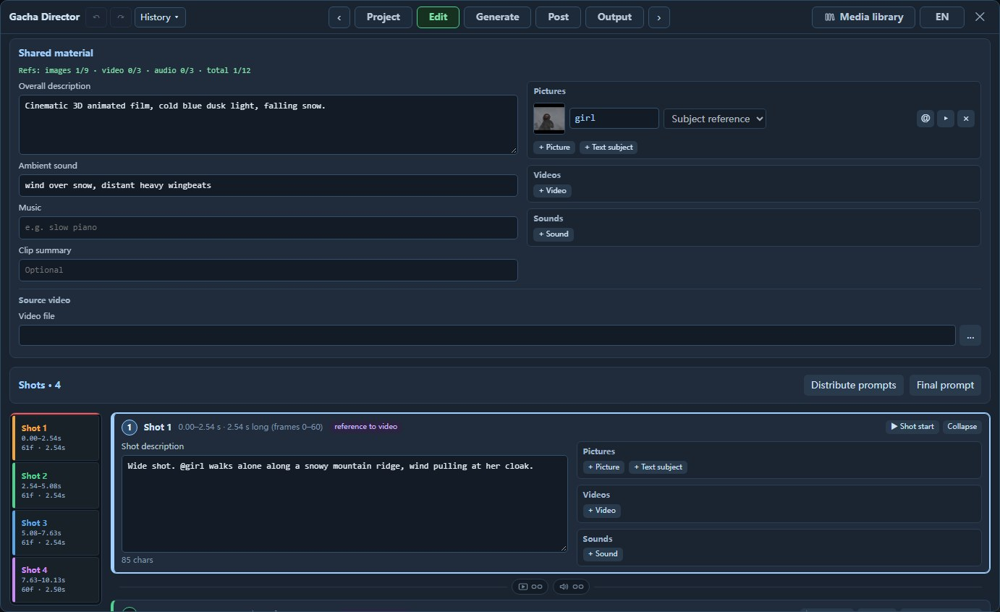
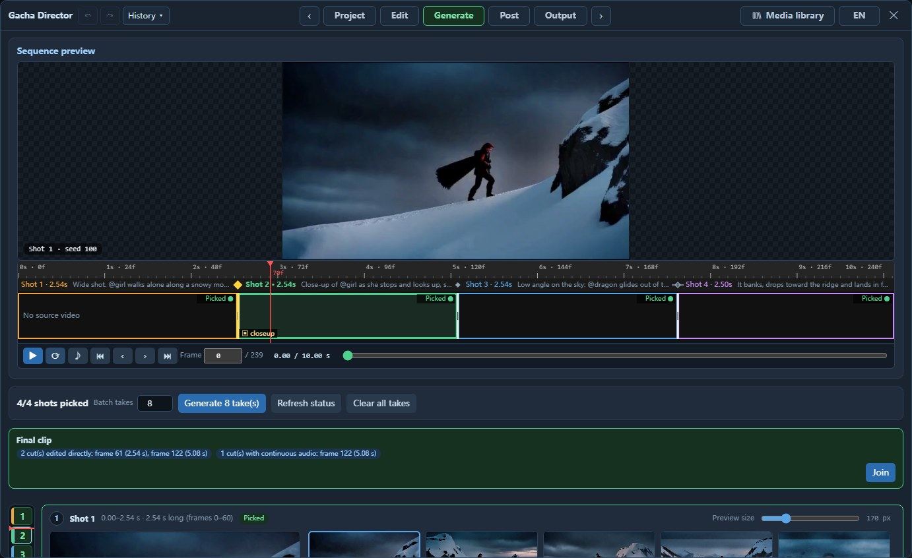
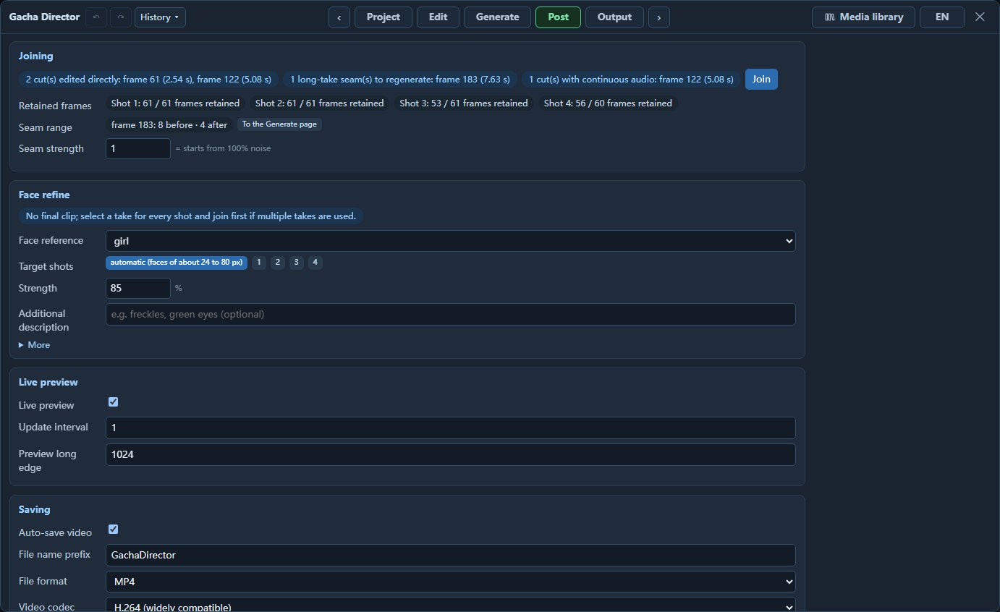

# Gacha Director

**A director's console for MiniMax H3.** One ComfyUI canvas node opens a tabbed panel for text-to-video, image-to-video, first/last-frame generation, multi-keyframe generation, continuation, reference generation and video editing.

Gacha in the name refers to random card draws in games: generate N takes at once, pick one per shot, then join them into a final clip, like a 10-pull.

English | [日本語](README_JA.md) | [中文](README_ZH.md)

[](https://github.com/excifroge/ComfyUI-GachaDirector/releases/download/v2.1.0/GachaDirector_reel.mp4)

**A user-friendly UI for an all-in-one production workflow.** Built for **Edit + multi-shot Gacha Generate**: define shots and material on the Edit page, then generate takes in batches, pick one per shot and join the picks into a final clip on the Generate page. Suited to iterative tuning at scale and batch production.

Videos with sound: [feature reel (70 s)](https://github.com/excifroge/ComfyUI-GachaDirector/releases/download/v2.1.0/GachaDirector_reel.mp4) · [promo made with Gacha Director (15 s)](https://github.com/excifroge/ComfyUI-GachaDirector/releases/download/v2.1.0/GachaDirector_promo.mp4). The animations are silent previews.

> [!NOTE]
> **AI-Friendly**: [AGENTS.md](AGENTS.md) at the repository root is a handoff document for your AI to understand, explain and modify the project.

<details>
<summary>Contents</summary>

- [What it solves](#what-it-solves)
- [Supported uses](#supported-uses)
  - [Sample clips](#sample-clips)
  - [Made with it: a 15-second promo](#made-with-it-a-15-second-promo)
- [Installation](#installation)
- [Quick start](#quick-start)
  - [A complete example: turning live-action footage into a snowy scene](#a-complete-example-turning-live-action-footage-into-a-snowy-scene)
- [Node](#node)
- [Panel](#panel)
  - [Project page](#project-page)
  - [Edit page](#edit-page)
  - [Generate page](#generate-page)
  - [Post page](#post-page)
  - [Output page](#output-page)
- [Time cells](#time-cells)
- [How prompts are assembled](#how-prompts-are-assembled)
- [Connections upstream of the node](#connections-upstream-of-the-node)
- [Measurements](#measurements)
- [Known limitations](#known-limitations)
- [Development and testing](#development-and-testing)
- [Credits and license](#credits-and-license)

</details>


## What it solves

MiniMax H3 provides a separate node graph for each use. Switching uses requires switching graphs; comparing seeds, measuring run times or combining sections from two results requires additional setup.

Gacha Director brings these tasks into one node, organized around five features:

- **A tabbed workbench.** Pages follow an editing workflow: Project → Edit → Generate → Post → Output.
- **Material organized by shot.** Each card holds a shot description and its pictures, videos and sounds. Material is numbered and declared to the model automatically during generation.
- **Run presets that record their cost.** Named presets manage the compute budget: `Draft` (draft), `Standard` (standard) and `Final` (final). Each records measured run times by clip length.
- **Takes → picks → final clip.** Queue N whole-clip takes, pick one per shot, then click "Join". Using one take throughout outputs it without regeneration. Changes at cuts are spliced directly; changes within a long take regenerate only the seam.
- **You decide whether to cut or keep the shot continuous.** Set cuts or continuity on the Edit page; both the model prompt and final joins follow that choice. At cuts, independently choose whether sound switches with the picture or continues from the preceding take.

The panel uses familiar units and descriptions: width × height, seconds, and "the first frame of this shot". It calculates model labels, declarations, the pixel budget and schedule-adjusted denoise.

The node reuses ComfyUI core sampling logic. At run time it expands into core conditioning nodes, samplers and VAEs.

## Supported uses

H3's "modes" combine several mechanisms. Gacha Director derives the setup from the material and its **use**, without a mode selector. Each shot card has a read-only tag ("text to video", "first / last frame", "reference to video"…) showing the current combination.

| What you add (material · use) | Resulting use | Model | Core nodes in the expansion |
|---|---|---|---|
| Text only | Text-to-video | fl2va | `MiniMaxH3ImageToVideo` |
| A picture for the first shot · "First frame" | Image-to-video | fl2va | Same as above, connected to `first_frame` |
| Add a picture for the last shot · "Last frame" | First/last-frame generation | fl2va | Same as above, connected to `first_frame` / `last_frame` |
| Last frame only | Last-frame generation | fl2va | Same as above, connected to `last_frame` |
| A picture · "Intermediate frame", or the first/last frame of an intermediate shot | Multi-keyframe generation | Either | A chain of `MiniMaxH3AddGuide` nodes |
| A video · "Video continuation" | Continuation | Either | `MiniMaxH3AddGuide` |
| A picture · "Subject reference" | Reference generation | ref2va | `MiniMaxH3ReferenceToVideo` |
| A video · "Motion/camera reference"; sound · "Character voice" or "Sound reference" | Motion, camera, voice and music references | ref2va | Same as above |
| Sound · "Original audio" | Put an audio clip into the final clip as it is | Either | `MiniMaxH3AddGuide` |
| Dialogue on its own line in a shot description (`@name says: …`) | Dialogue: the character speaks these words | Either | No extra nodes; dialogue is written into the prompt |
| Source video · "Video edit" | Video editing (the official approach) | ref2va | Same as above; the source video is `<Video 1>` |
| Source video · "Video continuation" | Continue from the end of this reference segment | ref2va | Same as above |
| Source video · "Source redraw" | Low-strength re-rendering / re-rendering only part of the clip | Either | `VAEEncode` + `LTXVConcatAVLatent`; add `SetLatentNoiseMask` when re-rendering only part |

Uses can be combined, for example editing a source video with a subject reference and a last-frame picture.

The "Starting setup" buttons in "Clip" on the Edit page configure these combinations. They replace existing material and keep the prompt; references to replaced material become plain names. Length and aspect ratio stay unchanged except for "Video edit", which follows the source ratio and uses the longest valid length within it (up to 362 frames). A 120-frame source gives a 107-frame clip with 13 unused frames, shown above the timeline. Set the length to 124 to cover the whole source; see the source video section on the [Edit page](#edit-page) for the trade-off. The operation can be undone.


### Sample clips

Each row shows a different use with `Standard` (standard model, 20 steps, 864×480), seed 7 and 6 evenly spaced frames. Each was rendered once, without selection.


The same six clips playing side by side (reduced to 12 fps):


"Reference-based continuation" and "ControlNet" use the source video from [the example below](#a-complete-example-turning-live-action-footage-into-a-snowy-scene): the former continues from its last frame; the latter uses its contours, with visuals set by the prompt. The video-editing sample is in that example.

### Made with it: a 15-second promo

Four shots, each starting from a crayon-style keyframe. The slot machine's reels stop on frames of the promo itself.

[](https://github.com/excifroge/ComfyUI-GachaDirector/releases/download/v2.1.0/GachaDirector_promo.mp4)

Added in post: only the pictures on the reels in the close-up. Everything else, sound included, is as generated by the model. The call at the start is a recording given to the model.

## Installation

Requires ComfyUI **0.39 or newer** (for `MiniMaxH3AddGuide`, H3 noise masks and H3 support in `LTXVConcatAVLatent`).

1. Place this repository in `ComfyUI/custom_nodes/ComfyUI-GachaDirector`.
   ```bash
   cd ComfyUI/custom_nodes
   git clone https://github.com/excifroge/ComfyUI-GachaDirector
   ```
2. Restart ComfyUI. `Gacha Director v2.1.0: 10 nodes registered` in the log confirms installation.

No extra pip dependencies or other custom-node packages are required. Prepare models using the [official ComfyUI tutorial](https://docs.comfy.org/tutorials/video/minimax/minimax-h3). On first use, face refinement downloads about 400 KB of detector weights through ComfyUI's bundled kornia.

## Quick start

`example_workflows/` contains two workflows with identical nodes and connections, different models and a starter prompt in each:

| Workflow | Model | Suitable for |
|---|---|---|
| `GachaDirector_Base.json` | fl2va | Text-to-video, image-to-video, first/last-frame generation, multi-keyframe generation, continuation |
| `GachaDirector_Reference.json` | ref2va | Reference generation, video editing, multi-keyframe generation, continuation |

Open either workflow, assign model files to the four loaders and acceleration LoRA loader, then:

1. Click **Open Gacha Director** on the node.
2. On the **Edit** page, write what happens in each shot. Add material with "+ Picture / + Video / + Sound" on the right of its card, or use the buttons after "Starting setup" in "Clip".
3. Select a preset on the **Project** page (`Draft` / `Standard` / `Final`) to see its frame size and expected time.
4. Click "Generate N take(s)" on the **Generate** page (set N under "Batch takes" on the Project page), or use ComfyUI's own run button to render one clip.

> [!IMPORTANT]
> `Draft` uses the node's `model_turbo` input. Example workflows connect a model with an acceleration LoRA. Without that LoRA, remove its loader (leave `model_turbo` unconnected) and either avoid `Draft` or set its model to "standard model".


### A complete example: turning live-action footage into a snowy scene

The source is 124 frames of two people talking on a bridge in the open movie *Tears of Steel*. Keep the people, action and camera work, and change the season to a snowy winter.

1. Open `GachaDirector_Reference.json` and click **Open Gacha Director** on the node.
2. In "Clip" on the **Edit** page, click "Video edit" after "Starting setup" and select the source. Length becomes 124 frames and aspect ratio follows the source. Keep the defaults: "Source usage" is "Video edit" and "Source redraw" is off.
3. Fill in four text fields. Describe the desired changes in the shot and what to retain under "Keep/change description" for the source video:

   | Field | Content |
   |---|---|
   | Overall description | `The target video is live-action film footage in heavy snowfall.` |
   | Shot description | `The scene of <Video 1> now takes place in deep winter: thick snow is falling, the trees are bare and white, snow lies on the bridge railing, the street and the rooftops, and the light is cold and blue. The two people, their clothes, their movements and the camera are the same as in <Video 1>.` |
   | "Keep/change description" under the source video's "More" | `the people, their motion and timing, the camera and the composition of <Video 1> are kept; only the season and the weather change` |
   | Ambient sound | `Muffled winter air, soft wind, snow hissing on stone.` |

   Reference the editing source directly as `<Video 1>`. Leave "Clip summary" empty: the task type and "The target video is an edited version of `<Video 1>`" are added automatically.
4. Click "Final prompt" to see the text actually sent to the model:

   ```text
   subject_definitions:
   <Video 1> is the source video for the target video edit.

   summary: [video editing] The target video is an edited version of <Video 1>.

   retention_analysis:
   <Video 1> (motion and camera work): fully_preserved - the people, their motion and timing, the camera and the composition of <Video 1> are kept; only the season and the weather change.

   detailed_description: The target video is live-action film footage in heavy snowfall. [Shot 1] The scene of <Video 1> now takes place in deep winter: thick snow is falling, the trees are bare and white, snow lies on the bridge railing, the street and the rooftops, and the light is cold and blue. The two people, their clothes, their movements and the camera are the same as in <Video 1>.

   overall_soundscape: Muffled winter air, soft wind, snow hissing on stone.

   non_diegetic_music: N/A
   ```

5. Check the direction with `Draft` on the **Project** page (4 steps, about 2.5 minutes), then use `Standard` (20 steps, 864×480, about 12.5 minutes). Timed on one GPU with 24 GB of VRAM.


The same comparison in motion (left: source video; right: final clip):


## Node


**Inputs**

| Name | Type | Description |
|---|---|---|
| `model` | MODEL | The H3 diffusion model. Connect ref2va for the reference model, fl2va for the base model. |
| `clip` | CLIP | `CLIPLoader` with type `minimax`. |
| `vae` | VAE | H3 video VAE. |
| `audio_vae` | VAE | H3 audio VAE. |
| `model_turbo` | MODEL, optional | The same model with an acceleration LoRA, or a distilled model. Used when the preset's model is set to "fast model (turbo)". |
| `sampler` | SAMPLER, optional | When connected, overrides the preset's sampler. |
| `sigmas` | SIGMAS, optional | When connected, overrides the preset's scheduler and step count. |

The node has a preset selector, `seed` (with ComfyUI's "control after generate"), read-only metrics (frame size, frames, steps and measured time for the current preset and length), and the panel button with a language switch. Other settings are in the panel.

**Outputs**: `frames`, `audio`, `fps`, `frame_count`, `source_frames`, `latent`, `positive`, `model`, `prompt` (the prompt actually sent to the model), `run_report` (a summary of this run).

## Panel

Pages show names and values. Hover over a parameter, button or heading for half a second to see its tooltip.

### Project page


The list on the left shows each preset's frame size, steps and model for the current clip. The selected preset is on the right: **Resolution** (width × height), **Frame rate** (24 fps, "fixed"), **Length** and **Expected time** (the measured average for this preset and length).

| Setting | Description |
|---|---|
| Resolution | Actual width × height at the clip's aspect ratio. Presets store a pixel budget; the clip sets the ratio, so one preset works for landscape and portrait. "Standard (official template)" is 864×480 at 16:9; "Native (training resolution)" is 1344×768. |
| Resolution · "custom…" | Enter width and height, for example for a square frame. Values must be multiples of 32; otherwise the nearest actual size is shown (720 × 720 becomes 736 × 736). Values outside 256 to 2048 pixels are flagged in red and cannot be applied. Custom dimensions update the clip's ratio, which stays unchanged when selecting another size. |
| Steps | 20 is the official default; the fast model uses 4 or 8. |
| Model | "standard model", or "fast model (turbo)" (the node's `model_turbo` input). |
| Batch takes | How many takes one press of Generate queues. |
| Reference material size | Sets reference video scaling and whether reference pictures are scaled down. Affects reference-model speed, not final resolution. Videos participate in every step, making their size the main speed factor when using video references. |
| Advanced | Pixel count (MP), Guidance (CFG), Sampler, Scheduler, Schedule shift · picture / Schedule shift · sound (default 12 / 3), and Save VRAM. Official defaults are CFG 1, `res_multistep` / `simple`. |

Timing history is below. Takes use the preset and length **at queue time**, or at execution start if the page was reloaded while waiting; ComfyUI's run button uses those **at execution start**. Changes to preset parameters during a run prevent recording; changing parameters clears old records by default. Only this node is timed, excluding model loading, downstream nodes and other director nodes. Joining and face refinement are different jobs and are excluded to avoid skewing generation estimates (same clip and preset: about 128 seconds for joining, 100 seconds for a take).

> [!NOTE]
> `Draft` and `Final` produce different clips: changing size changes the noise, even with the same seed. Use `Draft` to check the prompt and material, not to select a seed.

### Edit page



The top has a preview, timeline and playback controls. Above the timeline are length (seconds, frames, frame rate), frame size, steps, shot count and the generation type derived from the material. Below are clip settings, shared material and shots.

**Clip**

- **Model**: Reference model (ref2va) accepts people, videos and sounds as references; Base model (fl2va) accepts text and the whole clip's first/last frames. Pinned material (intermediate pictures, "Video continuation" videos, unchanged audio) is added separately and works with either model. The page flags incompatible material.
- **Length**: Select 5 / 10 / 15 seconds or enter seconds; the value snaps to a valid length, with frames shown beside it. The core node gives a trained range of about 5 to 15 seconds (124 to 362 frames). Longer values are accepted but exceed that range.
- **Aspect ratio**: "Source aspect ratio", or specify a ratio.



**Shared material**: material for all shots. The left has Overall description (style and scene), Ambient sound, Music and Clip summary; the right has shared pictures, reference videos and sounds, with the source video at the bottom. Put shot-specific material on its card. Reference-model limits are 9 pictures, 3 videos, 3 audio clips and 12 files per clip; usage is shown at the top.

**Shots**: each card has a description on the left and pictures, videos and sounds on the right. Cards correspond to `[Shot 1]`, `[Shot 2] At 00:02.833, …` in the prompt, not separate generations. Shots without text, subjects or references are omitted and not numbered. Click the length-proportional navigation strip on the left to jump to a shot.

Each item has a thumbnail, name and **use**, which defines how the model uses it:

| Material | Use | Meaning |
|---|---|---|
| Picture | Subject reference | The person or thing in the picture appears in the video. It defines appearance without fixing a particular frame. Subjects with pictures are shown to the reference model; the base model has no reference-image channel and uses only their text descriptions. |
| | First frame / Last frame | The shot opens on / ends on this picture. |
| | Intermediate frame | The specified frame within the shot becomes this picture. |
| | Storyboard frame (composition reference) | Shows the composition to the model without fixing a frame to the picture (reference model). |
| Video | Motion/camera reference | Follows the video's movement and camera work (reference model). |
| | Video continuation | Holds a short stretch of this video (5 / 22 / 39… frames, with optional sound) at the start of the shot; the model generates onward from it. At the start of the first shot, this provides continuation. |
| Sound | Character voice | The selected subject speaks with this voice (reference model). |
| | Sound reference | Follows its timbre or musical style (reference model). |
| | Original audio | This sound plays as it is from the start of the shot in the final clip. |

The triangle on a material row opens "More settings": subject kind, description, short name, multiple pictures, retention ("Fully preserved", "Mostly preserved", "Attribute transfer", "Loose reference") and video ranges.

**Media library.** "Media library" at the top right opens a floating window from any page. Move or resize it; it stays in place across pages and stores its position and size in the browser.


- **Two categories**: *Imported* lists files in ComfyUI's `input` folder; *Generated* lists generated files in `output`, newest first. Both can be filtered by "Pictures" / "Videos" / "Sounds" and searched by file name.
- **Folders**: create folders and subfolders on the left; double-click to rename. Drag material into a folder to file it, or onto "Unfiled" to remove it. Virtual folders do not move or rename files, so other workflows remain valid. The folder list is stored in ComfyUI user data and shared across workflows.
- **Using material**: drag onto a shot's material area for that shot, or shared material for all shots. Use Ctrl or Shift for multi-selection. "+ Picture", "+ Video" and "+ Sound" open the same window filtered by type; click an item to add it.
- **Importing from your computer**: click "Import from this computer..." or drop files into the window to add them to the open folder. You can also drop onto shot, shared or source material areas (a video in the source area becomes the source). ComfyUI's upload mechanism copies files to `input` and renames new files on collision. Drops elsewhere are ignored and do not reach the canvas behind the panel.

"Video continuation" can use generated final clips from the library. The recipe pins the last 22 frames to the first shot's first 22 frames (close to the original, not pixel-identical). A 124-frame clip therefore has 102 new frames (4.25 seconds). Trim the overlapping 22 frames when joining clips.


**Montage or long take: separate links for picture and sound.** Two chain icons between cards set how the lower shot follows the preceding shot: picture on the left, sound on the right. Linked is bright, unlinked dim; click to toggle.

Picture:

- *Unlinked = cut (montage)*: cuts to another shot. It becomes a new `[Shot N] At <time>` section in the prompt.
- *Linked = continuous (long take)*: keeps one shot continuous; sections allow separate descriptions and picks. They form one `[Shot]` paragraph in order, with dialogue on separate lines. The official format specifies cut times but not event times within a shot: text sets the order, the model sets the timing.

Sound (only meaningful at cuts):

- *Unlinked = switches with picture*: after a cut, uses the sound from the take picked for the new picture. This is the default.
- *Linked = continuous*: keeps the preceding take's sound across the cut while picture changes. Consecutive links carry sound from the earliest take.
- When picture is linked (a long take), sound always continues with it. The sound link is shown as linked and locked.

Sound links set the audio source for each final frame, without changing generation or picture cut times. Each take still contains the whole clip's picture and sound. A difference is audible only with **different** takes across a cut.

New boundaries default to cuts when generating from scratch and continuity with a source video. Timeline cuts are solid diamonds; long-take boundaries are hollow diamonds with a horizontal line. Dashed boundaries in the left navigation indicate continuity.

Older workflows lack these settings: clips with a source video use long takes, preserving the previous seam-regeneration behaviour; clips from scratch use cuts. Sound still switches with picture.


**No manual numbering.** Labels (`<Subject 1>`, `<Picture 2>`, `<Video 1>`…) and first-frame declarations are automatic. Type `@` to choose material, with shot-specific items first; Up/Down and Enter work. A row's `@` button inserts the name at the cursor. Renames, use changes and removals update the prompt. Unmentioned shot subjects, reference videos and sound references get an appearance statement; first/last pictures have dedicated declarations, and voices are declared with their subjects. "Final prompt" shows the text and refreshes on changes.

Pinned material follows its shot: "First frame" stays at the shot's start when moving boundaries. Inserting or deleting a boundary leaves it on its original frame. Timeline markers are read-only.

**Source video** (optional, below shared material): the whole clip's source plate, from the input directory or a generated final clip. "Source usage" has four choices:

- *Video edit* (reference model, default): the official video-editing approach; the model sees it as `<Video 1>`.
- *Video continuation* / *Motion/camera reference*: also sent as `<Video 1>`, with a different role. The reference is the part of the source video beginning at the start frame and matching the clip's length. To continue from another part, change the start frame under "More".
- *Source redraw*: used only as the starting frames.

"Source redraw" under "More" adds noise to the source frames and redraws them; this is the base model's only source-video use. "Change amount" shows the calculated starting-noise percentage (see [Measurements](#measurements)); retaining composition requires well below 100%. Enable it for partial redraw.

A source shorter than the clip from its start frame is padded with its last frame, making the final clip stop at the end (4 missing frames led to a gradual stop over roughly the last 6 frames).

> [!NOTE]
> Video editing does not require "Source redraw". In tests, editing with the source as a reference already preserved composition, movement and camera work. Enabling redraw (Change amount: 0.85) gave almost the same clip, more slowly.

**Partial redraw** (shown only with "Source redraw" enabled): choose which [cells](#time-cells) to regenerate; the rest are kept as they are. The sound in those cells is kept too, when the source has a sound track.

**Dialogue**: H3 generates visuals and sound together, so characters can speak. Write each spoken line on its own line in the shot description:

```text
@girl pulls down her scarf and looks straight at the camera.
@girl says quietly: I have been looking for you.
```

`@girl` names the subject girl, with or without pictures. For an unassigned voice, use `@voice(a warm elderly male voice) says cheerfully: Good morning!`. The colon separates delivery from spoken words. English is default; add `[Japanese]` or another language tag after `@girl` or `@voice(…)`. The model receives `<Subject 1> (S1) says quietly, <d>[English] I have been looking for you.</d>`: `<Subject 1>` for pictured subjects, a description or short name for text-only subjects. A speaker keeps `(S1)` across shots. `@girl says "…"` lacks the required colon and is flagged in "Final prompt". For a specific voice, add audio, choose "Character voice" and its subject. Audio supplies the voice; the prompt supplies the words.

**Advanced** (collapsed at the bottom of the page):

- *Prompt format*: "structured (official layout)" (assembled in the official format; see [How prompts are assembled](#how-prompts-are-assembled)) or "free text" (sent as written, for LoRA trigger words or a complete prompt you write yourself; shot descriptions are not sent and material names are not replaced).
- *Negative prompt*: used only when the preset's Guidance (CFG) is not 1. The official templates all use CFG 1, with no negative branch.

### Generate page




**Sequence preview** plays the picks in order without the model. Unpicked shots show "Shot N · not picked" for their duration; changes within long takes are hard cuts until joining generates the transition. A current final clip (after "Join", with unchanged picks and seams) plays directly. The red playhead follows playback; drag the ruler to seek or click a shot to jump to its takes. Sound is off by default. All players share the ♪ switch; each preview section plays its take's sound when enabled.


**Seam range strip.** Different picks in adjacent long-take sections show a range bar below the timeline. Joining regenerates that range; the rest uses the picks.

- **auto** starts before the seam and ends at its cell boundary. It targets at least 12 frames; the actual 12 to 21 frames depend on position within the cell. At a cell boundary, only the preceding 12 frames are redrawn; none from the next take. Near clip or long-take boundaries, the range is shorter. See [Time cells](#time-cells).
- Drag the ends to snap to latent-frame boundaries: five per cell, spaced by 1 frame and four groups of 4 frames. Long lines mark cell boundaries; the readout gives frames before and after the seam.
- Amber warns of a range under 12 frames or ending off a cell boundary, where the next 1–2 retained frames show measurable changes. Joining remains available.
- Double-click the bar to restore the automatic range. The range stays within the long take; the tooltip explains when a boundary shortens it.
- "takes alike: N dB" is PSNR over 8 frames on each side of the seam, measured on small frames. Below about 22 dB it turns red to warn that repair may fail. The threshold is advisory and uncalibrated (see [Measurements](#measurements)).
- If two seam ranges overlap, click the small triangle above a seam to bring its bar to the front.
- Seams already present in older workflows keep the previous range, one whole cell on each side, until dragged or double-clicked.

1. **Generate N take(s)**: queue N whole-clip takes with incrementing seeds. "Batch takes" beside the button shares the Project preset setting. Live preview appears at the top; interrupt at any time. Only this node and downstream outputs run, excluding other director and unrelated save nodes.
2. **Pick**: each shot has a player on the left and a take pool on the right. Pick one; click a card to play. "Apply to all" uses the viewed take throughout; deleting removes it from every pool but keeps its output file. Cards wrap and pools scroll vertically. Each shot has an independent "Preview size" slider; minimum gives a list. Playback uses actual cut-in/out frames rather than requested frames (see [Measurements](#measurements)). Cards show the middle frame and play from the shot's start on hover. The left navigator has one section per shot, proportional in height to length. Colors show "Picked" / "Has takes" / "No takes"; the red line follows the timeline. It scales with window height; click to jump.
3. **Final clip**: once all shots have picks, "Join" produces a separate file listed on Output and shows "View output". Processing depends on the picks:
   - One take throughout → output without the model, with one re-encode in two or three seconds.
   - Changes only at cuts → splice directly in a few seconds. Joins use **actual** cuts. If the preceding take cuts earlier, intervening frames belonging to neither shot are removed, shortening the clip; otherwise join where both permit it, keeping the length. Actual length is shown afterwards; "Join log" records each cut. Sound follows picture by default, or continues from the preceding take when linked (`the sound stays with …`).
   - Changes within a long take → regenerate the seam range. Other picture and sound use the picks with one encode/decode round trip (see [Known limitations](#known-limitations)). Ranges stay inside the long take and avoid all actual cuts. Set strength on the [Post page](#post-page); cuts in the same job are still spliced directly.

> [!NOTE]
> Takes have no "regenerate only this shot" operation. The model computes the whole clip: a single-shot retry costs as much as a new take and regenerates from generated frames. Retry with a new take. Redrawing part of a **source video** is a separate operation, "Partial redraw" on Edit.

Hard cuts allow freely mixed takes. Long-take seams require similar pictures, measured by the strip. A shared source or identical first, last and intermediate frames usually gives similar motion, but is no guarantee. One measured pair had very different lighting and colour; no tested range or strength joined it smoothly. Unconstrained text-to-video takes are different videos and still jump after repair (see [Measurements](#measurements)).

Takes record their length and shot layout. A length change prevents old picks; layout changes leave them usable but flagged, since actual cuts do not move. Generate new takes for the new layout. Joined clips record their picks; changing picks stops the old join being shown as current.

### Post page

Joining, face refinement, preview and save settings.



**Joining**: lists cuts, seams to regenerate and cuts with continuing sound. Click "Join"; without seams, no model runs. "Retained frames" counts each shot's picked frames; the rest are regenerated. Short sections between seams can be covered entirely and flagged "No retained frames" in red. A long take too short for its range is also flagged as unrepairable. The following settings apply only to long-take seams and are grayed out when all changes are at cuts:

- *Seam range*: lists the number of frames regenerated before and after each seam. Set the range by dragging its ends in the strip below the [Generate page](#generate-page) timeline; it is read-only here.
- *Seam strength*: 1 (default) redraws from scratch; lower values retain more original picture. In one similar pair, 0.3 smoothed two whole cells, but 0.3 was less effective than 1 over the automatic 12 frames (see [Measurements](#measurements)). Starting-noise percentage is shown beside it. External `sigmas` overrides strength.


**Face refine**: small faces have too few pixels and can blur or distort. Crop the main face region, regenerate at a larger size and paste it back. Pixels outside remain unchanged; keep the original clip and its sound. Before/after players synchronize playback and frame stepping. Click to zoom both to that point; click again to reset.

- *Face reference*: choosing a person from the material uses their pictures as references for regeneration (reference model).
- *Target shots*: "automatic (faces of about 24 to 80 px)" by default. Smaller faces cannot retain detail; larger ones are already clear and redraws replace them. Select shot numbers to override size limits. Shots without faces stay unchanged; if none qualify, the run fails with per-shot reasons.
- *Strength*: 85% by default. Below 70%, this model reconstructs almost the original picture, so the value is much higher than intuition suggests (see [Measurements](#measurements)).
- Longer stretches where no face is found (the person turns away or leaves the frame) are not pasted back; a gap of a few frames is bridged, and processing resumes when the face returns.
- One face per shot: the longest-present face, which may be a different person in each shot. "Face reference" supplies images, not face selection. In multi-person clips, use "Target shots" to keep only shots led by the intended person.
- Uses the active preset: the face region is generated as a square with the preset's pixel budget (`Standard` gives 640×640). Refinement takes about as long as generating a clip.

**Live preview** and **Saving** (file name prefix, file format, video codec) apply to every run of this node and do not belong to a preset.

### Output page

Output lists this clip's direct runs, joins and face refinements from ComfyUI's latest 40 history entries, with reports and original prompts. Splice-only clips show "Cut together (N shots; no regeneration)" without steps or seeds. Takes stay on Generate. Material, prompt or redraw-range changes flag old results as "The clip has changed since generation; this result is out of date."; preset or seed changes do not. Face refinements are checked on Post, not flagged here. Joins ignore redraw ranges here; Generate marks changes to picks or seams.

## Time cells

H3's video VAE independently encodes blocks of 17 frames from frame 0, with the remaining 5 frames at the end. A 124-frame clip therefore has 7 cells of 17 frames (0–16, 17–33…102–118), plus 1 final cell of 5 frames (119–123).

A cell contains 5 latent frames: its first video frame occupies one, and the following 16 frames are grouped in sets of 4. The short final cell contains 1 + 4 video frames, or two latent frames. Masks operate on latent frames, so **the smallest unit that can be kept or regenerated independently is one latent frame (4 video frames; the first one in each cell holds only 1), not a cell**.

Encoding is independent per cell and causal within it: later latents depend on earlier pictures, not subsequent cells. The measured rule is: **a regenerated range is best ended on a cell boundary** (see [Measurements](#measurements)). Ending inside a cell leaves later retained latents based on replaced pictures. In the tested pair, the next 1–2 frames lost 3–5 dB; extending 1 frame into the next cell failed to repair the seam. Starting points have no such restriction. Decoding reads 7 latent frames at once and blends 5 frames between windows, without cell boundaries. Retained means not regenerated, not pixel-identical: nearby retained frames matched at about 38 dB across two runs, with no visible difference.

The timeline's cell strip, used for "Selected cells", selects whole cells. It appears only with "Source redraw", because only then can cells be "Kept" (every cell is redrawn when generating from scratch). Seam ranges within long takes are selected by latent frame; see the strip on the [Generate page](#generate-page). Montage cuts have no relation to cells: nothing is regenerated there.

## How prompts are assembled

Structured mode follows MiniMax's two official prompt-writing guides:

- **Base model**: three fields, `integrated_multimodal_description` / `overall_soundscape` / `non_diegetic_music`. With a first frame, last frame or both, the official fixed image-alignment sentence is prepended.
- **Reference model, with material to declare**: six sections, `subject_definitions` / `summary` / `retention_analysis` / `detailed_description` / `overall_soundscape` / `non_diegetic_music`. Roles determine the `summary` task type (`reference generation`, `video editing`, `video continuation`, `keyframe completion`, `audio reuse`, `audio reference`). Write the following sentence or two in "Clip summary". Editing or continuing a source adds the official opening automatically, so it can stay empty. "Final prompt" warns if automatic additions still leave it empty.
- **Reference model, without any material to declare**: the same three fields as the base model.

Empty fields are omitted except music, which becomes `non_diegetic_music: N/A`. Empty Ambient sound omits `overall_soundscape`; "Final prompt" notes that the official guide requires it.

**Numbering is automatic.** Pictured subjects get `<Subject 1>`, `<Subject 2>`… in list order. Their pictures take the first `<Picture N>` labels; first, last, intermediate and storyboard images follow chronologically. Videos follow list order, with editing, continuation or motion-reference sources as `<Video 1>`. Audio orders enabled video soundtracks before standalone files. `@name` becomes a label, or the description for unnumbered text-only subjects. The base model allows only subject mentions and sees only the clip's first/last frames; other pictures are pinned but omitted from the prompt.

The bundled upstream planner handles this part (see [NOTICE](NOTICE)).

Reference limits: 9 pictures, 3 videos totalling at most 15 seconds, 3 audio clips including video soundtracks, 12 files and 9 subjects including text-only ones. Excess counts block the run. Durations require file reads and are checked in "Final prompt" and at execution start. Videos, including the source, are read up to the clip length and at most 15 seconds, with truncation warnings. A total above 15 seconds rejects the run; references are never silently dropped, which would shift later labels.

## Connections upstream of the node

Models are loaded upstream and passed through `MODEL`. Connect model patches before `model` / `model_turbo`; no panel setting is needed:

- **LoRA, acceleration LoRA**: `LoraLoaderModelOnly`.
- **Fun ControlNet Union** (the official approach to structural control / local re-rendering): `ModelPatchLoader` + `Apply MiniMax H3 Fun ControlNet`; connect its output to `model` (also connect it on the `model_turbo` branch if using `Draft`). Prepare the control video at 24 fps, starting at the clip's first frame. The patch adapts it to the clip's length and frame size.
- **FastH3** (FastVideo's 8-step distilled model): `UNETLoader` → `ModelAttentionBackend` → `BlockSparseAttention`, connected to `model`. Set the preset to 8 steps and schedule shift to 10 / 3.

## Measurements

Development measurements (ComfyUI 0.39.0), illustrating behaviour rather than guaranteed performance.

PSNR is averaged across frames; "frame-to-frame change" is mean absolute pixel difference. Seam measurements use `tests/measure_seam.py` (two takes, the join and seam frame); cell independence uses `tests/measure_vae_cells.py`. Unless noted, settings are draft (acceleration LoRA, around 672×384, 124 frames), with one run per number and no multi-seed statistics.

**"Change amount" is not linear.** The model's schedule has a shift. With the panel's own schedule, shift s and denoise d give a starting noise fraction of s·d / (1 + (s−1)·d). With external `sigmas` connected, Change amount has no effect; the starting level is determined by the sigma you supply. The panel then hides this percentage, and the run report says `external sigmas`:

| Change amount (shift 12) | Starting noise |
|---|---|
| 0.85 | 98.6% |
| 0.70 | 96.6% |
| 0.30 | 83.7% |
| 0.15 | 67.9% |
| 0.05 | 38.7% |

Retaining the source requires a lower Change amount than intuition suggests; use the displayed noise percentage. Face refinement's "Strength" takes that percentage directly. Base-model tests: 0.7 produced a different clip; 0.3 kept composition and motion but redrew detail; 0.15 stayed close to the source.

**The same seed does not guarantee the same clip.** Two consecutive runs of the unchanged official template matched at 19–20 dB PSNR, comparable to the difference between Gacha Director and the template. Keep the file to preserve a result.

**Seam regeneration within a long take (takes sharing a source video).** Two takes sharing a source video were spliced at a cell edge. With a direct hard cut, frame-to-frame change at the seam was 1.7 times the usual level; regenerating the seam brought it back to the usual level. Cells kept without regeneration differ from the picked takes by 31–34 dB (the loss from one VAE encode/decode round trip). Lowering strength from 1 to 0.3 still smoothed the seam while keeping the regenerated cells closer to the picked takes.

**The model misses cut times, so clips are spliced at their actual cuts.** A cut in the prompt is a time (`[Shot 2] At 00:02.833`), which the model does not execute frame by frame. Of 8 two-shot, 124-frame text-to-video clips, 4 had the hard cut at the requested frame, 3 were 1 frame late and 1 was 1 frame early. More shots and longer clips produce larger offsets: 8 draft takes with four shots and 243 frames (about 10 seconds) requested cuts at frames 61, 122 and 183. The first cut was 0–3 frames late, the second 4–8 frames early and the third 1–9 frames early. One `Standard` run of the same clip cut 2, 11 and 13 frames early, so this is not a draft-preset issue. A three-shot, 362-frame (15-second) draft cut 6 and 18 frames early. Starting each shot after a cut with "The shot cuts.", or writing it the way the official examples do ("the camera cuts to …"), did not bring the cuts nearer (the first four seeds of those 8, once each): the second and third cuts were still 1–8 frames early, against 1–9 without. The panel therefore adds no such wording for you.

Four of those 8 takes were picked, one for each of the four shots, and joined in three ways:

| Method | Result |
|---|---|
| Splice directly at the requested frame numbers | 6 switches instead of 3: 3, 6 and 3 frames from other shots were mixed in at the cuts |
| Splice at each take's actual cuts (the panel's current approach) | Exactly 3 hard cuts, with no stray frames; 240-frame final clip, removing 3 frames belonging to neither side; no model pass, 5 seconds on a cold server |
| Regenerate the seams (the panel's previous approach) | 3 switches, but 9 of 15 cells were regenerated; only 34, 17, 0 and 39 frames remained from the four picked takes; cuts moved to frames 62, 130 and 194; 196 seconds |

How actual cuts are found: what is compared is not brightness but where light and dark lie in the picture. Each frame is first stripped of its overall brightness and has its contrast largely evened out (a very dark or flat picture is not stretched), then is measured against the frame before: about 0 for the same picture, about 1 for two unrelated ones. Lightning or an explosion lighting up a shot then counts for little, and a change of shot for a lot. A cut measures 0.28–1.21, which is 4–800 times the clip's usual frame-to-frame change (the panel's threshold is 5 times; in a clip that moves hard throughout, the usual change is itself large and a cut may be less than 5 times it, so the threshold never rises above 0.5). In addition, on each side of the cut, at least 6 of the 8 frames next to it and at least 6 of the 8 frames beyond those must look unlike the other side. This rules out flashes and bursts of light of up to about half a second: after them the picture goes back to what it was, and after a cut it does not. Last, the 4 frames before the cut and the 4 after it are compared as two groups: the groups must differ from each other at least twice as much as the frames within each group differ among themselves, which flickering light and movement that keeps going do not. (Near the ends of a clip, or next to a very short shot set in the clip, the frames that exist are counted.)

Three harder subjects were measured as well, 4 draft takes each. A dim forge (the same man in all four shots, two close-ups in a row, and in every take two or three hammer blows, bursts of sparks or the workpiece leaving the frame, the largest 34 times the usual change): all 12 cuts were found, between 2 frames early and 4 frames late. A thunderstorm at night (lightning lights the picture up again and again, and in a dark shot shows things that were not visible before; the largest flash is 105 times the usual change): all 12 cuts were found, including one where a burst of lightning ended just before a soft cut. Found by difference in brightness, as an earlier version did, only 5 of those 12 were exact and the rest were 1 to 22 frames off. A fast action clip (a handheld chase, a close-up of running feet with motion blur, an explosion, a whip pan): all 12 cuts were found. In shots like these the model sometimes jumps inside a shot, where no cut was asked for, and such a jump measures as much as a cut. Of two changes of about the same size (within 15% of each other), the one nearer the requested frame is taken; this came up twice, with the cuts 1 and 4 frames from the requested frame and the jumps 7 and 17. All of the above are draft-size takes; the thunderstorm and the action clip were then rendered at the Standard preset, 2 takes each, and all 12 of their cuts were found as well.

If the model produces a dissolve or whip pan rather than a hard cut, the cut may not be found, and that join uses the requested frame number.

**Long takes stay uncut.** A four-section, 243-frame clip had its first three sections set to one long take and the fourth to a cut (draft preset, two seeds). Both results cut only at the start of the fourth section (7 and 11 frames later than requested); the first three formed one uninterrupted shot, with actions following the text order. Two results with all four sections set to one long take had no cuts at all. Combining consecutive sections into one `[Shot]` therefore works; the panel cannot control the exact second at which each section occurs.

**Switching takes within a long take works only when they are similar.** The two single-long-take results above are different videos (text-to-video, different seeds). The first half used the first take and the second half the second, with a seam at frame 122. At strength 1, the three regenerated cells continued the first take's picture, pushing the jump to the end of that range (frame 153, with frame-to-frame change 25 times the usual level). At strength 0.3, both sides stayed as they were and the jump remained at frame 122. Neither connected the takes. This step helps only when the takes are already similar.

**Seam range: how many frames to regenerate, and where to stop.** Measured with `tests/measure_seam_range.py` on one similar pair: two seeds of the edited clip in the [complete example](#a-complete-example-turning-live-action-footage-into-a-snowy-scene), draft settings, 124 frames, with a similarity reading of about 33 dB in the strip. The first 68 frames use the first take, the rest the second. Only the regenerated range changes; strength is always 1. "Jump" is the largest frame-to-frame change near the seam in the joined clip, divided by the two takes' own change at that frame. The takes' own motion is around 1×; a value clearly above 1 indicates a seam jump. "Retained-frame penalty" is how much further the retained frame immediately after the range is from the picked take, compared with the same frame after one encode/decode round trip with no regeneration. Frame 68 is exactly on a cell boundary.

| Regenerated frames | Frame count | Jump | Retained-frame penalty |
|---|---|---|---|
| None, direct hard cut | 0 | 3.0× | – |
| None, one encode/decode round trip | 0 | 2.4× | – |
| 64–67 | 4 | 1.6× | 0.4 dB |
| 60–67 | 8 | 1.5× | 0.5 dB |
| 56–67 (automatic range) | 12 | 1.3× | 0.0 dB |
| 52–67 | 16 | 1.4× | 0.1 dB |
| 64–68 (1 frame into the next cell) | 5 | 2.0× | 4.5 dB |
| 56–68 (1 frame into the next cell) | 13 | 2.1× | 4.8 dB |
| 60–72 (ends inside a cell) | 13 | 1.2× | 3.6 dB |
| 56–76 (ends inside a cell) | 21 | 1.1× | 3.6 dB |
| 60–84 (through the end of the next cell) | 25 | 1.1× | 1.6 dB |
| 51–84 (previous method: one whole cell per side) | 34 | 1.3× | 1.6 dB |

Findings:

- Ranges ending on a cell boundary (the four rows ending at 67) impose almost no penalty on subsequent retained frames (0–0.5 dB); ending inside a cell costs 3.6 dB. Extending only 1 frame into the next cell leaves the jump (2×). Regenerating the whole next cell as well (60–84) gives the smallest jump, at a penalty of 1.6 dB, and replaces 17 more frames of the second take.
- 4 and 8 frames help, but less than 12; 16 is no better. The automatic range's target of "at least 12 frames, ending on a cell boundary" comes from this table. The automatic-range row was also run with two other seeds (1.27× and 1.25×; penalties 0.4 and 0.1 dB), then once with the two takes swapped (1.18×, 0.5 dB).
- Over the same 12 frames, strength 0.3 gives 1.5×, worse than strength 1.
- With the seam inside a cell at frame 62 (hard cut: 4.4×; encode/decode only: 3.6×), regenerating just its group of 4 frames (60–63) gives 2.1×; 56–67 (12 frames, through the cell's end) gives 1.3× with a 0.9 dB penalty; the previous method (34–84, 51 frames) gives 1.4× with a 1.9 dB penalty. With the seam at frame 70, just inside a cell, 64–84 (21 frames) gives 1.3× with a 1.6 dB penalty.

Results apply to this pair only, with one run per number unless noted. 12 frames is the current default, not a universal minimum. Seam audio was not measured.

**For one dissimilar pair, none of the tested ranges and strengths closed the seam.** Another pair also shared one source video and one prompt, with two seeds, but had more movement and very different lighting and colour between seeds. Its similarity reading in the strip was about 19 dB. The seam was again at frame 68: a hard cut gave 2.1×; encode/decode only gave 2.0×. Ranges of 8, 12 and 16 frames ending on a cell boundary all gave 2.0×, with the jump staying in place. A 13-frame range across both sides gave 1.8×; 25 and 34 frames gave 1.9×, moving the jump to the range's end (frame 85). At strength 0.3, 25 and 34 frames gave 1.9× and 1.8×, with the jump staying at the seam. This is why the strip shows similarity. The red threshold, 22 dB, was merely placed between these two measured points and has not been calibrated: all that is currently known is that this pair at about 33 dB joined smoothly, and this pair at about 19 dB did not.

**Dialogue is spoken as written.** Two draft generations were tested: an elderly baker speaks one line in a text-to-video clip; one character speaks one line in each of two shots in a reference-generation clip. Local speech recognition transcribed the final clips' audio. All three lines matched the prompt exactly, and the second shot's line fell within that shot's time interval. A voice reference was tried twice (a higher voice and a deep voice, each given to the same character). The lines were still spoken word for word, without copying the reference audio's words. The fundamental frequency of the speech followed the reference (reference 232 Hz → result 235 Hz; reference 131 Hz → result 142 Hz; three renders without a reference were at 157–198 Hz). How similar the timbre sounds could not be measured here.

**Reference-video size determines speed.** With the same frame size and step count, a reference video with a short edge of 512 took about 15 seconds per step; at 256, about 6 seconds.

**Face refinement helps faces tens of pixels across, but not smaller or larger ones.** A full-body wide shot at 864×480 (`Standard` preset, 124 frames, face about 38 pixels across, with a stretch where the person turns away) was refined once at each of four strengths using the same preset:

| Strength | Result |
|---|---|
| 50% | Almost no difference from before refinement |
| 70% | The blurred facial features became a little more coherent |
| 85% | Eyes, nose and mouth became clear, including a clean profile during the turn; hairstyle, head orientation and lighting stayed the same |
| 93% | Clearest face, but the hair and background around it also changed |

Another draft final clip at 672×384 contained two other face sizes. A face about 14 pixels across in a wide shot gained no visible facial detail at 85%, while other things in the region (clothing color) changed. A face about 160 pixels across in a close-up showed no difference at 50%, and was replaced by a different, more realistic face at 85%. Automatic mode therefore handles only faces about 24–80 pixels across. The bounds of 24 and 80 were not tested point by point; they were chosen between the three measured cases: no benefit at 14 pixels, benefit at 38, harm at 160. Run time: the 124-frame clip took 359 seconds to generate; the four refinements each took 349–370 seconds.

**Generating the whole clip again: no benefit at the same size; enlarging helps but costs a lot.** The same wide shot at 864×480 was tested once in each case, with 85% starting noise. Generating it again at its original size (394 seconds) kept composition and movement but replaced the details; the face stayed just as blurred. Enlarging it to 1344×768 before another generation (2035 seconds, while the machine was also doing other work) kept composition and movement and made face and clothing detail visibly clearer. Every detail was regenerated, however, and differed from the original. For comparison, generating directly at 1344×768 with the same seed (1613 seconds) produced a different clip with a completely different composition. In this comparison, generating small, picking, then enlarging and regenerating was the only approach that retained the composition, at the cost of another generation at the larger size.

**Face detection.** The detector is kornia's YuNet. Feeding it RGB frames failed to find small faces in wide shots, while snow-covered rocks and clouds were detected as faces (score 0.7). Switching to the BGR order it was trained on gave a score of 0.9 for a 14-pixel face in the same frames. Across 8 draft takes with 4 shots each, faces in close-ups were detected in 89–93% of frames. Small faces in wide shots were found in more than 98% of frames in 4 takes, and 2–48% in the other 4. In the two shots without human faces (a dragon), the detector treated the dragon's head as a face in 0–36% of frames. A shot qualifies only when the same face is seen in at least four tenths of its frames. Neither of those two shots qualified in any of the 8 takes, so none was processed by mistake.

**The model recognizes material without a mention; naming it is most reliable.** A subject belonging only to shot 2 (one dog picture) was tested with three approaches and two seeds each (draft preset): explicitly name it with `@name` in the shot description; omit the mention and let the panel add "it appears in this shot"; or neither name it nor assign it to a shot, declaring it only at the start. A dog appeared in shot 2 in all six clips. Both explicit-mention results had a black-and-white dog matching the reference. Both automatic-sentence results had that dog too, but one also had a second animal. Of the declaration-only results, one got the coat color right and one did not. Two runs per approach cannot establish rates; they only show that all three work. Name material when you want the model to distinguish who does what.


## Known limitations

- **Held to a frame does not mean pixel-identical.** Pinned pictures are conditioning constraints. Retained cells pass through one VAE round trip: close to the source, not copies.
- **The model decides cut timing.** Short two-shot clips are usually within a frame; longer clips with more shots can deviate by over ten frames (see [Measurements](#measurements)). For exact music cues, generate and select more takes, or generate sections in separate nodes and splice in an editor.
- **Splicing may shorten the clip by a few frames.** If the preceding take cuts earlier, frames belonging to neither shot are removed. Generate shows the actual length, which face refinement uses.
- **Spliced audio can change level at cuts.** Takes have different overall loudness. A 10-second clip from 4 takes changed by +15, −9 and −5 dB at its three cuts, due to source changes. No loudness matching is applied: shot-by-shot levelling would flatten dynamics. Link sound to use one take throughout (all three linked: −1, +18 and −2 dB; +18 was that take's own event, measuring +15 when played alone), or replace it with a continuous soundtrack in an editor. Carried sound may not match lips or action, so it suits ambience and music, not dialogue.
- **Cut detection relies on sudden visual change.** Dissolves, whip pans or similar shots may go undetected, falling back to the requested frame and possibly retaining stray frames. Nearby lightning or explosions may shift a detection by a few frames (none in the 12 measured cuts). Flat black-to-white cuts are not detected. "Join log" reports `no cut found`; there is no manual override.
- **Timing within a long take cannot be controlled.** The official prompt format has no notation for times within a shot; the panel guarantees only the order.
- **Switching takes within a long take helps only when they look alike at the seam.** A shared source or first/last frames usually helps, without guarantees (see [Measurements](#measurements)); otherwise keep one take throughout. To change only the later part, make similar takes manually: select the pick as the source on Edit (generated files are listed), set "Source usage" to "Source redraw", then "Partial redraw" / "Redraw range" to "Selected cells". Specify the later range (`f122-242` or click the cell strip), leave other settings and generate. Draft tests with two seeds, redrawing from frame 119: the first 119 frames matched (one VAE round trip, PSNR 38 dB); boundary change was 1.0 times normal, with no jump. Later parts differed without new cuts; 163–175 seconds each (about 2 minutes from scratch). Pick the new take for all sections, then clear the source and reset "Redraw range" to "Whole clip". No single-step operation exists. Automatic ranges redo 12 to 21 frames; wider or legacy whole-cell ranges (34 to 51 frames) may cover short sections entirely.
- **Seam ranges are based only on picture.** Audio was not measured. The red threshold, about 22 dB, lies between two measured pairs, is uncalibrated and is not a lower limit for joining.
- **Fun ControlNet and FastH3 are not integrated into the panel.** See the connections above.
- **There is no whole-clip refinement button.** Same-size regeneration adds no benefit; enlarging helps at the cost of a large render (see [Measurements](#measurements)). Manually select the final clip as source, set "Source usage" to "Source redraw", Change amount to 0.32 (85% starting noise) under "More", and generate with a larger preset.
- **Face refinement has a narrow useful range.** It helps medium/wide-shot faces tens of pixels across (see [Measurements](#measurements)) and costs about a new generation. Low starting noise changes nothing; high noise changes nearby background.
- **Face refinement handles one face per shot**, the longest-present one, without identifying people. "Face reference" applies the same person's images to every processed face. Detection must cover at least four tenths of the shot; lower coverage is usually false. Exclude animal or monster detections with "Target shots".
- One node handles one clip, a 5 to 15 second window. Continue longer content by adding the previous node's output video to the next node with "Video continuation".
- Output reads ComfyUI history: a restart clears the history and list, but keeps output files.
- Preview and timing follow runs queued from this browser page. Other browsers or API runs are not previewed or timed, but save normally; direct runs appear on Output. Reloading or switching workflow tabs during generation restores preview shortly afterwards (measured: within ten-odd seconds), without timing that run.
- Tested only on Windows 11 with one 24 GB GPU; other systems and smaller VRAM have not been measured.

## Development and testing

```bash
# from the ComfyUI root, with ComfyUI's own Python
python custom_nodes/ComfyUI-GachaDirector/tests/test_grid.py
python custom_nodes/ComfyUI-GachaDirector/tests/test_schema.py
python custom_nodes/ComfyUI-GachaDirector/tests/test_widget_order.py
python custom_nodes/ComfyUI-GachaDirector/tests/test_expand.py
python custom_nodes/ComfyUI-GachaDirector/tests/test_splice.py
```

JavaScript mirrors the document rules so the panel can show cells, sizes and problems without server requests; parity tests check consistency. Other tests cover face tracking and crop/paste, cut planning (`test_cuts.py`; `test_splice.py` tests splice-node picture and sound), run ownership, and material/prompt relationships. The last three commands need Node 20 or newer; run these from the package directory:

```bash
python tests/test_faces.py
python tests/test_cuts.py
python tests/make_parity_fixtures.py
node --experimental-default-type=module tests/parity.mjs
node --experimental-default-type=module tests/tracker.mjs
node --experimental-default-type=module tests/material.mjs
```

The Edit flow test uses headless Edge or Chrome: `@` input, keyboard selection, use changes, renaming, boundary insertion/merging, material removal and final-prompt checks. Requires running ComfyUI; generates nothing:

```bash
node --experimental-websocket tests/shot.mjs tests/ui_edit_flow.mjs --lang zh
```

The example workflows are generated: `python templates/make_workflows.py`.

`tests/measure_vae_cells.py` and `tests/measure_seam.py` produce the [Measurements](#measurements), rather than test assertions. The former needs an H3 video VAE and runs on CPU; the latter needs three videos.

## Credits and license

Gacha Director builds on earlier MiniMax H3 Director projects. Thanks to their authors:

| Project | License | What this package takes from it |
|---|---|---|
| [ComfyUI-MiniMaxH3-Director](https://github.com/seesee75-commits/ComfyUI-MiniMaxH3-Director) by seesee75 and contributors | GPL-3.0 | The prompt planner and the live preview, bundled unmodified in `vendor/`; the frame-rate conform and the sizing of reference videos |
| [ComfyUI-MiniMax-H3-Motion-Director](https://github.com/j955229/ComfyUI-MiniMax-H3-Motion-Director) by its contributors | GPL-3.0 | The launcher on the node, the full-page overlay and the tab header. Ideas: staged pages, a material library, a shot track drawn as a filmstrip of the source clip |
| [ComfyUI_MiniMaxH3_Director](https://github.com/AIMixer/ComfyUI_MiniMaxH3_Director) by AIMixer | Apache-2.0 | Parts of the timeline: frame/pixel mapping, the ruler, the cut marker |
| [ComfyUI-MiniMaxH3-Director](https://github.com/Thefrizzy1/ComfyUI-MiniMaxH3-Director) by the_frizzy1 | Apache-2.0 | The extension scaffold, DOM helpers and the memory hand-off. Idea: a pure compiler module in front of the conditioning nodes |
| LTX Director by WhatDreamsCost | GPL-3.0 | The lineage the prompt planner comes from |

Frame-grid and megapixel calculations restate [ComfyUI](https://github.com/Comfy-Org/ComfyUI) (GPL-3.0). File origins and commits are listed in [NOTICE](NOTICE).

**License: GPL-3.0.** The package contains GPL-3.0 code and is distributed under that license. Apache-2.0 parts retain their license texts in `LICENSES/`.

Screenshots and samples use footage from *Sintel* (© Blender Foundation, CC BY 3.0, durian.blender.org) and *Tears of Steel* ((CC) Blender Foundation, CC BY 3.0, mango.blender.org; picture only, no sound). Both are open movies; other footage is generated with MiniMax H3. Each README uses panel screenshots in its own language.
