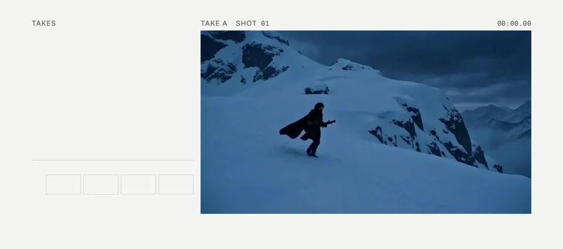
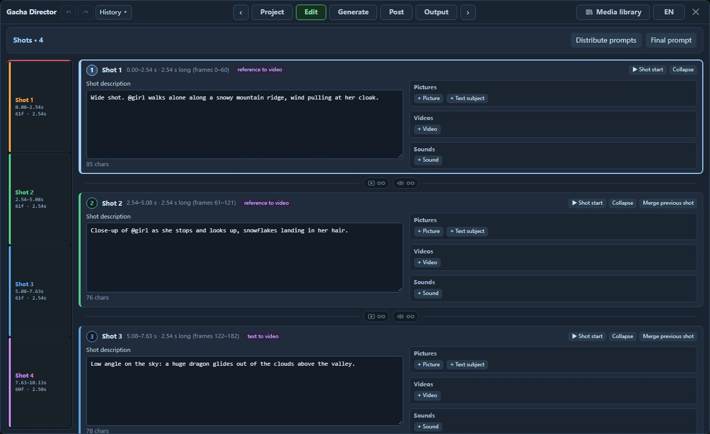
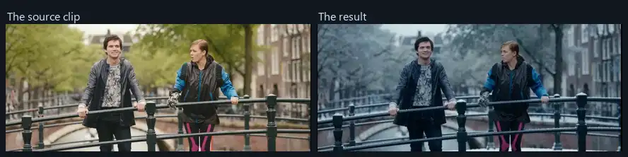
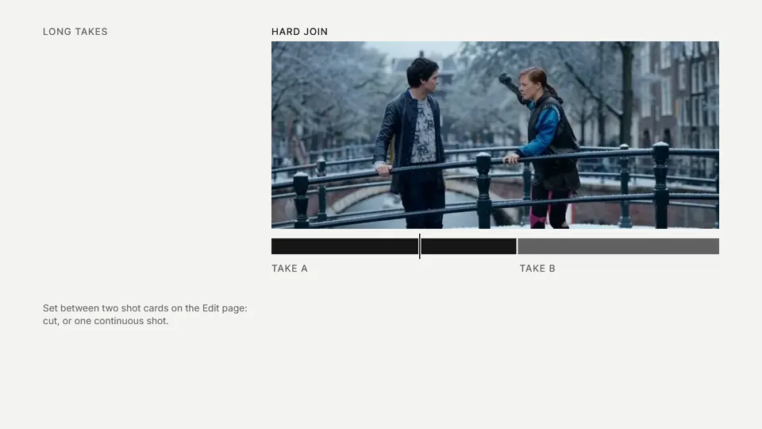
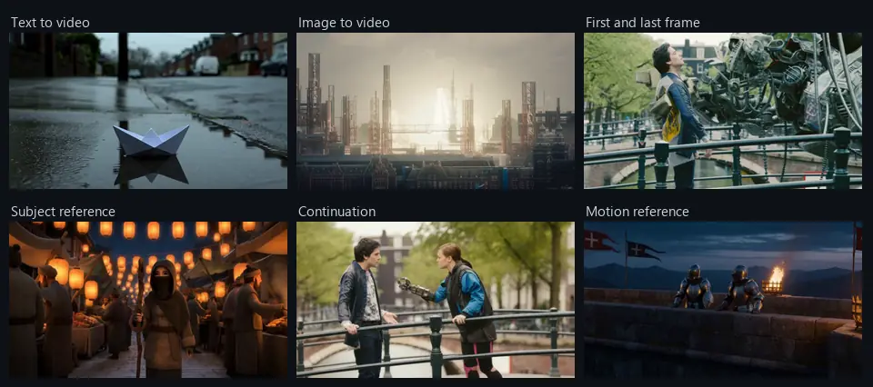
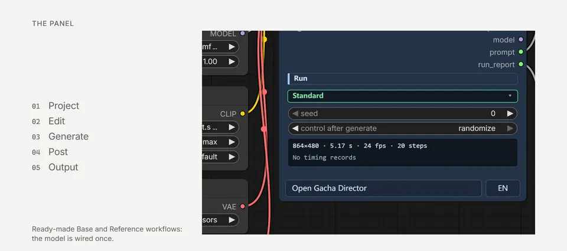

# Gacha Director

**An all-in-one MiniMax H3 director panel for ComfyUI: generate takes in batches, pick your preferred take for each shot, and join them into a final clip.**

English | [日本語](README_JA.md) | [中文](README_ZH.md)

https://github.com/user-attachments/assets/4ab0e2a9-b260-47e5-8df9-826cfff57b43

Promo (15 seconds), made with Gacha Director.

A user-friendly interface for shot planning, media management, and take selection in one panel. Built for **Edit + multi-shot Gacha Generate**: plan shots on **Edit**, then generate batches and pick takes per shot on **Generate**. Designed for batch iteration and production.

https://github.com/user-attachments/assets/1d01bf37-fab6-4222-8e08-b9cb88085edc

Feature demo (70 seconds).

> [!NOTE]
> **AI-Friendly**: [AGENTS.md](AGENTS.md) is a handoff document for your AI assistant to understand, explain, and modify this project.

## What it does

**Batch generation, per-shot picks, one-click joining.** Generate several takes at once. Replace a shot you dislike with the same shot from another take, keeping your other picks.



**One card per shot.** Describe what happens, add pictures, videos, or sounds, and choose how each asset is used.



**Edit existing video.** Describe what to change and what to keep, such as turning live-action footage into a winter scene.



**Switch takes within a long take.** For two visually similar takes, regenerate the transition at the seam when joining them.



**One node, multiple H3 workflows.** Text-to-video, image-to-video, first/last frames, multiple keyframes, continuation, subject and motion references, and video editing.



The interface supports Chinese, English, and Japanese.

## Installation

Requires ComfyUI 0.39 or newer. No additional Python packages or other custom-node packages are required.

```bash
cd ComfyUI/custom_nodes
git clone https://github.com/excifroge/ComfyUI-GachaDirector
```

Restart ComfyUI; `Gacha Director v2.1.0: 10 nodes registered` in the log confirms installation. Prepare the model files using the [official ComfyUI tutorial](https://docs.comfy.org/tutorials/video/minimax/minimax-h3).

## Quick start

1. Open [GachaDirector_Base.json](example_workflows/GachaDirector_Base.json) and select the model files in the loaders; delete the acceleration LoRA loader if you do not have that LoRA.
2. Click **Open Gacha Director** on the node. The example already has two shots: use them as they are, or change their descriptions and add media on **Edit**.
3. On **Generate**, set **Batch takes** to 2 and click the generate button.
4. Once both takes are ready, click **Pick** for your preferred take under each shot, then click **Join**.



## Documentation

- [User guide](docs/GUIDE.md)
- [AGENTS.md](AGENTS.md): handoff notes for AI assistants
- [Changelog](CHANGELOG.md)

## Credits and license

Gacha Director builds on and draws from the following open-source projects; thanks to their authors. See [NOTICE](NOTICE) for individual sources.

- [ComfyUI-MiniMaxH3-Director](https://github.com/seesee75-commits/ComfyUI-MiniMaxH3-Director): seesee75 and contributors, GPL-3.0
- [ComfyUI-MiniMax-H3-Motion-Director](https://github.com/j955229/ComfyUI-MiniMax-H3-Motion-Director): its contributors, GPL-3.0
- [ComfyUI_MiniMaxH3_Director](https://github.com/AIMixer/ComfyUI_MiniMaxH3_Director): AIMixer, Apache-2.0
- [ComfyUI-MiniMaxH3-Director](https://github.com/Thefrizzy1/ComfyUI-MiniMaxH3-Director): the_frizzy1, Apache-2.0
- LTX Director: WhatDreamsCost, GPL-3.0
- [ComfyUI](https://github.com/Comfy-Org/ComfyUI): GPL-3.0

Footage in the samples and screenshots comes from the open films *Sintel* (© Blender Foundation, CC BY 3.0, [durian.blender.org](https://durian.blender.org/)) and *Tears of Steel* ((CC) Blender Foundation, CC BY 3.0, [mango.blender.org](https://mango.blender.org/)); the remaining footage was generated with MiniMax H3.

The promo mascot is a fan interpretation of Phoebe from Wuthering Waves; the character and the opening voice clip belong to Kuro Games.

This package contains GPL-3.0 code and is released under [GPL-3.0](LICENSE).
