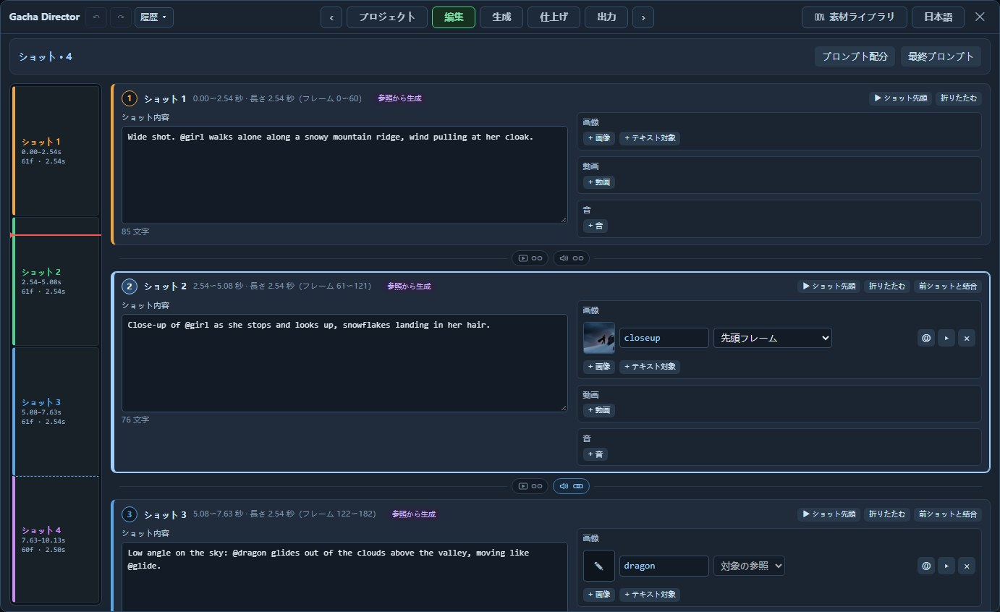

# Gacha Director

**ComfyUIのMiniMax H3向け制作パネル：テイクを一括生成し、ショットごとに気に入ったものを選んで、一本の動画に仕上げます。**

[English](README.md) | 日本語 | [中文](README_ZH.md)

https://github.com/user-attachments/assets/4ab0e2a9-b260-47e5-8df9-826cfff57b43

Gacha Directorで制作したプロモーション映像（15秒）です。

ショット構成、素材管理、テイク選びを一つのパネルにまとめた、使いやすいUIです。**Edit + マルチショット Gacha Generate** を想定し、「編集」でショットを組み立て、「生成」でテイクを一括生成・採用します。大量のテイクを試しながら調整し、動画をまとめて制作する用途に適しています。

https://github.com/user-attachments/assets/1d01bf37-fab6-4222-8e08-b9cb88085edc

機能デモ（70秒）です。

> [!NOTE]
> **AI-Friendly**：[AGENTS.md](AGENTS.md) は、AIアシスタントがこのプロジェクトを理解・説明・変更するための引き継ぎ資料です。

## できること

**一括生成、ショットごとの採用、ワンクリックで合成。** 複数のテイクを一度に生成します。変更したいショットだけを別のテイクの同じショットに差し替え、ほかのショットの採用状態は維持できます。


**ショットごとに1枚のカード。** ショットの内容を記述し、画像・動画・音を追加して、各素材の使い方を指定します。



**既存の動画を編集。** 実写映像を雪景色に変えるなど、変更する内容と残す要素を記述します。


**長回しの途中でもテイクを変更。** 映像が近い2本のテイクをつなぐ際は、合成時につなぎ目の映像を再生成します。


**一つのノードでH3の複数の用途に対応。** テキストや画像からの動画生成、先頭・最終フレーム、複数キーフレーム、続きの生成、被写体・動作参照、動画編集に対応します。


UIは中国語・英語・日本語に対応しています。

## インストール

ComfyUI 0.39以降が必要です。追加のPythonパッケージや、ほかのカスタムノードパッケージは不要です。

```bash
cd ComfyUI/custom_nodes
git clone https://github.com/excifroge/ComfyUI-GachaDirector
```

ComfyUIを再起動し、ログに `Gacha Director v2.1.2: 10 nodes registered` と表示されればインストール完了です。モデルファイルは[ComfyUI公式チュートリアル](https://docs.comfy.org/tutorials/video/minimax/minimax-h3)に従って用意します。

## クイックスタート

1. [GachaDirector_Base.json](example_workflows/GachaDirector_Base.json)を開き、各ローダーでモデルファイルを選び、高速化LoRAがない場合はそのローダーを削除します。
2. ノードの **Gacha Director を開く** をクリックします。サンプルには2ショットが設定済みなので、そのまま使うか、「編集」で内容や素材を変更できます。
3. 「生成」で生成ボタンをクリックします。初期設定では、1回につき2本のテイクを生成します。
4. 2本のテイクが完成したら、各ショットで気に入ったテイクの **採用** をクリックし、**合成** を実行します。


## ドキュメント

- [ユーザーガイド](docs/GUIDE_JA.md)
- [AGENTS.md](AGENTS.md)：AIアシスタント向け引き継ぎ資料
- [変更履歴](CHANGELOG.md)

## クレジットとライセンス

UI・制作ワークフローの設計、プロモーション映像のディレクション：[Excifroge](https://github.com/excifroge)

Gacha Directorの基盤や参考となった以下のオープンソースプロジェクトの作者に感謝します。個別の出典は [NOTICE](NOTICE) に記載しています。

- [ComfyUI-MiniMaxH3-Director](https://github.com/seesee75-commits/ComfyUI-MiniMaxH3-Director)：seesee75 and contributors、GPL-3.0
- [ComfyUI-MiniMax-H3-Motion-Director](https://github.com/j955229/ComfyUI-MiniMax-H3-Motion-Director)：its contributors、GPL-3.0
- [ComfyUI_MiniMaxH3_Director](https://github.com/AIMixer/ComfyUI_MiniMaxH3_Director)：AIMixer、Apache-2.0
- [ComfyUI-MiniMaxH3-Director](https://github.com/Thefrizzy1/ComfyUI-MiniMaxH3-Director)：the_frizzy1、Apache-2.0
- LTX Director：WhatDreamsCost、GPL-3.0
- [ComfyUI](https://github.com/Comfy-Org/ComfyUI)：GPL-3.0

サンプルとスクリーンショットの映像には、オープンムービー *Sintel*（© Blender Foundation、CC BY 3.0、[durian.blender.org](https://durian.blender.org/)）と *Tears of Steel*（(CC) Blender Foundation、CC BY 3.0、[mango.blender.org](https://mango.blender.org/)）を使用し、それ以外はMiniMax H3で生成しています。

プロモーション映像のマスコットは、鳴潮のキャラクター「フィービー」のファンアートで、キャラクターと冒頭の音声の権利はKuro Gamesに帰属します。

本パッケージはGPL-3.0のコードを含み、[GPL-3.0](LICENSE)で公開しています。
