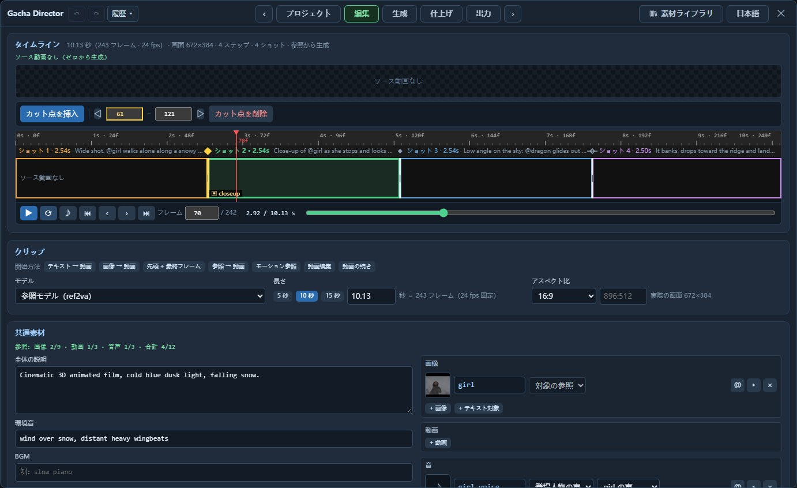
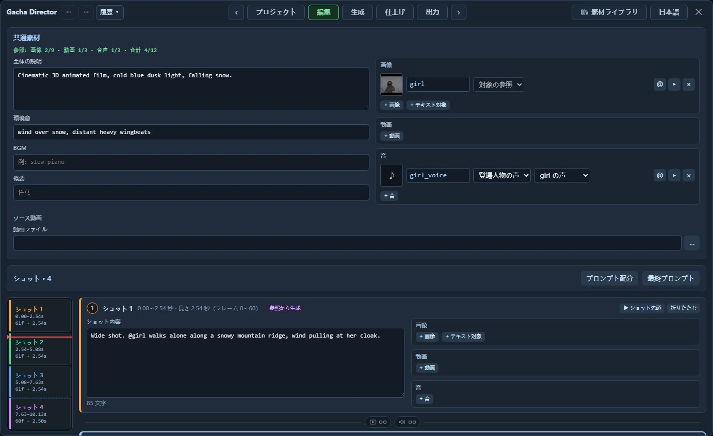
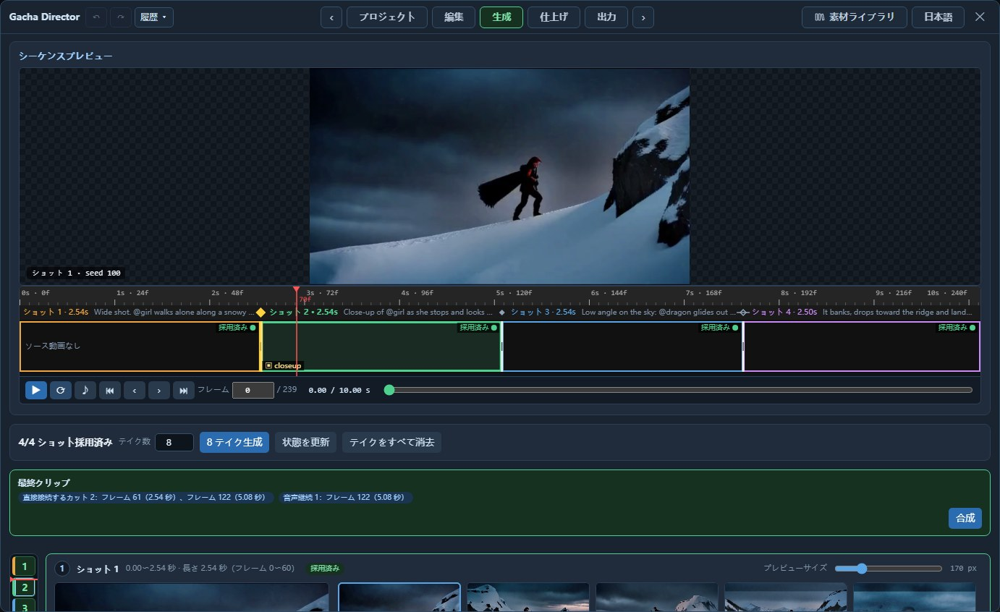
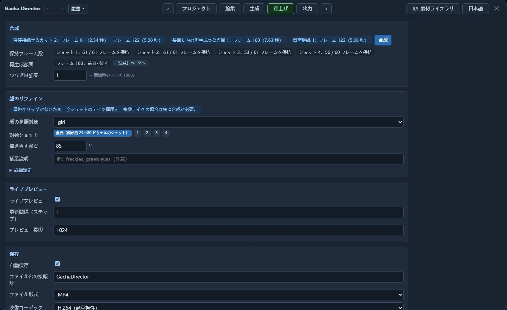

# Gacha Director

**MiniMax H3 のディレクターコンソール。** キャンバス上の 1 ノードからタブ式パネルを開く ComfyUI カスタムノードです。テキスト・画像からの動画生成、先頭・最終フレーム、複数キーフレーム、動画の続きの生成、参照生成、動画編集に対応します。

名前の Gacha はゲームのガチャのことで、一度に N 本のテイクを生成し、ショットごとに 1 本を選んで最終クリップに合成する流れは、10 連ガチャのようなものです。

[English](README.md) | 日本語 | [中文](README_ZH.md)

[](https://github.com/excifroge/ComfyUI-GachaDirector/releases/download/v2.1.0/GachaDirector_reel.mp4)

**使いやすい UI で制作を完結するワンストップの環境。** 主に **Edit + マルチショットの Gacha Generate** を想定し、編集ページでショットの内容と素材を整理し、生成ページでテイクを一括生成してショットごとに 1 本を選び、最終クリップに合成します。大量のテイクを使った反復調整と、クリップの一括制作に適しています。

音声付き動画：[機能紹介（70 秒）](https://github.com/excifroge/ComfyUI-GachaDirector/releases/download/v2.1.0/GachaDirector_reel.mp4) · [このツールで制作したプロモーション映像（15 秒）](https://github.com/excifroge/ComfyUI-GachaDirector/releases/download/v2.1.0/GachaDirector_promo.mp4)。本文中のアニメーションは無音プレビューです。

> [!NOTE]
> **AI-Friendly**：リポジトリ直下の [AGENTS.md](AGENTS.md) は、利用者の AI がプロジェクトを理解・説明・変更するための引き継ぎドキュメントです。

<details>
<summary>目次</summary>

- [解決する課題](#解決する課題)
- [対応する使い方](#対応する使い方)
  - [サンプル動画](#サンプル動画)
  - [このツールで制作：15 秒のプロモーション映像](#このツールで制作15-秒のプロモーション映像)
- [インストール](#インストール)
- [クイックスタート](#クイックスタート)
  - [一通りの例：実写映像を雪景色に変える](#一通りの例実写映像を雪景色に変える)
- [ノード](#ノード)
- [パネル](#パネル)
  - [プロジェクトページ](#プロジェクトページ)
  - [編集ページ](#編集ページ)
  - [生成ページ](#生成ページ)
  - [仕上げページ](#仕上げページ)
  - [出力ページ](#出力ページ)
- [時間セル](#時間セル)
- [プロンプトの組み立て方](#プロンプトの組み立て方)
- [ノードの上流に接続するもの](#ノードの上流に接続するもの)
- [実測データ](#実測データ)
- [既知の制限](#既知の制限)
- [開発とテスト](#開発とテスト)
- [謝辞とライセンス](#謝辞とライセンス)

</details>


## 解決する課題

MiniMax H3 の公式テンプレートは用途ごとに別のノードグラフです。用途の切り替えにはグラフの変更が必要で、シード比較、設定ごとの計測、2 本の結果の組み合わせには追加の構成が必要です。

Gacha Director はこれらを 1 ノードにまとめ、次の 5 点で構成します。

- **タブ式の作業パネル。** 編集ソフトの作業順にページを配置：プロジェクト → 編集 → 生成 → 仕上げ → 出力。
- **ショットごとに素材を整理。** 各カードに内容と画像・動画・音をまとめ、生成時に番号付けとモデルへの宣言を自動で行います。手書きは不要です。
- **所要時間を記録する実行プリセット。** 名前付きの設定で計算コストを管理します。`Draft`（下書き）、`Standard`（標準）、`Final`（完成版）の 3 つを内蔵し、クリップ長ごとに実測の所要時間を記録します。
- **テイク → 採用 → 最終クリップ。** クリップ全体のテイクを N 本キューに追加し、ショットごとに 1 本を選んで「合成」します。全ショットで同じテイクを使う場合はそのまま出力。カットでの切り替えは再生成せずにつなぎ、長回し内での切り替えはつなぎ目だけを描き直します。
- **カットか長回しかは自分で指定。** 編集ページでカットか連続かを設定し、モデルへの指示と最終クリップのつなぎ方に反映します。カットで音声も切り替えるか、前のテイクの音声を続けるかは個別に設定できます。

パネルでは幅 × 高さ、秒、「このショットの最初のフレーム」など、直感的な単位と記述を使います。モデル用のラベル、宣言、画素数、スケジュールに応じた denoise はパネルで計算します。

サンプリング処理は再実装せず、実行時に ComfyUI の標準ノードへ展開します。標準のコンディショニングノード、サンプラー、VAE が処理を実行します。

## 対応する使い方

H3 の「モード」は複数の仕組みの組み合わせです。Gacha Director は素材とその**使い方**から用途を決めるため、モード選択は不要です。カードの読み取り専用タグ（「テキストから生成」「先頭・最終フレーム」「参照から生成」など）で現在の組み合わせを確認できます。

| 追加するもの（素材・使い方） | 用途 | モデル | 展開される標準ノード |
|---|---|---|---|
| テキストのみ | テキストからの動画生成 | fl2va | `MiniMaxH3ImageToVideo` |
| 最初のショットの画像・「先頭フレーム」 | 画像からの動画生成 | fl2va | 同上。`first_frame` に接続 |
| 最後のショットの画像も追加・「最終フレーム」 | 先頭・最終フレームからの生成 | fl2va | 同上。`first_frame` / `last_frame` に接続 |
| 最終フレームのみ | 最終フレームからの生成 | fl2va | 同上。`last_frame` に接続 |
| 画像・「中間フレーム」、または途中のショットの先頭・最終フレーム | 複数キーフレーム | どちらも可 | `MiniMaxH3AddGuide` を直列に接続 |
| 動画・「動画の続き」 | 続きの生成 | どちらも可 | `MiniMaxH3AddGuide` |
| 画像・「対象の参照」 | 参照生成 | ref2va | `MiniMaxH3ReferenceToVideo` |
| 動画・「動作・カメラ参照」、音・「登場人物の声」「音声参照」 | 動き、カメラワーク、声質、BGM の参照 | ref2va | 同上 |
| 音・「ショット内の原音」 | 音声をそのまま完成クリップに入れる | どちらも可 | `MiniMaxH3AddGuide` |
| ショットの説明で単独の行に書くセリフ（`@名前 says: …`） | セリフ：キャラクターがこの言葉を話す | どちらも可 | ノードは追加せず、セリフをプロンプトに記述 |
| ソース動画・「動画編集」 | 動画編集（公式の方法） | ref2va | 同上。ソース動画は `<Video 1>` |
| ソース動画・「動画の続き」 | この参照区間の末尾から続きを生成 | ref2va | 同上 |
| ソース動画・「ソース再描画」 | 低い強さで再描画 / 一部だけ再描画 | どちらも可 | `VAEEncode` + `LTXVConcatAVLatent`。一部だけ再描画する場合は `SetLatentNoiseMask` も追加 |

ソース動画の編集に対象の参照と最終フレームを加えるなど、用途を組み合わせられます。

編集ページの「クリップ」にある「開始方法」のボタンで、これらの組み合わせを設定できます。既存の素材は置き換え、プロンプトは保持します。置き換えた素材への @ 参照は通常の名前のテキストになります。長さとアスペクト比も保持しますが、「動画編集」ではソースの比率に合わせ、ソース内に収まる最長の有効な長さにします（最大 362 フレーム）。120 フレームのソースなら 107 フレームとなり、未使用の 13 フレームをタイムライン上部に表示します。全区間を使うには 124 に変更します。影響は[編集ページ](#編集ページ)のソース動画の項を参照してください。操作は取り消せます。


### サンプル動画

各行は用途別の生成結果から等間隔に 6 フレームを抜き出したものです。すべて `Standard`（標準モデル、20 ステップ、864×480）、シード 7 で各 1 回、1 本だけ生成し、選別していません。


同じ 6 本を並べて再生したものです（12 fps に間引いています）。


「参照による続きの生成」と「ControlNet」は[下の例](#一通りの例実写映像を雪景色に変える)のソース動画をこの 2 行で使います。前者は最終フレームから続きを生成し、後者は輪郭を使い、内容はプロンプトで指定します。動画編集のサンプルは同じ例にあります。

### このツールで制作：15 秒のプロモーション映像

4 ショットは、それぞれクレヨン画風のキーフレームから始まります。スロットのリールは、この映像自体のフレームを表示して止まります。

[](https://github.com/excifroge/ComfyUI-GachaDirector/releases/download/v2.1.0/GachaDirector_promo.mp4)

後から加えたのは、クローズアップのリールに映る画像だけです。それ以外は音声も含め、モデルの生成結果をそのまま使っています。冒頭の掛け声は、モデルに渡した録音です。

## インストール

ComfyUI **0.39 以降**が必要です（`MiniMaxH3AddGuide`、H3 のノイズマスク、`LTXVConcatAVLatent` の H3 対応を使用します）。

1. このリポジトリを `ComfyUI/custom_nodes/ComfyUI-GachaDirector` に配置します。
   ```bash
   cd ComfyUI/custom_nodes
   git clone https://github.com/excifroge/ComfyUI-GachaDirector
   ```
2. ComfyUI を再起動します。ログに `Gacha Director v2.1.0: 10 nodes registered` と表示されれば、インストール完了です。

追加の pip 依存関係や他のカスタムノードパッケージは不要です。モデルは [ComfyUI の公式チュートリアル](https://docs.comfy.org/tutorials/video/minimax/minimax-h3)に従って用意します。顔のリファインの初回使用時に、ComfyUI 付属の kornia が約 400 KB の検出用重みを自動ダウンロードします。

## クイックスタート

`example_workflows/` に、ノードと接続が同じでモデルが異なる 2 つのワークフローを用意しています。それぞれに初期プロンプトが入っています。

| ワークフロー | モデル | 用途 |
|---|---|---|
| `GachaDirector_Base.json` | fl2va | テキストからの動画生成、画像からの動画生成、先頭・最終フレーム、複数キーフレーム、続きの生成 |
| `GachaDirector_Reference.json` | ref2va | 参照生成、動画編集、複数キーフレーム、続きの生成 |

どちらかを開き、4 つのローダーと高速化 LoRA ローダーにモデルファイルを指定します。

1. ノードの **Gacha Director を開く**をクリックします。
2. **編集**ページでショットごとに起きることを書きます。素材はカード右側の「+ 画像 / + 動画 / + 音」、または「クリップ」の「開始方法」に続くボタンから追加します。
3. **プロジェクト**ページでプリセットを選び（`Draft` / `Standard` / `Final`）、画面サイズと所要時間を確認します。
4. **生成**ページの「N テイク生成」をクリックするか（N はプロジェクトページの「テイク数」で設定）、ComfyUI 自体の実行ボタンで 1 本を生成します。

> [!IMPORTANT]
> `Draft` はノードの `model_turbo` 入力を使います。サンプルでは高速化 LoRA を適用したモデルが接続済みです。LoRA がない場合はローダーを削除し（`model_turbo` は未接続）、`Draft` を使わないか、そのモデルを「標準モデル」に変更します。


### 一通りの例：実写映像を雪景色に変える

ソースはオープンムービー『Tears of Steel』で橋の上の 2 人が話す 124 フレームの実写映像です。人物、動作、カメラワークを保ち、雪の降る冬に変更します。

1. `GachaDirector_Reference.json` を開き、ノードの **Gacha Director を開く**をクリックします。
2. **編集**ページの「クリップ」で「開始方法」に続く「動画編集」を選び、ソース動画を指定します。長さは 124 フレーム、比率はソースに合わせます。「ソース用途」は「動画編集」、「ソース再描画」はオフのままにします。
3. 4 か所にテキストを入力します。変更したい内容はショットに、残したい内容はソース動画の「保持・変更内容」に書きます。

   | 入力箇所 | 内容 |
   |---|---|
   | 全体の説明 | `The target video is live-action film footage in heavy snowfall.` |
   | ショット内容 | `The scene of <Video 1> now takes place in deep winter: thick snow is falling, the trees are bare and white, snow lies on the bridge railing, the street and the rooftops, and the light is cold and blue. The two people, their clothes, their movements and the camera are the same as in <Video 1>.` |
   | ソース動画の「詳細設定」にある「保持・変更内容」 | `the people, their motion and timing, the camera and the composition of <Video 1> are kept; only the season and the weather change` |
   | 環境音 | `Muffled winter air, soft wind, snow hissing on stone.` |

   編集用ソースは `<Video 1>` と直接書けます。「概要」は空欄で構いません。生成の種類と「生成する動画は `<Video 1>` の編集版」が自動で加わります。
4. 「最終プロンプト」をクリックすると、実際にモデルへ送るテキストを確認できます。

   ```text
   subject_definitions:
   <Video 1> is the source video for the target video edit.

   summary: [video editing] The target video is an edited version of <Video 1>.

   retention_analysis:
   <Video 1> (motion and camera work): fully_preserved - the people, their motion and timing, the camera and the composition of <Video 1> are kept; only the season and the weather change.

   detailed_description: The target video is live-action film footage in heavy snowfall. [Shot 1] The scene of <Video 1> now takes place in deep winter: thick snow is falling, the trees are bare and white, snow lies on the bridge railing, the street and the rooftops, and the light is cold and blue. The two people, their clothes, their movements and the camera are the same as in <Video 1>.

   overall_soundscape: Muffled winter air, soft wind, snow hissing on stone.

   non_diegetic_music: N/A
   ```

5. **プロジェクト**ページで `Draft` を使って方向性を確認し（4 ステップ、約 2.5 分）、`Standard` に切り替えます（20 ステップ、864×480、約 12.5 分）。VRAM 24 GB の GPU 1 枚での実測です。


同じ比較を動画で見たものです（左：ソース動画、右：完成クリップ）。


## ノード


**入力**

| 名前 | 型 | 説明 |
|---|---|---|
| `model` | MODEL | H3 の拡散モデル。参照モデルには ref2va、ベースモデルには fl2va を接続します。 |
| `clip` | CLIP | `CLIPLoader` で種類を `minimax` にします。 |
| `vae` | VAE | H3 の動画 VAE。 |
| `audio_vae` | VAE | H3 の音声 VAE。 |
| `model_turbo` | MODEL、省略可 | 同じモデルに高速化 LoRA を適用したもの、または蒸留モデルです。プリセットのモデルが「高速モデル（turbo）」のときに使います。 |
| `sampler` | SAMPLER、省略可 | 接続すると、プリセットのサンプラーを上書きします。 |
| `sigmas` | SIGMAS、省略可 | 接続すると、プリセットのスケジューラーとステップ数を上書きします。 |

ノードにはプリセット選択、`seed`（ComfyUI の「生成後の制御」を含む）、読み取り専用の数値（画面サイズ、フレーム数、ステップ数、現在のプリセットと長さでの実測時間）、パネル起動ボタン（横に言語切り替え）の 4 項目があります。その他の設定はパネル内にあります。

**出力**：`frames`、`audio`、`fps`、`frame_count`、`source_frames`、`latent`、`positive`、`model`、`prompt`（実際にモデルへ送るプロンプト）、`run_report`（今回の実行の概要）。

## パネル

ページには名前と値を表示します。パラメーター、ボタン、見出しに半秒マウスを重ねると、説明のツールチップが出ます。

### プロジェクトページ


左の一覧に、現在のクリップでの各プリセットの画面サイズ、ステップ数、モデルを表示します。右は選択中の設定で、上部の 4 項目は**解像度**（幅 × 高さ）、**フレームレート**（24 fps、モデル固定）、**長さ**、**所要時間の目安**（現在のプリセットと長さでの実測平均）です。

| 設定 | 説明 |
|---|---|
| 解像度 | 現在の比率での幅 × 高さを表示します。プリセットは画素数、クリップは比率を保持するため、同じプリセットを横長・縦長に使えます。「標準（公式テンプレート）」は 16:9 で 864×480、「ネイティブ（学習時の解像度）」は 1344×768 です。 |
| 解像度・「カスタム…」 | 正方形など、幅と高さを直接入力します。32 の倍数以外では最も近い実際のサイズを表示します（720 × 720 は 736 × 736）。256〜2048 ピクセルの範囲外は赤字になり、適用できません。カスタムサイズでクリップの比率も更新し、その後のサイズ変更では比率を保持します。 |
| ステップ数 | 公式の既定値は 20。高速モデルでは 4 または 8 にします。 |
| モデル | 「標準モデル」、または「高速モデル（turbo）」（ノードの `model_turbo` 入力）。 |
| テイク数 | 生成ページのボタン 1 回で、何本をキューに追加するか。 |
| 参照素材サイズ | 参照動画の縮小サイズと、参照画像を縮小するかを設定します。参照モデルの速度に影響し、最終クリップの解像度は変わりません。動画は全ステップの計算に加わるため、そのサイズが速度の主な要因になります。 |
| 詳細 | 画素数（MP）、ガイダンスの強さ（CFG）、サンプラー、スケジューラー、スケジュールのシフト · 映像 / スケジュールのシフト · 音声（既定値 12 / 3）、VRAM の節約。公式の既定値は CFG 1、`res_multistep` / `simple`。 |

下部は所要時間の記録です。テイクは**キューに追加した時点**のプリセットと長さで記録し、待機中にページを再読み込みした場合と ComfyUI の実行ボタンでは**実行開始時点**の設定を使います。実行中にパラメーターを変えた回は記録せず、設定変更時は既定で旧記録を消去します。モデル読み込み、下流ノード、他のディレクターノードを除き、このノードだけを計測します。合成と顔のリファインは別の処理のため、生成時間の目安を歪めないよう計測対象外です（同じクリップ・プリセットで合成約 128 秒、テイク約 100 秒）。

> [!NOTE]
> `Draft` と `Final` は異なるクリップになります。サイズ変更でノイズが変わり、同じシードでも結果は異なります。`Draft` はプロンプトと素材の方向性を確認するために使い、シード選びには使いません。

### 編集ページ



上部はプレビュー、タイムライン、再生コントロールです。タイムライン上に長さ（秒・フレーム数・フレームレート）、画面サイズ、ステップ数、ショット数、素材から決まる生成の種類を表示します。下部はクリップ、共通素材、ショットの順です。

**クリップ**

- **モデル**：参照モデル（ref2va）は人物・動画・音声の参照に対応し、ベースモデル（fl2va）の条件入力はテキストとクリップ全体の先頭・最終フレームです。固定素材（中間フレームの画像、「動画の続き」の動画、そのまま使う音声）は別途追加し、両モデルで使えます。不適合な素材はページに理由を表示します。
- **長さ**：5 / 10 / 15 秒を選ぶか秒数を入力し、有効な長さに自動調整します。横に対応フレーム数を表示します。標準ノードの学習範囲は約 5〜15 秒（124〜362 フレーム）です。より長い値も入力できますが、学習範囲外です。
- **アスペクト比**：「ソースの比率」、または比率を指定します。



**共通素材**：全ショット共通の素材を置きます。左は全体の説明（スタイルとシーン）、環境音、BGM、概要、右は画像・参照動画・音、最下部はソース動画です。1 ショット用の素材は対応するカードに置きます。参照モデルの上限は画像 9 枚、動画 3 本、音声 3 本、計 12 ファイルで、上部に使用数を表示します。

**ショット**：各カードの左に内容、右に画像・動画・音を配置します。プロンプトの `[Shot 1]`、`[Shot 2] At 00:02.833, …` に対応し、別々には生成しません。説明も専用の対象・参照素材もないショットは省略し、番号にも含めません。左のナビゲーターはショット長に比例し、クリックで移動します。

各素材にはサムネイル、名前、**使い方**があり、モデルでの用途を決めます。

| 素材 | 使い方 | 意味 |
|---|---|---|
| 画像 | 対象の参照 | 画像の人物や物が映像に登場します。見た目の参照で、特定のフレームには固定しません。画像のある対象は参照モデルに見せます。ベースモデルには参照画像用の入力がなく、説明文だけを使います。 |
| | 先頭フレーム / 最終フレーム | ショットがこの画像から始まる / この画像で終わります。 |
| | 中間フレーム | ショット内で指定したフレームがこの画像になります。 |
| | 絵コンテ（構図参照） | 構図をモデルに見せるだけで、フレームは固定しません（参照モデル）。 |
| 動画 | 動作・カメラ参照 | この動画の動きとカメラワークを参照します（参照モデル）。 |
| | 動画の続き | 動画の短い区間（5 / 22 / 39… フレーム、音声付きも可）をショットの先頭に固定し、モデルがその続きを生成します。最初のショットに置くと、続きの生成になります。 |
| 音 | 登場人物の声 | 選んだ対象がこの声で話します（参照モデル）。 |
| | 音声参照 | 音色や曲調を参照します（参照モデル）。 |
| | ショット内の原音 | この音がショットの先頭からそのまま完成クリップに入ります。 |

素材行右の三角で「詳細設定」を開き、対象の種類・説明・短い呼び名・複数画像、保持の度合い（「完全保持」「一部変更可」「特徴の転用」「弱い参照」）、動画の使用区間などを設定します。

**素材ライブラリ。** 上部右の「素材ライブラリ」で、どのページからでも移動・サイズ変更可能なウィンドウを開けます。ページ間で位置を保ち、位置とサイズをブラウザーに保存します。


- **2 つの分類**：*取り込み*には ComfyUI の `input` フォルダー内のファイル、*生成*には `output` 内の生成済みファイルが新しい順に並びます。どちらも「画像」「動画」「音声」で絞り込み、ファイル名で検索できます。
- **フォルダー**：左側でフォルダー・サブフォルダーを作り、ダブルクリックで改名します。素材をドラッグして分類し、「未分類」へ戻すと分類を外します。仮想フォルダーなので実ファイルは移動・改名せず、ほかのワークフローに影響しません。分類リストは ComfyUI のユーザーデータに保存し、全ワークフローで共有します。
- **素材を使う**：ショットの素材欄へドラッグするとそのショットに、共通素材欄なら全ショットに追加します。Ctrl または Shift で複数選択できます。「+ 画像」「+ 動画」「+ 音」も同じウィンドウを種類で絞り込んで開き、クリックで追加します。
- **PC からの取り込み**：「PC から取り込む…」かウィンドウへのドロップで、現在のフォルダーに追加します。ショット・共通素材欄・ソース動画欄へ直接ドロップもできます（ソース欄の動画はソースになります）。ComfyUI のアップロード機構で `input` にコピーし、同名の場合は新規ファイルを改名します。他の場所へのドロップは無効で、背後のキャンバスにも渡りません。

「動画の続き」では生成済みの最終クリップを選べます。このレシピは末尾 22 フレームを最初のショットの先頭 22 フレームに固定します（原映像に近いですが、ピクセル単位では同一ではありません）。124 フレームの新クリップには 102 フレーム（4.25 秒）の新規映像が含まれます。つなぐ際は重複する 22 フレームを削除します。


**モンタージュか長回しか：映像と音声に個別のリンク。** カード間の 2 つのチェーンで下のショットのつなぎ方を設定します。左が映像、右が音声で、接続時は明るく、解除時は暗くなります。クリックで切り替えます。

映像：

- *リンクなし = カット（モンタージュ）*：別のショットに切り替えます。プロンプトでは新しい `[Shot N] At <時刻>` の区間になります。
- *リンクあり = 連続（長回し）*：カットせず、内容と採用のために区間を分けます。連続区間を 1 つの `[Shot]` として順に 1 段落へまとめ、セリフは別行にします。公式形式はカット時刻だけを指定でき、ショット内の時刻は指定できません。長回しの順序は文章、時刻はモデルが決めます。

音声（カットの位置でのみ意味を持ちます）：

- *リンクなし = 映像と同時に切り替え*：カット後は、新しい映像に採用したテイクの音声を使います。これが既定です。
- *リンクあり = 継続*：カット前のテイクの音声を続け、映像だけを切り替えます。連続してリンクすると、最初のテイクの音声を維持します。
- 映像がつながっている場合（長回し）、音声は必ず映像とともに連続します。音声リンクはつながった状態でロックされます。

音声リンクは最終クリップの音声の出所だけを決め、生成や映像のカット位置は変えません。各テイクはクリップ全体の映像と音声を含みます。カット前後で**異なる**テイクを使う場合だけ、音に違いが出ます。

新しい境界は、ゼロからの生成ではカット、ソース動画がある場合は連続が既定です。タイムラインの塗りつぶしたひし形はカット、白抜きのひし形と横線は長回し内の区切りです。左のナビゲーターの破線は連続を示します。

旧ワークフローにはこの 2 つの設定がありません。ソース動画がある場合は長回しとして従来のつなぎ目再生成を維持し、ゼロからの生成ではカットにします。音声は従来どおり映像と切り替えます。


**番号の手書きは不要。** 番号（`<Subject 1>`、`<Picture 2>`、`<Video 1>`…）と先頭フレームの所属などを自動で宣言します。`@` で一覧を開き、ショット専用の素材から選べます。上下キーと Enter に対応し、素材行の `@` でもカーソル位置に名前を挿入できます。改名・使い方の変更・削除はプロンプトに反映します。未指定の対象・参照動画・音声参照には登場の記述を補い、先頭・最終画像は専用の宣言、声は対象と一緒に宣言します。「最終プロンプト」で全文を確認でき、変更時に自動更新します。

固定素材はショットに追従し、境界を動かしても「先頭フレーム」はショット先頭を維持します。境界の挿入・削除では元のフレーム位置に残ります。タイムラインのマーカーは表示専用です。

**ソース動画**（任意、共通素材の最下部）：クリップ全体の元映像です。入力ファイルか生成済みの最終クリップを選べます。「ソース用途」は 4 種類です。

- *動画編集*（参照モデル、既定）：公式の動画編集方法で、モデルには `<Video 1>` として渡します。
- *動画の続き* / *動作・カメラ参照*：同じく `<Video 1>` として渡しますが、役割が異なります。渡すのはソース動画の開始フレームから、クリップと同じ長さの区間です。別の位置から続ける場合は「詳細設定」で開始フレームを変えます。
- *ソース再描画*：開始時の映像としてだけ使います。

「詳細設定」の「ソース再描画」は元映像にノイズを加えて描き直します。ベースモデルのソース用途はこれだけです。「変更量」の横に開始ノイズ率を表示します（[実測データ](#実測データ)）。構図を保つには 100% より十分低くします。部分再描画にも必要です。

開始フレーム以降のソースが不足すると末尾フレームで補い、生成結果の末尾も止まります（4 フレーム不足した実測では、最後の約 6 フレームで徐々に停止）。

> [!NOTE]
> 動画編集に「ソース再描画」は不要です。実測では編集用の参照だけで、ゼロから生成しても構図・動き・カメラワークを保持しました。再描画を加えても（変更量 0.85）、ほぼ同じ結果で時間は増えました。

**部分再描画**（「ソース再描画」が有効な場合だけ表示）：再生成する[セル](#時間セル)を選び、それ以外は元のまま残します。ソースに音声トラックがある場合は、残すセルの音も保持されます。

**セリフ**：H3 は映像と音声を同時に生成するため、キャラクターに話させられます。ショットの説明では、セリフを単独の行に書きます。

```text
@girl pulls down her scarf and looks straight at the camera.
@girl says quietly: I have been looking for you.
```

`@girl` は画像の有無にかかわらず girl という対象を指します。対象のない声は `@voice(a warm elderly male voice) says cheerfully: Good morning!` と書きます。コロン前は話し方、後はセリフです。既定は英語で、他の言語は `@girl` または `@voice(…)` の後に `[Japanese]` などを付けます。モデルには `<Subject 1> (S1) says quietly, <d>[English] I have been looking for you.</d>` と送ります。画像付きは `<Subject 1>`、テキストのみは説明か短い呼び名を使い、同じ話者は全ショットで `(S1)` を維持します。`@girl says "…"` はコロンがないためセリフにならず、「最終プロンプト」で案内します。声を指定するには音声を追加し、「登場人物の声」と対象を選びます。声質は音声、言葉はプロンプトに従います。

**詳細**（ページ最下部、折りたたみ）：

- *プロンプト形式*：「構造化（公式の構成）」（公式形式で組み立てます。[プロンプトの組み立て方](#プロンプトの組み立て方)を参照）、または「自由記述」（入力したまま送ります。LoRA のトリガーワードや手書きの完全なプロンプト向けで、各ショットの説明は送らず、素材名も置き換えません）。
- *ネガティブプロンプト*：プリセットのガイダンスの強さ（CFG）が 1 以外の場合だけ使われます。公式テンプレートはすべて CFG 1 で、ネガティブ側の分岐はありません。

### 生成ページ




上部の**シーケンスプレビュー**は、モデルを使わず採用順に再生します。未採用は「ショット N · 未採用」と表示して区間を空け、長回し内の切り替えは合成までハードカットです。有効な最終クリップ（「合成」後に採用・つなぎ目設定を変更していない場合）があれば、それを再生します。赤い再生ヘッドが追従し、目盛りのドラッグで移動、ショットのクリックでテイクへスクロールします。音声は既定でオフ。全プレーヤー共通の ♪ スイッチをオンにすると、各区間のテイクの音声を再生します。


**つなぎ目の再生成範囲。** 長回し内の隣接区間で別のテイクを選ぶと、タイムライン下に範囲バーを表示します。合成で再生成するのはその範囲だけで、他は採用したテイクを使います。

- 既定の**自動**は、つなぎ目の手前からセル末尾までです。目標は少なくとも 12 フレームで、位置に応じて 12〜21 フレームになります。セル境界では前の 12 フレームだけを再生成し、後のテイクは 1 フレームも描き直しません。先頭や長回しの端では短くなります。理由は[時間セル](#時間セル)を参照してください。
- 両端は latent フレーム境界の細線にスナップします。1 セルに 5 本で、間隔は 1 フレームと 4 フレームずつ 4 区間です。長線はセル境界、横の数値は前後の再生成フレーム数です。
- 12 フレーム未満か右端がセル境界以外なら橙色になります。直後の保持フレーム 1–2 枚に測定可能な変化が出るための注意表示で、合成は可能です。
- バーをダブルクリックすると自動範囲に戻ります。範囲は長回しの外へ出ません。端で短くなった場合はツールチップに説明が表示されます。
- 「テイク間の一致 N dB」は、2 本のテイクのつなぎ目前後各 8 フレームを縮小して測った PSNR です。約 22 dB 未満で赤くなり、差が大きく修復に失敗する可能性を示します。未校正の目安です（[実測データ](#実測データ)）。
- 2 か所の範囲が重なる場合は、つなぎ目の上の小さな三角をクリックすると、そのバーを最前面に表示します。
- 旧ワークフローにすでにあるつなぎ目は、ドラッグかダブルクリックをするまで、従来の両側各 1 セルを再生成する範囲を保ちます。

1. **N テイク生成**：シードを順に増やしてクリップ全体を N 回キューに追加します。ボタン横の「テイク数」はプロジェクトの設定と共通です。上部のライブプレビューを確認し、いつでも中断できます。このノードと下流の出力だけを実行し、他のディレクターや無関係な保存ノードは実行しません。
2. **採用**：左のプレーヤーと右の一覧から、ショットごとに 1 本を選びます。カードをクリックして再生し、「全ショット採用」で全体に適用できます。削除は全ショットの一覧に反映し、出力ファイルは残します。テイクはクリップ全体の 1 回の生成です。カードは折り返し、一覧内で縦スクロールします。各ショットの「プレビューサイズ」は個別で、最小はリスト表示です。再生は指定フレームではなく実際のカットイン・アウトに従います（ずれは[実測データ](#実測データ)を参照）。停止中は中央の画像、ホバー時はショット先頭から再生します。左のナビゲーターは 1 区画が 1 ショットで、長さに比例し、色が「採用済み」「テイクあり」「未生成」、赤線がタイムライン位置を示します。ウィンドウに合わせて伸縮し、クリックで移動します。
3. **最終クリップ**：全ショットの採用後に「合成」を実行すると、別ファイルで出力し、出力ページに掲載します。完了後は「出力を表示」が現れます。処理は採用内容で変わります。
   - 全ショットで同じテイク → モデルを使わず、再エンコード 1 回で出力します（2〜3 秒）。
   - カットでのみ切り替え → モデルを使わず数秒で接続します。**実際に**カットした位置を使い、前のテイクが早く切れた場合はどちらにも属さない中間フレームを除き、最終クリップが短くなります。逆なら両方で使える位置で接続し、長さを維持します。完了後に実際の長さと「接続記録」を表示します。音声は映像と切り替え、音声リンクがあれば前のテイクを続けます（記録は `the sound stays with …`）。
   - 長回し内で切り替え → 帯で指定した範囲を再生成し、他の映像・音声は採用したテイクをエンコード・デコード 1 回だけ通します（[既知の制限](#既知の制限)）。範囲は長回し内に収まり、実際のカット位置を避けます。強度は[仕上げページ](#仕上げページ)で設定し、同じ処理のカットは直接つなぎます。

> [!NOTE]
> テイクの「このショットだけ再生成」はありません。モデルは毎回全体を計算するため、1 ショットでも新規テイクと同じコストで、生成済み映像を再生成します。再試行は新規テイクを使います。**ソース動画**の「部分再描画」は別の操作です。

カットではテイクを自由に組み合わせられます。長回しではつなぎ目の映像が近い必要があり、帯の値がその近さを示します。同じソースや先頭・最終・中間フレームなら通常は動きが近くなりますが、保証はありません。実測の 1 組では光と色調が大きく異なり、試した範囲・強度ではつながりませんでした。制約のないテキスト生成は別々の映像となり、修復後も飛びが残ります（[実測データ](#実測データ)）。

テイクは生成時の長さと区切りを記録します。長さ変更後は採用不可です。カット位置や 1 本の長回しを構成する区間を変えても使えますが、映像のカットは動かないため印を付けます。新しい区切りには新規生成が必要です。合成も採用内容を記録し、変更後は旧合成を現在の最終クリップとして表示しません。

### 仕上げページ

合成、顔のリファイン、プレビュー、保存の設定です。



**合成**：採用したテイクを 1 本につなぎます。カット、再生成するつなぎ目、音声を続けるカットの数を表示し、「合成」を実行できます。つなぎ目がなければモデルは使いません。「保持フレーム数」は採用映像の残る枚数で、他は再生成します。2 つのつなぎ目間の短い区間が全て覆われると「採用映像なし」、長回しが範囲より短ければ処理不能を赤字で示します。次の 2 項目は長回しのつなぎ目専用で、全てカットならグレーアウトします。

- *再生成範囲*：つなぎ目の前後で再生成するフレーム数を表示します。範囲は[生成ページ](#生成ページ)のタイムライン下の帯で両端をドラッグして設定し、ここでは読み取り専用です。
- *つなぎ目強度*：1（既定）は一から再生成し、低い値ほど元映像を残します。似た 1 組では 2 セル全体なら 0.3 でも修復できましたが、自動の 12 フレームでは 0.3 は 1 より弱い結果でした（[実測データ](#実測データ)）。横に開始ノイズ率を表示します。外部 `sigmas` 接続時は強度が無効です。


**顔のリファイン**：画素の少ない小顔はぼけや変形が起きやすいため、主な顔の周辺を切り出し、拡大して再生成後に戻します。範囲外は変えず、元の最終クリップと音声を保持します。前後を並べて再生・フレーム移動を同期し、クリックで同じ位置へズーム、再クリックで戻します。

- *顔の参照対象*：素材の人物を選ぶと、その人物の画像を参照して描き直します（参照モデル）。
- *対象ショット*：既定は「自動（顔が約 24〜80 ピクセルのショット）」。小さい顔は細部が残らず、大きい顔は鮮明で描き直すと別の顔になります。番号を選ぶと大きさに関係なく処理します。顔のないショットは変えず、対象がなければ実行に失敗し、除外理由を表示します。
- *描き直す強さ*：既定値は 85%。このモデルは 70% 未満ではほぼ元の映像を再現するため、直感よりもかなり高い値になります（[実測データ](#実測データ)を参照）。
- 顔が見つからない区間が長い場合（人物が後ろを向いたり画面外へ出たりした場合）は貼り戻しません。数フレームの検出抜けは前後をつないで貼り戻し、顔が再び見つかると処理を再開します。
- 1 ショットにつき最も長く映る 1 つの顔を処理するため、別のショットでは別人になる場合があります。「顔の参照対象」は画像参照だけで、顔の選択には使いません。複数人なら「対象ショット」を目的の人物が主役のショットに絞ります。
- 現在のプリセットを使い、その画素数で顔の周辺を正方形として生成します（`Standard` は 640×640）。所要時間はクリップ 1 本の生成とほぼ同じです。

**ライブプレビュー**と**保存**（ファイル名の接頭辞、ファイル形式、映像コーデック）は、このノードのすべての実行に作用し、プリセットには属しません。

### 出力ページ

出力ページは ComfyUI の直近 40 件から通常実行・合成・顔のリファインを掲載し、実行レポートと当時のプロンプトを表示します。再生成なしの最終クリップは「直接接続（N ショット・再生成なし）」で、ステップ数・シードは表示しません。テイクは生成ページです。素材・プロンプト・再描画範囲の変更は「生成後にクリップが変更済み。」を表示し、プリセット・シードだけなら対象外です。顔のリファインはここでは印を付けず、仕上げページで最新結果との一致を確認します。合成はここで再描画範囲を比較せず、採用・つなぎ目変更を生成ページで示します。

## 時間セル

H3 の動画 VAE はフレーム 0 から 17 フレームずつ独立してエンコードし、残りの 5 フレームを末尾に置きます。そのため、124 フレームのクリップは 17 フレームのセルが 7 個（0–16、17–33…102–118）と、末尾の 5 フレームのセルが 1 個（119–123）になります。

1 セルは 5 個の latent フレームになります。セルの先頭の動画フレームが 1 個を占め、続く 16 フレームは 4 フレームずつ 1 個になります。末尾の短いセルは 1 + 4 フレームで、latent フレーム 2 個です。マスクは latent フレーム単位なので、**個別に保持・再生成できる最小単位は 1 個の latent フレーム（動画の 4 フレーム分。ただし各セルの先頭は 1 フレーム分）で、1 セルではありません**。

エンコードはセルごとに独立し、セル内は因果的です。後の latent フレームは同じセルの前の映像に依存し、後続セルには依存しません。実測では**再生成範囲をセル境界で終えるのがよい**と分かりました（[実測データ](#実測データ)）。途中で終えると、後の保持 latent は置き換え済みの映像に依存します。測定した 1 組では直後の 1–2 フレームが 3–5 dB 悪化し、次セルへ 1 フレームだけ入ると修復に失敗しました。開始位置に制約はありません。デコードはセル境界に関係なく 7 個の latent を読み、窓間で 5 フレームをブレンドします。保持は再生成しない意味で、同一ピクセルではありません。付近の保持フレームは 2 回の実行間で約 38 dB の一致ですが、差は見えません。

タイムラインのセル帯は「選択セル」用で、セル全体を選びます。「ソース再描画」の場合だけ表示するのは、その場合だけ「元のまま」を選べるためです（ゼロから生成する場合は全セルを描き直します）。長回し内のつなぎ目の再生成範囲は latent フレーム単位で指定します。[生成ページ](#生成ページ)の範囲帯を参照してください。モンタージュのカット点はセルとは無関係で、そこでは描き直しません。

## プロンプトの組み立て方

構造化形式では、MiniMax の 2 つの公式プロンプト作成ガイドに従って組み立てます。

- **ベースモデル**：`integrated_multimodal_description` / `overall_soundscape` / `non_diegetic_music` の 3 フィールドです。先頭、最終、または両方のフレームがある場合は、公式の固定の画像対応文を先頭に追加します。
- **参照モデル、宣言する素材がある場合**：`subject_definitions` / `summary` / `retention_analysis` / `detailed_description` / `overall_soundscape` / `non_diegetic_music` の 6 段です。`summary` の種類（`reference generation`、`video editing`、`video continuation`、`keyframe completion`、`audio reuse`、`audio reference`）は素材の役割で決め、後の 1〜2 文を「概要」に書きます。ソースの編集・続きでは公式の冒頭文を自動追加するため空欄にできます。補完後も空なら「最終プロンプト」で案内します。
- **参照モデルで、宣言する素材がない場合**：ベースモデルと同じ 3 フィールドです。

空欄は省略しますが、BGM は `non_diegetic_music: N/A` にします。環境音が空なら `overall_soundscape` を省き、「最終プロンプト」で公式ガイドの必須項目と案内します。

**番号は自動です。** 画像付き対象は一覧順に `<Subject 1>`、`<Subject 2>`…となり、その画像が先に `<Picture N>` を使います。先頭・最終・中間フレームと絵コンテは時刻順です。動画は一覧順で、編集・続き・動作参照のソースは `<Video 1>`。音声は有効な動画音声、独立した音の順です。`@名前` は番号に、番号のないテキスト対象は説明に置き換えます。ベースモデルで名前を指定できるのは対象だけで、見える画像はクリップの先頭・最終のみです。他の画像は固定しますが、プロンプトには含めません。

この部分は同梱の上流プロジェクトのプランナーが処理します（[NOTICE](NOTICE)を参照）。

上限は画像 9 枚、動画 3 本（計 15 秒以内）、動画音声込みの音声 3 本、計 12 ファイル、テキストのみを含む対象 9 個です。超過はページで示し、実行を拒否します。時間はファイルを読み、「最終プロンプト」と実行開始時に確認します。ソースを含む動画はクリップ長かつ最大 15 秒まで読み、超過を切り詰めて案内します。合計 15 秒超は実行を拒否し、後の番号がずれるため素材を黙って省きません。

## ノードの上流に接続するもの

モデルは上流で読み込み、`MODEL` に渡します。モデルのパッチは `model` / `model_turbo` の上流に接続し、パネル設定は不要です。

- **LoRA、高速化 LoRA**：`LoraLoaderModelOnly`。
- **Fun ControlNet Union**（公式の構造制御 / 局所的な再描画の方法）：`ModelPatchLoader` + `Apply MiniMax H3 Fun ControlNet` の出力を `model` に接続します（`Draft` を使う場合は `model_turbo` 側にも接続）。制御動画は 24 fps で、クリップの先頭フレームから始まるものを用意してください。パッチがクリップの長さと画面サイズに合わせます。
- **FastH3**（FastVideo の 8 ステップ蒸留モデル）：`UNETLoader` → `ModelAttentionBackend` → `BlockSparseAttention` を `model` に接続し、プリセットのステップ数を 8、スケジュールのシフトを 10 / 3 にします。

## 実測データ

開発時の測定値（ComfyUI 0.39.0）です。動作の説明であり、性能保証ではありません。

PSNR は 2 本の動画のフレームごとの値を平均し、「フレーム間変化」は隣接する 2 フレームの画素差の絶対値を平均します。つなぎ目は `tests/measure_seam.py`（2 テイク、合成、つなぎ目のフレーム）、セル独立性は `tests/measure_vae_cells.py` で測ります。別記以外は下書き設定（高速化 LoRA、672×384 程度、124 フレーム）で、各値 1 回の実行、複数シードの統計はありません。

**「変更量」は線形ではありません。** モデルのスケジュールにはシフト（shift）があります。パネル自身のスケジュールを使う場合、シフトを s、変更量（denoise）を d とすると、開始時のノイズの割合は s·d / (1 + (s−1)·d) です（外部の `sigmas` を接続すると変更量は作用せず、開始時のレベルは指定した sigma で決まります。この場合はパネルに率を表示せず、実行レポートに `external sigmas` と記載します）。

| 変更量（シフト 12） | 開始時のノイズ |
|---|---|
| 0.85 | 98.6% |
| 0.70 | 96.6% |
| 0.30 | 83.7% |
| 0.15 | 67.9% |
| 0.05 | 38.7% |

元映像を保つには直感より低い変更量を使い、横のノイズ率を参照します。顔のリファインの「描き直す強さ」はその率を直接入力します。ベースモデル実測では、0.7 は別の映像、0.3 は構図・動きを保持して細部を再描画、0.15 は元映像に近い結果でした。

**同じシードでも同じクリップとは限りません。** 公式テンプレートをそのまま連続実行した 2 本の PSNR は 19–20 dB で、Gacha Director とテンプレートの差も同程度です。結果はファイルで残してください。

**長回し内のつなぎ目の再描画（同じソース動画を使うテイク）。** 2 本のテイクをセル境界でつなぐと、直接カットした場合のフレーム間変化は通常の 1.7 倍になりました。つなぎ目を描き直すと通常の水準に戻りました。再生成せず残したセルと採用したテイクとの比較は 31–34 dB です（VAE のエンコード・デコード 1 往復による損失）。強さを 1 から 0.3 に下げてもつなぎ目は同じようにならされ、描き直したセルは採用したテイクにより近くなりました。

**モデルのカット時刻は正確ではないため、実際のカット位置でつなぎます。** プロンプトのカット点は時刻（`[Shot 2] At 00:02.833`）で指定しますが、モデルはフレーム単位で正確に実行しません。2 ショット、124 フレームのテキストからの動画生成を 8 本試すと、指定フレームでカットしたものが 4 本、1 フレーム遅いものが 3 本、1 フレーム早いものが 1 本でした。ショット数と長さが増えるとずれも大きくなります。4 ショット、243 フレーム（約 10 秒）の下書きテイク 8 本では、指定カット点がフレーム 61、122、183 に対し、最初は 0–3 フレーム遅れ、2 つ目は 4–8 フレーム早く、3 つ目は 1–9 フレーム早く切れました。同じクリップを `Standard` で 1 本生成すると、各カットは 2、11、13 フレーム早く、下書きプリセットだけの問題ではありません。3 ショット、362 フレーム（15 秒）の下書き 1 本では、2 つのカットが 6 フレームと 18 フレーム早く切れました。カットの後の各ショットを "The shot cuts." で始めても、公式の例にならって "the camera cuts to …" と書いても（上の 8 本のうち最初の 4 つのシードで各 1 回）、カットは正確になりませんでした。2 番目と 3 番目のカットは 1〜8 フレーム早いままで、書かない場合は 1〜9 フレームでした。そのため、パネルがこうした文言を自動で足すことはありません。

その 8 本のうち 4 本を各ショットに 1 本ずつ採用し、3 通りの方法でつなぎました。

| つなぎ方 | 結果 |
|---|---|
| 指定したフレーム番号で直接つなぐ | 本来 3 回の切り替えが 6 回に。カット点に別ショットの映像が 3、6、3 フレーム混入 |
| 両テイクの実際のカット位置でつなぐ（現在のパネルの方法） | ちょうど 3 回のカットで、余分なフレームなし。どちらにも属さない 3 フレームを取り除き、完成クリップは 240 フレーム。モデルを使わず、コールドスタートのサーバーで 5 秒 |
| つなぎ目を再描画（以前のパネルの方法） | 切り替えは 3 回だが、15 セル中 9 セルを描き直し、各ショットの採用テイクは 34、17、0、39 フレームしか残らなかった。カット点はフレーム 62、130、194 に移動。196 秒 |

実際のカット点の検出方法：比べるのは明るさではなく、画面内の明暗の配置です。各フレームから全体の明るさを取り除き、コントラストをおおむねそろえたうえで（非常に暗い画面や平坦な画面は無理に引き伸ばしません）、前のフレームとどれだけ違うかを測ります（同じ画面ならほぼ 0、無関係な 2 つの画面ならほぼ 1）。こうすると、稲妻や爆発でショットが明るくなっても変化は小さく、ショットが切り替わったときだけ大きくなります。カットのフレームは 0.28〜1.21 で、通常のフレーム間変化の 4〜800 倍です（パネルのしきい値は 5 倍。全体が激しく動くクリップでは通常の変化そのものが大きく、カットがその 5 倍に届かないことがあるため、しきい値は 0.5 を上限にしています）。さらに、カットの前後それぞれで、カットに接する 8 フレームとその外側の 8 フレームのうち、いずれも 6 フレーム以上が反対側と違って見えることを確認します。これで、フラッシュや 0.5 秒程度までの光のまたたきを除外します（そのあと画面は元に戻りますが、カットでは戻りません）。最後に、カット前の 4 フレームとカット後の 4 フレームを 2 つのグループとして比べます。グループ同士の差が、各グループ内のばらつきの 2 倍以上あることを求めます。ちらつく光や、続いている大きな動きはこれを満たしません。（クリップの先頭・末尾の近くや、指定されたごく短いショットの隣では、存在するフレームだけで判定します。）

より難しい題材 3 つでも、下書きを 4 本ずつ測定しました。暗い鍛冶場（4 ショットすべてに同じ人物、クローズアップが 2 つ続き、どのテイクにもハンマーの打撃や火花、加工物が素早く画面外へ出る動きが 2〜3 か所あり、最大で通常の 34 倍の変化）：12 個のカットをすべて検出でき、指定フレームとのずれは −2〜+4 フレームでした。夜の雷雨（稲妻が何度も画面を照らし、暗いショットでは見えていなかったものまで映し出す。最大で通常の 105 倍の変化）：12 個のカットをすべて検出できました。稲妻のまたたきが終わった直後にディゾルブ気味のカットが来る箇所も含みます。同じ雷雨のテイクを明るさの差で検出すると（以前の方式）、正確なのは 12 個中 5 個だけで、残りは 1〜22 フレームずれました。激しいアクション（手持ちの追跡、モーションブラーのかかった足元のクローズアップ、爆発、ウィップパン）：12 個のカットをすべて検出できました。こうしたショットでは、指定していない箇所でモデルがショット内の映像を飛ばすことがあり、その変化はカットと同じ大きさになります。同じくらいの大きさ（差が 15% 以内）の変化が 2 つあるときは、指定フレームに近いほうを採用します。実測では 2 回あり、カットは指定フレームから 1 フレームと 4 フレーム、飛びは 7 フレームと 17 フレームの位置でした。ここまではすべて下書きサイズのテイクです。雷雨とアクションの 2 つは Standard プリセットでも 2 本ずつ生成し、12 個のカットをすべて検出できました。

モデルがカットではなくディゾルブやウィップパンを生成した場合は検出できないことがあり、そのときは指定フレームでつなぎます。

**長回しは途中で切れません。** 4 区間、243 フレームのクリップで、最初の 3 区間を 1 つの長回し、4 区間目をカットに設定しました（下書きプリセット、2 シード）。両方とも 4 区間目の先頭で 1 回だけカットし（指定より 7 フレームと 11 フレーム遅れ）、最初の 3 区間は切れない 1 ショットで、動作は文章の順に進みました。全 4 区間を 1 つの長回しにした 2 本には、カットがありませんでした。連続する区間を 1 つの `[Shot]` にまとめる方法は有効ですが、各区間が何秒目に起きるかはパネルで制御できません。

**長回しでテイクを切り替えても、似ていない映像はつながりません。** 上の長回し 1 ショットの 2 本は、別々の映像です（テキストからの動画生成、異なるシード）。前半に 1 本目、後半に 2 本目を使い、フレーム 122 でつなぎました。強さ 1 では描き直した 3 セルが 1 本目の映像を続け、画面の飛びが再描画範囲の末尾へ移りました（フレーム 153、フレーム間変化は通常の 25 倍）。強さ 0.3 では両側が元のまま残り、飛びはフレーム 122 に残りました。どちらもつながりませんでした。この処理が役立つのは、もともと似ているテイク同士だけです。

**再生成範囲：何フレームを描き直し、どこで止めるか。** `tests/measure_seam_range.py` で、似た 1 組のテイクを測定しました。[一通りの例](#一通りの例実写映像を雪景色に変える)の編集を 2 つのシードで生成したもので、下書き設定、124 フレーム、範囲帯の一致の値は約 33 dB です。先頭 68 フレームに 1 本目、その後に 2 本目を使い、再生成範囲だけを変えました。強度はすべて 1 です。「飛び」は合成クリップのつなぎ目付近で最大のフレーム間変化を、2 本のテイク自体の同じ位置の変化で割った値です。テイク自体の動きは約 1 倍で、それを明らかに上回る場合はつなぎ目で映像が飛んでいます。「保持フレームへの影響」は、範囲直後の保持フレームが、再生成せずエンコード・デコードを 1 回通した同じフレームに比べて、採用したテイクからどれだけ遠くなったかです。フレーム 68 はセル境界上にあります。

| 再生成するフレーム | フレーム数 | 飛び | 保持フレームへの影響 |
|---|---|---|---|
| 再生成せずハードカット | 0 | 3.0 倍 | – |
| 再生成せずエンコード・デコード 1 回 | 0 | 2.4 倍 | – |
| 64–67 | 4 | 1.6 倍 | 0.4 dB |
| 60–67 | 8 | 1.5 倍 | 0.5 dB |
| 56–67（自動範囲） | 12 | 1.3 倍 | 0.0 dB |
| 52–67 | 16 | 1.4 倍 | 0.1 dB |
| 64–68（次のセルへ 1 フレーム入る） | 5 | 2.0 倍 | 4.5 dB |
| 56–68（次のセルへ 1 フレーム入る） | 13 | 2.1 倍 | 4.8 dB |
| 60–72（セルの途中で終える） | 13 | 1.2 倍 | 3.6 dB |
| 56–76（セルの途中で終える） | 21 | 1.1 倍 | 3.6 dB |
| 60–84（次のセルの末尾まで） | 25 | 1.1 倍 | 1.6 dB |
| 51–84（従来の方法：両側各 1 セル全体） | 34 | 1.3 倍 | 1.6 dB |

結果：

- セル境界で終える範囲（67 で終わる 4 行）は、その後の保持フレームへの影響がほぼありません（0–0.5 dB）。セルの途中で終えると 3.6 dB です。次のセルへ 1 フレームだけ入る場合は飛びが残ります（2 倍）。次のセル全体も再生成する 60–84 は飛びが最小ですが、影響は 1.6 dB で、2 本目のテイクの映像がさらに 17 フレーム置き換わります。
- 4 フレーム、8 フレームでも改善しますが、12 フレームほどではなく、16 フレームでも改善は増えません。自動範囲の「少なくとも 12 フレームを目標に、セル境界で終える」はこの表をもとに決めました。自動範囲の行は、別の 2 シードでも測定しました（1.27 倍、1.25 倍、影響は 0.4、0.1 dB）。さらに 2 本を入れ替えて 1 回つなぐと、1.18 倍、0.5 dB でした。
- 同じ 12 フレームでも、強度 0.3 は 1.5 倍で、強度 1 より効果が低くなりました。
- つなぎ目がセルの途中、フレーム 62 にある場合（ハードカット 4.4 倍、エンコード・デコードのみ 3.6 倍）、そこを含む 4 フレーム（60–63）だけの再生成は 2.1 倍です。56–67（セル末尾までの 12 フレーム）は 1.3 倍、影響 0.9 dB、従来の方法（34–84、51 フレーム）は 1.4 倍、影響 1.9 dB でした。セルに入った直後のフレーム 70 では、64–84（21 フレーム）が 1.3 倍、影響 1.6 dB でした。

この 1 組だけの結果で、別記以外は各値 1 回の実行です。12 フレームは現在の既定で、普遍的な下限ではありません。つなぎ目の音声は未測定です。

**差の大きい 1 組では、試した範囲と強度のいずれもつながりませんでした。** 別の 1 組も同じソース動画とプロンプトを 2 シードで生成しましたが、動きが大きく、シーンの光と色調も大きく異なりました。範囲帯の一致の値は約 19 dB です。つなぎ目は同じフレーム 68 で、ハードカットは 2.1 倍、エンコード・デコードのみは 2.0 倍でした。セル境界で終える 8、12、16 フレームはすべて 2.0 倍で、飛びは元の位置に残りました。両側合わせて 13 フレームは 1.8 倍、25 フレームと 34 フレームは 1.9 倍で、飛びが範囲の末尾（フレーム 85）に移りました。強度 0.3 で 25、34 フレームを再生成すると 1.9 倍、1.8 倍で、飛びはつなぎ目に残りました。そのため範囲帯に一致の値を表示しています。赤くなる境界の 22 dB は、この 2 つの実測点の間に置いただけで、校正していません。現在分かっているのは、約 33 dB のこの 1 組はつながり、約 19 dB のこの 1 組はつながらなかったことだけです。

**セリフは書いたとおりに発話されます。** 下書きで 2 本を生成しました。テキストからの動画生成では高齢のパン職人が 1 行を話し、参照生成では同じキャラクターが 2 ショットでそれぞれ 1 行を話します。ローカルの音声認識で完成クリップの音声を文字に起こすと、3 つのセリフともプロンプトと完全に一致し、2 ショット目のセリフもそのショットの時間内に収まりました。声質の参照も 2 回試しました（高めの声と低い声を、それぞれ同じキャラクターに指定）。セリフは一字一句そのままで、参照音声の言葉は写されませんでした。発話の基本周波数は参照に従いました（参照 232 Hz → 結果 235 Hz、参照 131 Hz → 結果 142 Hz、参照なしの 3 本は 157–198 Hz）。音色がどれだけ似て聞こえるかは、ここでは測定できません。

**参照動画のサイズが速度を左右します。** 画面サイズとステップ数が同じ場合、参照動画の短辺が 512 では 1 ステップ約 15 秒、256 では約 6 秒でした。

**顔のリファインは数十ピクセルの顔には有効ですが、それより小さくても大きくても役立ちません。** 864×480 の全身が映るロングショット（`Standard`、124 フレーム、顔は約 38 ピクセル、途中で後ろを向く区間あり）を、同じプリセットで 4 つの強さで各 1 回リファインしました。

| 描き直す強さ | 結果 |
|---|---|
| 50% | リファイン前とほぼ違いなし |
| 70% | ぼけた顔のパーツが少し整った |
| 85% | 目・鼻・口が鮮明になり、振り向く際の横顔もきれい。髪形、頭の向き、照明は変わらなかった |
| 93% | 顔は最も鮮明だが、髪や顔の周りの背景も変わった |

別の 672×384 の下書きクリップには、異なる 2 種類の顔サイズがありました。ロングショットの約 14 ピクセルの顔は、85% でも顔の細部に改善が見られず、周囲のもの（服の色）が変わりました。クローズアップの約 160 ピクセルの顔は、50% では違いがなく、85% では別の、より写実的な顔になりました。そのため、自動モードでは約 24–80 ピクセルの顔だけを処理します。24 と 80 の境界は細かく検証した値ではなく、「14 ピクセルは効果なし、38 は有効、160 は有害」という 3 つの実測点の間から選んだものです。所要時間は、124 フレームのクリップ生成が 359 秒、4 回のリファインが各 349–370 秒でした。

**クリップ全体の再生成：同じサイズでは効果がなく、拡大すると有効ですが高コストです。** 同じ 864×480 のロングショットで、開始時のノイズを 85% にして各 1 本試しました。元のサイズで再生成（394 秒）すると、構図と動きは変わらず、細部は入れ替わりましたが、顔は同じようにぼけたままでした。1344×768 に拡大してから再生成（2035 秒、同時にほかの作業も実行）すると、構図と動きを保ち、顔や服の細部が明らかに鮮明になりました。ただし、すべての細部が描き直され、元動画とは同一ではありません。比較として、同じシードで直接 1344×768 を生成（1613 秒）すると、構図がまったく違う別の動画になりました。今回の比較で構図を保てたのは「小さいサイズで採用を決め、拡大して描き直す」方法だけで、もう一度大きいサイズで生成する時間がかかります。

**顔検出。** 検出器は kornia の YuNet です。RGB 順で映像を渡すと、ロングショットの小さな顔が見つからず、雪の上の岩や雲が顔と判定されました（スコア 0.7）。学習時の BGR 順に変えると、同じ映像内の 14 ピクセルの顔がスコア 0.9 で検出されました。4 ショットの下書きテイク 8 本では、クローズアップの顔は 89–93% のフレームで検出されました。ロングショットの小さな顔は、4 本で 98% 以上、残りの 4 本で 2–48% のフレームで見つかりました。人の顔がない 2 ショット（ドラゴン）では、0–36% のフレームでドラゴンの頭を顔と判定しました。処理対象とするには同じ顔の検出フレーム数がショットの 4 割以上必要です。その 2 ショットは 8 本のどれでも条件を満たさず、誤って処理されたものはありませんでした。

**名前を指定しなくても素材は認識されますが、指定が最も確実です。** 第 2 ショットだけに属する対象（犬の画像 1 枚）を、3 通りの書き方で各 2 シード試しました（下書きプリセット）。ショットの説明で `@名前` を使って指定する、指定せずパネルに「このショットに登場する」という文を補わせる、指定もショットへの割り当てもせず冒頭で宣言するだけ、の 3 通りです。6 本とも第 2 ショットに犬が登場しました。名前を指定した 2 本は、どちらも参照画像と同じ白黒の犬でした。自動で文を補った 2 本も同じ犬でしたが、1 本には別の動物も出ました。宣言だけの 2 本は、1 本は毛色が合い、もう 1 本は違いました。各 2 本なので比率を論じることはできず、3 通りとも機能することだけを示します。「誰が何をするか」を区別させるには、名前を指定してください。


## 既知の制限

- **フレームに固定しても同一ピクセルにはなりません。** 固定画像は条件付けで、保持セルも VAE を 1 往復します。元映像に近くてもコピーではありません。
- **カット時刻はモデルが決めます。** 短い 2 ショットなら通常 1 フレーム以内ですが、長さとショット数が増えると十数フレームずれます（[実測データ](#実測データ)）。音楽などに正確に合わせるには、テイクを増やして選ぶか、別ノードで生成して編集ソフトでつなぎます。
- **接続後は数フレーム短くなる場合があります。** 前のテイクが早く切れると、どちらにも属さない中間フレームを除きます。生成ページに実際の長さを表示し、顔のリファインもその長さを使います。
- **カットで音量差が出ることがあります。** テイクごとに全体の音量が異なります。4 テイクの 10 秒クリップでは、3 カットで +15、−9、−5 dB の差が出ました。原因は音源の切り替えです。ショットごとの均一化は強弱を失うため、ラウドネスは合わせません。音声リンクで 1 テイクを通して使うか、編集ソフトで連続音声に替えられます。全 3 カットをリンクした同じクリップは −1、+18、−2 dB で、+18 はテイク自体の音の出来事でした（単独再生の同位置は +15）。別テイクの音声は口や動作とずれる場合があり、環境音・BGM 向けで、セリフには不向きです。
- **カット検出は映像の急変に依存します。** ディゾルブ、ウィップパン、似たショットは検出できず、指定位置でつないで他ショットのフレームが混ざる場合があります。近接する稲妻・爆発で数フレームずれる可能性もあります（実測 12 カットでは発生なし）。黒一色から白一色など構造のないカットも検出しません。「接続記録」は `no cut found` となり、手動指定はありません。
- **長回し内の各区間の時刻は制御できません。** 公式のプロンプト形式にショット内の時間指定がなく、パネルが保証するのは順序だけです。
- **長回しのテイク切り替えは、つなぎ目で似ている場合だけ有効です。** 同じソースや先頭・最終フレームでも保証はなく（[実測データ](#実測データ)）、差が大きければ全区間で同じ 1 本のテイクを使います。後半だけ変えるには手動で近いテイクを作れます。編集ページで採用テイクをソースに選び（生成ファイルも表示）、「ソース用途」を「ソース再描画」、「部分再描画」の「再描画範囲」を「選択セル」にします。区切り以降を指定し（`f122-242` またはセル帯）、他を変えず生成します。下書き・2 シードで 119 フレーム目から再描画した実測では、先頭 119 フレームは元に一致（VAE 1 往復、PSNR 38 dB）、交界の変化は通常の 1.0 倍で飛びなし。後半は別の映像で、追加カットはなく、各 163〜175 秒でした（ゼロから約 2 分）。新テイクを全区間で採用し、終了後はソースを外して「再描画範囲」を「クリップ全体」に戻します。1 ステップの操作はありません。自動は 1 つなぎ目 12〜21 フレームで、広い範囲や旧式の両側各 1 セル（34〜51 フレーム）では短区間全体を再生成する場合があります。
- **再生成範囲は映像だけで決めています。** 音声は未測定です。赤表示の約 22 dB は 2 つの測定点の間に置いた未校正の目安で、接続可能な下限ではありません。
- **Fun ControlNet と FastH3 はパネルに組み込んでいません**。接続方法は上記を参照してください。
- **クリップ全体をリファインするボタンはありません。** 同サイズでは改善せず、拡大後は有効ですが大きなサイズの 1 回分を要します（[実測データ](#実測データ)）。手動なら最終クリップをソースにし、「ソース用途」を「ソース再描画」、「詳細設定」の変更量を 0.32（開始ノイズ 85%）にして、大きなプリセットで生成します。
- **顔のリファインは適用範囲が狭い機能です。** ミディアム〜ロングショットの数十ピクセルの顔に有効で（[実測データ](#実測データ)）、所要時間は新規生成に近くなります。開始ノイズが低いと変わらず、高いと周囲の背景も変わります。
- **顔のリファインは 1 ショットの 1 つの顔だけを処理します**（最も長く映る顔）。人物を識別せず、「顔の参照対象」は全対象ショットに同じ人物の画像を使います。検出は 4 割以上が必要で、未満は誤検出が多くなります。動物・怪物も検出するため「対象ショット」で除外します。
- 1 ノードは 1 クリップ（5〜15 秒）です。長い内容は、次ノードに前の出力を追加し、「動画の続き」でつなぎます。
- 出力ページは ComfyUI の履歴を読みます。再起動で履歴と一覧は消えますが、ファイルは残ります。
- プレビューと計測はこのページでキューに追加した実行だけを追跡します。他ブラウザー・API は表示・計測しませんが通常どおり保存し、通常実行は出力ページに載ります。生成中の再読み込み・タブ切り替え後はプレビューが戻ります（実測十数秒以内）が、その回は計測しません。
- 実測は Windows 11、VRAM 24 GB の GPU 1 枚、1 環境のみです。他の OS と少ない VRAM は未測定です。

## 開発とテスト

```bash
# ComfyUI のルートで、ComfyUI 付属の Python を使って実行
python custom_nodes/ComfyUI-GachaDirector/tests/test_grid.py
python custom_nodes/ComfyUI-GachaDirector/tests/test_schema.py
python custom_nodes/ComfyUI-GachaDirector/tests/test_widget_order.py
python custom_nodes/ComfyUI-GachaDirector/tests/test_expand.py
python custom_nodes/ComfyUI-GachaDirector/tests/test_splice.py
```

JavaScript に規則を複製し、サーバーに問い合わせずセル・サイズ・問題を表示します。対照テストで一致を確認し、他のテストは顔追跡と切り出し・貼り戻し、カット計画（`test_cuts.py`。`test_splice.py` はノードの映像・音声処理）、実行の所属、素材とプロンプトの対応を確認します。最後の 3 コマンドは Node 20 以降が必要で、パッケージ内から実行します。

```bash
python tests/test_faces.py
python tests/test_cuts.py
python tests/make_parity_fixtures.py
node --experimental-default-type=module tests/parity.mjs
node --experimental-default-type=module tests/tracker.mjs
node --experimental-default-type=module tests/material.mjs
```

編集フローテストはヘッドレス Edge または Chrome で、`@` 入力、キーでの名前選択、使い方・名前変更、境界の挿入・結合、素材削除、最終プロンプトを確認します。ComfyUI の起動が必要で、生成は行いません。

```bash
node --experimental-websocket tests/shot.mjs tests/ui_edit_flow.mjs --lang zh
```

サンプルワークフローは生成したものです：`python templates/make_workflows.py`。

`tests/measure_vae_cells.py` と `tests/measure_seam.py` は[実測データ](#実測データ)の測定用で、テストではありません。前者は H3 動画 VAE を使い CPU で実行し、後者は動画 3 本だけが必要です。

## 謝辞とライセンス

Gacha Director は先行する MiniMax H3 の Director プロジェクトを基に開発しました。各作者に感謝します。

| プロジェクト | ライセンス | 本パッケージで取り入れたもの |
|---|---|---|
| [ComfyUI-MiniMaxH3-Director](https://github.com/seesee75-commits/ComfyUI-MiniMaxH3-Director)（seesee75 および貢献者） | GPL-3.0 | プロンプトプランナーとライブプレビューを、変更せずに `vendor/` に同梱。フレームレートの変換と参照動画のサイズ計算 |
| [ComfyUI-MiniMax-H3-Motion-Director](https://github.com/j955229/ComfyUI-MiniMax-H3-Motion-Director)（同プロジェクトの貢献者） | GPL-3.0 | ノード上の起動ボタン、画面全体を覆うオーバーレイ、タブバー。着想：工程別のページ構成、素材ライブラリ、ソースクリップのフィルムストリップで表すショットトラック |
| [ComfyUI_MiniMaxH3_Director](https://github.com/AIMixer/ComfyUI_MiniMaxH3_Director)（AIMixer） | Apache-2.0 | タイムラインの一部：フレームとピクセルの対応付け、ルーラー、カット位置のマーカー |
| [ComfyUI-MiniMaxH3-Director](https://github.com/Thefrizzy1/ComfyUI-MiniMaxH3-Director)（the_frizzy1） | Apache-2.0 | 拡張機能の基本構成、DOM ヘルパー、VRAM の引き継ぎ処理。着想：条件付けノードの前段に純粋なコンパイルモジュールを置く構成 |
| LTX Director（WhatDreamsCost） | GPL-3.0 | プロンプトプランナーの系譜の起点 |

フレームグリッドとメガピクセル計算は [ComfyUI](https://github.com/Comfy-Org/ComfyUI)（GPL-3.0）を別の形で記述しています。ファイルの出典とコミットは [NOTICE](NOTICE) に記載しています。

**ライセンス：GPL-3.0。** GPL-3.0 のコードを含むため、全体をこのライセンスで配布します。Apache-2.0 部分のライセンス文書は `LICENSES/` に保持します。

スクリーンショットとサンプルはオープンムービー 2 本、『Sintel』（© Blender Foundation、CC BY 3.0、durian.blender.org）と『Tears of Steel』（(CC) Blender Foundation、CC BY 3.0、mango.blender.org。映像のみ、音声不使用）を使い、他は MiniMax H3 で生成しています。各 README のパネル画像はそれぞれの言語です。
