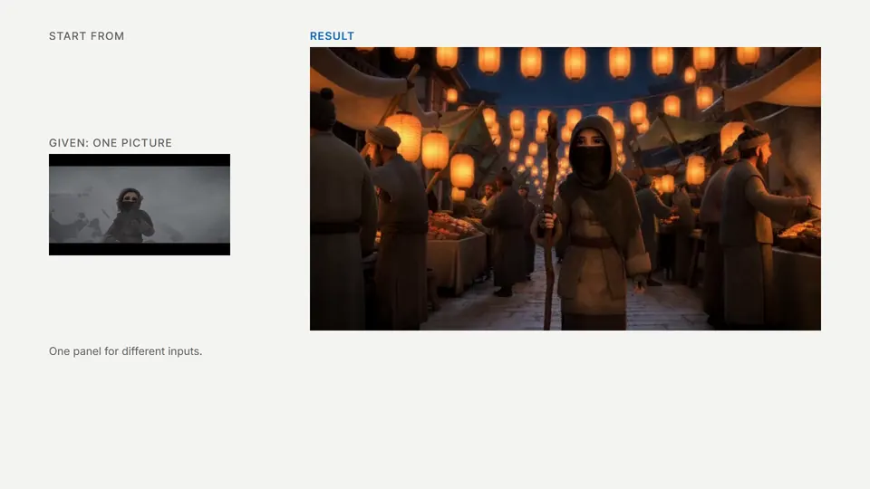

# Gacha Director

**MiniMax H3 的导演台。** ComfyUI 自定义节点：一个画布节点打开分页面板，统一支持文生视频、图生视频、首尾帧、多关键帧、续写、参考生成和视频编辑。

名字里的 Gacha 就是抽卡：一次生成 N 条候选，每个镜头挑一条，再合成一条成片，像十连抽。

[English](README.md) | [日本語](README_JA.md) | 中文

[](https://github.com/excifroge/ComfyUI-GachaDirector/releases/download/v2.1.0/GachaDirector_reel.mp4)

**用户友好的界面，一站式制作方案。** 主要面向 **Edit + 多镜头 Gacha Generate**：在剪辑页组织镜头内容和素材，在生成页批量生成候选、逐镜头选片并合成成片。适用于大批量迭代调优和批量出片。

带声音的视频：[功能演示（70 秒）](https://github.com/excifroge/ComfyUI-GachaDirector/releases/download/v2.1.0/GachaDirector_reel.mp4) · [用它做的宣传片（15 秒）](https://github.com/excifroge/ComfyUI-GachaDirector/releases/download/v2.1.0/GachaDirector_promo.mp4)。文中动图为无声预览。

> [!NOTE]
> **AI-Friendly**：仓库根目录的 [AGENTS.md](AGENTS.md) 是给你的 AI 的交接文档，供它理解、解释和修改项目。

<details>
<summary>目录</summary>

- [它解决什么问题](#它解决什么问题)
- [覆盖的用法](#覆盖的用法)
  - [样片](#样片)
  - [用它做的：十五秒宣传片](#用它做的十五秒宣传片)
- [安装](#安装)
- [快速开始](#快速开始)
  - [一个完整的例子：把一段实拍改成雪天](#一个完整的例子把一段实拍改成雪天)
- [节点](#节点)
- [面板](#面板)
  - [项目页](#项目页)
  - [剪辑页](#剪辑页)
  - [生成页](#生成页)
  - [后期页](#后期页)
  - [输出页](#输出页)
- [时间格](#时间格)
- [提示词是怎么拼出来的](#提示词是怎么拼出来的)
- [在节点外面接的东西](#在节点外面接的东西)
- [实测数据](#实测数据)
- [已知限制](#已知限制)
- [开发与测试](#开发与测试)
- [致谢与许可](#致谢与许可)

</details>


## 它解决什么问题

MiniMax H3 的官方模板按用途提供不同的节点图。切换用法需要换图；比较种子、统计设置耗时、从两条结果各取一段，都需要自行搭建。

Gacha Director 将这些工作统一到一个节点，按五项功能组织：

- **分页的工作台。** 按剪辑软件的工作顺序分页：项目 → 剪辑 → 生成 → 后期 → 输出。
- **按镜头组织素材。** 每张卡片包含镜头内容及所用的图片、视频和声音。生成时自动编号并向模型声明，无需手写。
- **会记账的运行预设。** 用命名预设管理每次运行的计算成本。内置三套：`Draft`（草稿）、`Standard`（标准）、`Final`（成品），各自按片长记录实测耗时。
- **候选 → 选片 → 成片。** 一次排队生成 N 条整片候选，逐镜头选一条，再按"合成"。全选同一条时原样输出；切镜处换候选直接剪接，不重新生成；长镜头内换候选只重画接缝。
- **蒙太奇还是长镜头，由你定。** 在剪辑页设置切镜或连续，生成提示词和成片接法都遵循此设置。切镜处的声音可独立设置为随画面切换或延续前一条候选。

面板使用直观的单位和描述：分辨率为宽 × 高，长度为秒，图片可指定为"这个镜头的首帧"。模型所需的标签、声明、像素预算和经调度换算的 denoise 由面板计算。

节点不重写采样逻辑。运行时展开为 ComfyUI 官方节点，由其条件节点、采样器和 VAE 执行。

## 覆盖的用法

H3 的"模式"由多种机制组合而成。Gacha Director 按素材及其**用途**决定用法，无需选择模式。镜头卡片的只读标签（文生视频、首尾帧、参考生成……）显示当前组合。

| 你放了什么（素材 · 用途） | 得到的用法 | 模型 | 展开出的官方节点 |
|---|---|---|---|
| 只有文字 | 文生视频 | fl2va | `MiniMaxH3ImageToVideo` |
| 第一个镜头的图片 ·「首帧」 | 图生视频 | fl2va | 同上，接 `first_frame` |
| 再加最后一个镜头的图片 ·「尾帧」 | 首尾帧 | fl2va | 同上，接 `first_frame` / `last_frame` |
| 只有尾帧 | 尾帧生成 | fl2va | 同上，接 `last_frame` |
| 图片 ·「中间帧」，或中间镜头的首帧、尾帧 | 多关键帧 | 两个都行 | `MiniMaxH3AddGuide` 串联 |
| 视频 ·「视频续写」 | 续写 | 两个都行 | `MiniMaxH3AddGuide` |
| 图片 ·「主体参考」 | 参考生成 | ref2va | `MiniMaxH3ReferenceToVideo` |
| 视频 ·「动作运镜参考」，声音 ·「角色声音」「声音参考」 | 动作、镜头、声线、配乐参考 | ref2va | 同上 |
| 声音 ·「镜头原声」 | 把一段声音原样放进成片 | 两个都行 | `MiniMaxH3AddGuide` |
| 镜头描述里单独一行的对白（`@名字 says: …`） | 对白：角色开口说这句话 | 两个都行 | 不加节点，对白写进提示词 |
| 源视频 ·「视频编辑」 | 视频编辑（官方做法） | ref2va | 同上，源视频是 `<Video 1>` |
| 源视频 ·「视频续写」 | 从这段参考的结尾往下接 | ref2va | 同上 |
| 源视频 ·「原画面重画」 | 低强度重绘 / 局部重画 | 两个都行 | `VAEEncode` + `LTXVConcatAVLatent`；只重画一部分时再加 `SetLatentNoiseMask` |

用法可以组合，例如源视频编辑叠加主体参考和尾帧。

剪辑页「片段」的"起始方案"按钮用于快速设置这些组合。选择后替换现有素材，保留提示词；被替换素材的 @ 引用变为普通名字文字。片长和宽高比保持不变，只有"视频编辑"会跟随源视频比例，并设置为源视频内最长的合法片长（最多 362 帧）。例如 120 帧源视频对应 107 帧片长，余下 13 帧不用；时间线上方显示余量。覆盖整段需改为 124 帧，代价见[剪辑页](#剪辑页)的源视频一节。此操作可撤销。



### 样片

每行对应一种用法：`Standard` 预设（标准模型、20 步、864×480），种子均为 7，每种只运行一次、未筛选，等间隔取 6 帧。


同样六条成片放在一起播放的样子（降到了 12 fps）：


"参考式续写"和"ControlNet"使用[下面例子](#一个完整的例子把一段实拍改成雪天)的源视频：前者从最后一帧续写，后者使用轮廓，由提示词决定画面。视频编辑样片见该例。

### 用它做的：十五秒宣传片

四个镜头，各从一张蜡笔关键帧开始。老虎机的转轮停在这条片子自己的画面上。

[](https://github.com/excifroge/ComfyUI-GachaDirector/releases/download/v2.1.0/GachaDirector_promo.mp4)

后期加的只有特写里转轮上的小画面。其余连同声音都是模型生成的原样。开头那一声是交给模型的录音。

## 安装

需要 ComfyUI **0.39 或更新**（用到了 `MiniMaxH3AddGuide`、H3 的噪声遮罩和 `LTXVConcatAVLatent` 对 H3 的支持）。

1. 把本仓库放进 `ComfyUI/custom_nodes/ComfyUI-GachaDirector`。
   ```bash
   cd ComfyUI/custom_nodes
   git clone https://github.com/excifroge/ComfyUI-GachaDirector
   ```
2. 重启 ComfyUI。日志里出现 `Gacha Director v2.1.0: 10 nodes registered` 就是装好了。

无额外 pip 依赖，也不依赖其他自定义节点包。模型文件按 [ComfyUI 官方教程](https://docs.comfy.org/tutorials/video/minimax/minimax-h3) 准备。首次人脸精修时，ComfyUI 自带的 kornia 自动下载约 400 KB 的人脸检测权重。

## 快速开始

`example_workflows/` 提供两个节点和连线相同、模型不同的工作流，各含起步提示词：

| 工作流 | 模型 | 适合 |
|---|---|---|
| `GachaDirector_Base.json` | fl2va | 文生、图生、首尾帧、多关键帧、续写 |
| `GachaDirector_Reference.json` | ref2va | 参考生成、视频编辑、多关键帧、续写 |

打开任一工作流，为四个加载器和加速 LoRA 加载器指定模型文件，然后：

1. 点节点上的 **打开 Gacha Director**。
2. 在**剪辑**页写每个镜头里发生什么；需要素材就点镜头卡片右边的"+ 图片 / + 视频 / + 声音"，或者用「片段」里"起始方案"后面的按钮。
3. 在**项目**页选预设（`Draft` / `Standard` / `Final`），查看画面大小和预计耗时。
4. 在**生成**页点"生成 N 个候选"（N 在项目页的"每批候选数"里设），或者直接用 ComfyUI 自己的运行按钮跑一条。

> [!IMPORTANT]
> `Draft` 使用节点的 `model_turbo` 输入。示例工作流已连接经加速 LoRA 处理的模型。没有该 LoRA 时，删除其加载器（`model_turbo` 留空），并停用 `Draft`，或将其模型改为「标准模型」。


### 一个完整的例子：把一段实拍改成雪天

源视频为开放电影《Tears of Steel》中桥上两人对话的 124 帧实拍。目标是保留人物、动作和运镜，将季节改为下雪的冬天。

1. 打开 `GachaDirector_Reference.json`，点节点上的**打开 Gacha Director**。
2. 在**剪辑**页「片段」中点"起始方案"后的"视频编辑"，选择源视频。片长变为 124 帧，宽高比跟随源视频；"源视频用途"默认为"视频编辑"，「原画面重画」关闭，保持默认即可。
3. 填四处文字。要改成什么写在镜头里，要留住什么写在源视频的"保留与修改"里：

   | 位置 | 内容 |
   |---|---|
   | 整体描述 | `The target video is live-action film footage in heavy snowfall.` |
   | 镜头内容 | `The scene of <Video 1> now takes place in deep winter: thick snow is falling, the trees are bare and white, snow lies on the bridge railing, the street and the rooftops, and the light is cold and blue. The two people, their clothes, their movements and the camera are the same as in <Video 1>.` |
   | 源视频「更多设置」里的"保留与修改" | `the people, their motion and timing, the camera and the composition of <Video 1> are kept; only the season and the weather change` |
   | 环境声 | `Muffled winter air, soft wind, snow hissing on stone.` |

   编辑用源视频在提示词中为 `<Video 1>`，可直接引用。"片段概述"可留空，生成类型和"目标视频是 `<Video 1>` 的编辑版"会自动添加。
4. 点"最终提示词"，看到的就是实际送进模型的文本：

   ```text
   subject_definitions:
   <Video 1> is the source video for the target video edit.

   summary: [video editing] The target video is an edited version of <Video 1>.

   retention_analysis:
   <Video 1> (motion and camera work): fully_preserved - the people, their motion and timing, the camera and the composition of <Video 1> are kept; only the season and the weather change.

   detailed_description: The target video is live-action film footage in heavy snowfall. [Shot 1] The scene of <Video 1> now takes place in deep winter: thick snow is falling, the trees are bare and white, snow lies on the bridge railing, the street and the rooftops, and the light is cold and blue. The two people, their clothes, their movements and the camera are the same as in <Video 1>.

   overall_soundscape: Muffled winter air, soft wind, snow hissing on stone.

   non_diegetic_music: N/A
   ```

5. 在**项目**页用 `Draft` 确认方向（4 步，约 2.5 分钟），再用 `Standard`（20 步、864×480，约 12.5 分钟）。耗时在单张 24 GB 显存显卡上测得。


动起来的对照（左：源视频；右：成片）：


## 节点


**输入**

| 名称 | 类型 | 说明 |
|---|---|---|
| `model` | MODEL | H3 的扩散模型。参考模型接 ref2va，基础模型接 fl2va。 |
| `clip` | CLIP | `CLIPLoader`，类型选 `minimax`。 |
| `vae` | VAE | H3 视频 VAE。 |
| `audio_vae` | VAE | H3 音频 VAE。 |
| `model_turbo` | MODEL，可选 | 同一个模型经过加速 LoRA 的版本（或者一个蒸馏模型）。预设的模型选"加速模型"时使用。 |
| `sampler` | SAMPLER，可选 | 接了就覆盖预设里的采样器。 |
| `sigmas` | SIGMAS，可选 | 接了就覆盖预设里的调度器和步数。 |

节点上仅有预设选择器、`seed`（含 ComfyUI 的"生成后控制"）、只读指标（画面大小、帧数、步数、当前预设和片长的实测耗时）及打开面板的按钮（旁有语言切换）。其余设置在面板中。

**输出**：`frames`、`audio`、`fps`、`frame_count`、`source_frames`、`latent`、`positive`、`model`、`prompt`（实际送进模型的提示词）、`run_report`（这次运行的摘要）。

## 面板

页面仅显示名称和数值。参数说明放在悬停提示中：鼠标停留在参数、按钮或标题上半秒后显示。

### 项目页


左侧预设列表显示当前片段的画面大小、步数和模型。右侧为所选预设，顶部显示**分辨率**（宽 × 高）、**帧率**（24 帧/秒，模型固定）、**长度**、**预计耗时**（当前预设和片长的实测平均）。

| 设置 | 说明 |
|---|---|
| 分辨率 | 按当前片段比例显示实际宽 × 高。预设存储像素量，片段决定宽高比，因此同一预设可用于横屏和竖屏。"标准"为官方模板尺寸（16:9 时 864×480），"原生"为训练尺寸（1344×768）。 |
| 分辨率 ·「自定义…」 | 直接输入宽高，例如正方形。尺寸须为 32 的倍数，否则显示最接近的实际尺寸（720 × 720 变为 736 × 736）。宽高须在 256 到 2048 像素内，否则标红且不可应用。自定义尺寸同时更新片段比例，此后切换档位保持该比例。 |
| 步数 | 官方默认 20；加速模型用 4 或 8。 |
| 模型 | 「标准模型」，或「加速模型（turbo）」（节点的 `model_turbo` 输入）。 |
| 每批候选数 | 生成页的生成按钮按一次排几条。 |
| 参考素材尺寸 | 设置参考视频缩小尺寸和是否缩小参考图片，仅影响参考模型速度，不改变成片分辨率。参考视频参与每一步计算，是使用视频参考时速度的主要影响因素。 |
| 高级 | 自定义像素量、引导强度（CFG）、采样器、调度器、调度偏移（画面 / 声音，默认 12 / 3）、省显存。官方默认是 CFG 1、`res_multistep` / `simple`。 |

下方为耗时记录。候选按**排队时**的预设和片长记录；等待期间刷新过页面则按执行开始时，ComfyUI 运行按钮则按**开始执行时**。运行中改过预设参数，该次不记录；修改参数默认清除旧记录。仅计节点自身耗时，不含模型加载、下游节点及其他导演台节点。合成和人脸精修属于不同任务，不计入预设耗时（同片段、同预设实测：合成约 128 秒，候选约 100 秒），以免影响生成耗时估计。

> [!NOTE]
> `Draft` 和 `Final` 不会生成同一条片子：尺寸改变会改变噪声，同种子也得到不同结果。`Draft` 用于确认提示词和素材方向，不用于选种子。

### 剪辑页


顶部为预览、时间线和播放条。时间线上方显示片长（秒、帧、帧率）、画面大小、步数、镜头数和当前素材对应的生成类型。下方依次为片段、共通素材、镜头。

**片段**
- **模型**：参考模型（ref2va）支持人物、视频和声音参考；基础模型（fl2va）的条件输入仅为文字及整段首尾帧。钉帧素材（中间帧图片、"视频续写"的视频、原样使用的声音）另行添加，两种模型均支持。素材与模型不匹配时页面会说明。
- **长度**：选 5 / 10 / 15 秒或直接输入秒数，自动对齐合法片长，旁边显示对应帧数。官方训练范围约为 5 到 15 秒（124 到 362 帧）；可输入更长值，但超出训练范围。
- **宽高比**：「源视频比例」，或指定比例。


**共通素材**：放置全镜头共用的素材。左侧为整体描述（风格和场景）、环境声、配乐、片段概述，右侧为图片、参考视频和声音，底部为源视频。单镜头素材放在对应卡片中。参考模型上限为每片 9 张图、3 段视频、3 段音频、共 12 个文件，顶部显示已用数量。

**镜头**：每段一张卡片，左侧写内容，右侧放图片、视频和声音，对应提示词的 `[Shot 1]`、`[Shot 2] At 00:02.833, …`，不单独生成。无内容且无专属主体或参考的镜头不进入提示词，也不计入编号。左侧导航按镜头长度分段，点击跳转。

每份素材包含缩略图、名字和**用途**，用途决定模型如何使用它：

| 素材 | 用途 | 含义 |
|---|---|---|
| 图片 | 主体参考 | 图里的人或物出现在画面里，只管长相，不固定在某一帧。带图片的主体是给参考模型看的；基础模型没有参考图通道，只用它的文字描述。 |
| | 首帧 / 尾帧 | 镜头从这张图开始 / 在这张图结束。 |
| | 中间帧 | 镜头里指定的那一帧变成这张图。 |
| | 分镜图（构图参考） | 只给模型看构图，不把画面固定成这张图（参考模型）。 |
| 视频 | 动作运镜参考 | 参考这段视频的动作和运镜（参考模型）。 |
| | 视频续写 | 取这段视频的一小段（5 / 22 / 39… 帧，可带声音）钉在镜头开头，模型从它后面接着生成。放在第一个镜头就是续写。 |
| 声音 | 角色声音 | 选中的主体用这个声音说话（参考模型）。 |
| | 声音参考 | 参考它的音色或曲风（参考模型）。 |
| | 镜头原声 | 这段声音从镜头开头原样进入成片。 |

素材行右侧三角打开"更多设置"：主体类别、描述、简称、多图，素材保留程度（完整保留、基本保留、特征迁移、弱参考）及视频取用范围等。

**素材库。** 顶栏右侧"素材库"在任何页面均可打开浮动窗口。支持拖动和缩放，换页时保持位置，位置与大小保存在浏览器中。


- **两大类**：*导入*是 ComfyUI 的 `input` 文件夹里的文件，*生成*是 `output` 文件夹里已经生成出来的文件（最新的在前）。两类都可以按图片 / 视频 / 声音筛选，按文件名搜索。
- **文件夹**：左侧可建文件夹和子文件夹，双击改名。拖入素材完成分类，拖到"未分类"移出。分类为虚拟文件夹，不移动或重命名硬盘文件，不影响其他工作流。分类清单存于 ComfyUI 用户数据，所有工作流共用。
- **使用素材**：拖到镜头素材栏供该镜头使用，或拖到共通素材栏供所有镜头使用。按 Ctrl 或 Shift 可多选拖动。"+ 图片 / + 视频 / + 声音"打开同一窗口并筛选适用类型，点击素材即可添加。
- **从电脑导入**：点"从电脑导入…"或将文件拖入窗口，素材归入当前文件夹。也可直接拖到镜头素材栏、共通素材栏或源视频栏（视频成为源视频）。文件通过 ComfyUI 上传机制复制到 `input`，重名时为新文件改名。拖到面板其他位置无效，也不会传到后方画布。

"视频续写"可从素材库选择已生成的成片。该配方将视频末尾 22 帧钉在首镜头的前 22 帧（接近原片，但不逐像素相同），因此 124 帧新片含 102 帧（4.25 秒）新内容。拼接时剪掉重叠的 22 帧。


**蒙太奇还是长镜头：画面和声音各一枚链接。** 卡片间两枚链条设置下方镜头如何衔接上方镜头：左侧为画面，右侧为声音。连上亮、断开暗，点击切换。

画面：
- *断开 = 切镜（蒙太奇）*：切到另一个镜头。提示词里它是新的一段 `[Shot N] At 时间`。
- *连上 = 连续（长镜头）*：同一镜头不切开，分段仅用于分别描述和选片。连续段合为一个 `[Shot]`，内容按顺序组成一段，对白仍单独成行。官方格式只能指定切镜时间，不能指定镜头内事件的秒数；长镜头按文字顺序发生，具体时间由模型决定。

声音（只在切镜处有意义）：
- *断开 = 随画面切换*：切镜之后用新画面所选候选的声音。这是默认。
- *连上 = 延续*：切镜后延续前一条候选的声音，仅画面换候选。连续链接多处时，始终沿用最早一条的声音。
- 画面连上（长镜头）时，声音一定跟着画面连续，这枚链接显示为连上并锁住。

声音链接仅决定成片各帧的声音来源，不改变生成或画面切点；候选仍包含整段画面和声音。切镜两侧选择**不同**候选时才有可听见的区别。

新增分段点在从零生成时默认为切镜，有源视频时默认为连续。时间线以实心菱形表示切镜，空心菱形加横线表示长镜头内分段。左侧导航以虚线表示接续前段的镜头。

旧工作流缺少这两项设置：有源视频时按长镜头处理，保留原有接缝重画行为；从零生成时按切镜处理。声音仍随画面切换。


**不用手写编号。** 素材编号（`<Subject 1>`、`<Picture 2>`、`<Video 1>`……）及首帧归属等声明在生成时自动完成。输入 `@` 后从列表选择素材，镜头专属素材优先，可用上下键和回车；也可点素材行的 `@` 将名字插入光标处。改名、换用途或移除素材会同步更新提示词。镜头中未点名的主体、参考视频和声音参考会自动补充出场说明；首尾帧图片有专用声明，角色声音随主体声明。"最终提示词"显示全文，内容改变后自动刷新。

钉帧素材随镜头移动：「首帧」始终对应镜头开头。插入或删除分段点时，素材保持原帧位置。时间线标记只读。

**源视频**（可选，共通素材底部）：整段底片，可选输入目录文件或已生成的成片。"源视频用途"有四种：
- *视频编辑*（参考模型，默认）：官方的视频编辑做法，模型把它看作 `<Video 1>`。
- *视频续写* / *动作运镜参考*：同样作为 `<Video 1>` 送进去，角色不同。送进去的是源视频从起始帧开始、和片段一样长的那一段；想从别处接，就在"更多设置"里改起始帧。
- *原画面重画*：只把它当作起步的画面。

"更多设置"中的「原画面重画」在源画面上加噪并重画，基础模型只有这一种源视频用法。"改动幅度"旁显示换算后的起始噪声比例（见[实测数据](#实测数据)）；保留构图需明显低于 100%。局部重画须启用此项。

源视频从起始帧算起不足片长时，以末帧补齐，成片末尾也会停住（实测短 4 帧，最后约 6 帧逐渐停下）。

> [!NOTE]
> 视频编辑无需「原画面重画」。实测仅将源视频用于编辑、从空白生成，已能保留构图、运动和运镜；启用原画面重画（改动幅度 0.85）几乎得到同一条片子，但更慢。

**局部重画**（开了「原画面重画」时才出现）：选择哪些[格](#时间格)重新生成，其余的保持原样。源视频有音轨时，保持原样的格连声音一起保留。

**对白**：H3 同时生成画面和声音，角色可以开口说话。在镜头的描述里，把一句对白单独写成一行：

```text
@girl pulls down her scarf and looks straight at the camera.
@girl says quietly: I have been looking for you.
```

`@girl` 指名为 girl 的主体，可有或无图片；无所属主体的声音写为 `@voice(a warm elderly male voice) says cheerfully: Good morning!`。冒号前为说话方式，后为台词。默认英语，其他语言在 `@girl` 或 `@voice(…)` 后加 `[Japanese]` 等标记。模型收到官方格式：`<Subject 1> (S1) says quietly, <d>[English] I have been looking for you.</d>`；有图片用 `<Subject 1>`，纯文字主体用描述或简称，同一说话人跨镜头保留 `(S1)`。`@girl says "…"` 缺少冒号，不识别为对白，"最终提示词"会提醒。指定声线时，添加声音并选"角色声音"及对应主体；音频只作声线参考，台词仍由提示词决定。

**高级**（页面最下面，折叠着）：
- *提示词格式*：结构化（按官方格式拼，见[提示词是怎么拼出来的](#提示词是怎么拼出来的)）或自由文本（原样发送，用 LoRA 触发词或者自己手写完整提示词时用；这时各镜头的描述不发送，素材名也不会被替换）。
- *负面提示词*：只有预设的引导强度（CFG）不等于 1 时才生效。官方模板都是 CFG 1，没有负面分支。

### 生成页


顶部**剪辑预览**按选片顺序播放，不经过模型。未选镜头显示"镜头 N · 未选用"，按镜头长度留空；长镜头内换候选显示为硬切，合成时才生成过渡。已有有效成片（执行过"合成"，选片和接缝设置未再改变）时直接播放成片。时间线红线跟随播放，拖动标尺定位预览，点击镜头跳转到其候选。声音默认关闭，♪ 开关由所有播放器共用；开启后各预览段播放对应候选的声音。


**过渡带。** 长镜头内相邻段选择不同候选时，时间线下方显示接缝范围条。合成仅重画条内范围，其余画面沿用选片。
- 默认**自动**：从接缝前至所在格末尾，目标至少 12 帧，实际为 12 到 21 帧，取决于格内位置。接缝在格线上时只重画前 12 帧，后方候选不重画；靠近片头或长镜头边界时更短。格线的意义见[时间格](#时间格)。
- 拖两端设范围，吸附细线（latent 帧边界，每格 5 条，间隔为 1 帧及 4 个 4 帧）；长线为格线。条旁显示前后各重画多少帧。
- 橙色提示范围不稳妥：少于 12 帧，或右端不在格线（后方紧邻的 1–2 帧保留画面有可测变化）。仍可合成。
- 双击条恢复自动。范围不会越出这段长镜头；被长镜头的边界截短时，提示里会说明。
- "两候选相似度 N dB"为接缝前后各 8 帧的 PSNR（缩小画面测量）。约 22 dB 以下标红，提示差异较大、修复可能失败；阈值未经校准，只作提示（见[实测数据](#实测数据)）。
- 两处接缝的范围叠在一起时，点接缝上方的小三角，把它的那一条放到最前。
- 在旧工作流里已经存在的接缝保持原来的做法（接缝两侧各重画一整格），直到你拖动或双击它。

1. **生成 N 个候选**：排队生成 N 条整片，种子递增。"每批候选数"可在按钮旁修改，与项目页预设共用。顶部显示实时预览，可随时中断。仅运行本节点及下游输出节点，不运行其他导演台和无关保存节点。
2. **选片**：各镜头左侧为播放器，右侧为候选池，每镜头选一条。点击卡片播放；播放器下可"全部镜头选用"或删除候选（从所有镜头移除，输出文件保留）。卡片自动换行，池内纵向滚动；各镜头的"候选预览尺寸"独立调节，最小为列表。播放区间按候选的实际入点和出点，不按请求帧号截取（切点偏移见[实测数据](#实测数据)）。静止卡片显示中间帧，悬停从镜头开头播放。左侧导航每格对应一个镜头，按片长分配高度，颜色表示已选用 / 有候选 / 没有，红线对应时间线位置；随窗口高度缩放，点击跳转。
3. **成片**：所有镜头选片后显示"合成"，执行后生成独立成片文件，列入输出页，并显示"查看输出"。按选片分三种处理：
   - 全选同一条 → 不经过模型，仅重新编码一次，两三秒输出成片。
   - 仅切镜处换候选 → 直接剪接，几秒完成。按各候选**实际**切点接合：前镜头候选切得更早时，去掉两边均不属于的中间帧，成片略短；反之在双方都允许的帧接合，长度不变。完成后显示实际长度，"接合记录"列出切点处理。声音默认随画面切换；声音链接启用时沿用切镜前候选，记录为 `the sound stays with …`。
   - 长镜头内换候选 → 按过渡带范围重画接缝，其他画面和声音沿用选片，只经过一次编解码（见[已知限制](#已知限制)）。范围不越出长镜头，也不碰各候选的实际切点。强度在[后期页](#后期页)设置，同次任务中的切镜仍直接剪接。

> [!NOTE]
> 候选不支持"只重新生成这一个镜头"。模型须计算整片，单镜头重算与新候选成本相同，还会将生成结果再次用于生成。重试应生成新候选；**源视频**的局部重画是另一种操作，见剪辑页"局部重画"。

蒙太奇可自由混用候选。长镜头内需要接缝处画面相近；过渡带读数衡量这一点。同源视频或相同首尾帧、中间帧通常能提供相近动作，但不保证。实测一对同源候选的光照和色调差异很大，所试范围和强度均未接上。无约束的文生视频各不相同，重画接缝也接不上，仍有跳变（见[实测数据](#实测数据)）。

候选记录生成时的片长和镜头划分。改片长后旧候选不可选；改切点或长镜头划分后仍可选，但会标记提醒：画面切点保留原位置，需新候选才能对应新划分。合成记录选片，选片变化后旧合成不再作为当前成片显示。

### 后期页

合成、人脸精修、预览和保存设置。


**合成**：列出需剪接的切镜、需重画的接缝及延续声音的切镜数量，可直接点"合成"；无接缝重画时不经过模型。有接缝时，"保留帧数"显示各镜头沿用候选的帧数，其余帧重新生成。两接缝间短分段可能被全部覆盖，标红"候选画面未保留"；长镜头容不下重画范围时也标红说明无法处理。以下两项仅用于长镜头接缝，全部为切镜时置灰：
- *过渡范围*：列出每个接缝前后各重画多少帧。范围本身在[生成页](#生成页)时间线下面的过渡带里拖动设置，这里只读。
- *接缝强度*：1（默认）从头重画；降低可保留更多原画面。一对相近候选重画两整格时，0.3 也能抹平接缝；自动范围 12 帧时，0.3 不如 1（见[实测数据](#实测数据)）。旁边显示起始噪声比例；外部 `sigmas` 接入时强度无效。


**人脸精修**：小脸像素不足，易模糊或变形。裁出成片主要人脸周围区域，放大重画后贴回；区域外像素不变，保留原成片及声音。前后版本并排同步播放、跳帧；点击画面同步放大到该位置，再点还原。
- *人脸参考主体*：选了素材里的人物，就会参考他 / 她的图片来重画（参考模型）。
- *精修镜头*：默认「自动（脸约 24–80 像素的镜头）」。更小的脸容不下细节，更大的脸已清楚，重画会换脸。点击编号可忽略大小，仅处理所选镜头。无脸镜头保持原样；无符合镜头时运行失败，页面列出各镜头跳过原因。
- *重画强度*：默认 85%。这个模型在 70% 以下几乎原样还原，所以这个数比直觉高得多（见[实测数据](#实测数据)）。
- 较长一段找不到人脸时（人物转过头去或走出画面），这段不会被贴回；几帧的短暂漏检会被桥接，照常贴回，人脸重新出现后接着处理。
- 每镜头仅处理出现最久的一张脸，不同镜头可选中不同人物。"人脸参考主体"仅决定参考图片，不参与选脸；多人片段应在"精修镜头"中仅保留目标人物为主的镜头。
- 用的是当前预设：脸的周围按预设的像素量生成一个正方形区域（`Standard` 是 640×640）。一次精修的耗时和生成一条片子差不多。

**实时预览**和**保存**（文件名前缀、文件格式、视频编码）对这个节点的每一次运行生效，不属于某一套预设。

### 输出页

输出页列出 ComfyUI 最近 40 条历史中的本片段结果：普通运行、合成和人脸精修，附运行报告及当时的提示词。仅剪接、未重画的成片标为"剪接"，不显示步数或种子。候选仅列于生成页。素材、提示词或重画范围改变后，旧结果标为"片段已在生成后改变，此结果与当前内容不符。"；仅改预设或种子不算。人脸精修不在此标记，由后期页判断最新结果是否匹配。合成在此不比较重画范围，选片或接缝变化由生成页标记过期。

## 时间格

H3 的视频 VAE 从第 0 帧起每 17 帧独立编码一块，剩下的 5 帧在片尾。所以一条 124 帧的片子是 7 个 17 帧的格（0–16、17–33……102–118）加上末尾 1 个 5 帧的格（119–123）。

一格在 latent 里是 5 帧：格的第一帧单独占一个，后面 16 帧每 4 帧一个（末尾的短格是 1 + 4 帧，占两个）。遮罩是按 latent 帧做的，所以**能单独保留或重画的最小单位是一个 latent 帧（4 帧；每格开头的那一个只有 1 帧），不是一格**。

编码逐格独立，格内采用因果关系：后面的 latent 帧依赖本格前方画面，与后格无关。实测建议**重画的范围最好在格线上结束**（见[实测数据](#实测数据)）。在格中结束时，后方保留 latent 帧依赖已被替换的画面，与新画面不匹配：所测一对候选中，紧邻 1–2 帧比原候选差 3–5 dB；伸入下一格 1 帧时修复失败。起点无此限制。解码不受格界约束，一次读取 7 个 latent 帧，窗口间混合 5 帧。"保留"仅指不重新生成，不是像素不变；范围附近保留帧两次运行的相似度约 38 dB，差别不可见。

时间线上的格条（"所选格"用）按整格选；它只在片段是"原画面重画"时才显示，因为只有那时才有"保持原样"可选（从零生成的片段每一格都是重画）。长镜头内接缝的重画范围按 latent 帧选，见[生成页](#生成页)的过渡带。蒙太奇的切点和格没有关系：那里不重画。

## 提示词是怎么拼出来的

结构化格式按 MiniMax 官方的两份提示词写作指南来拼：

- **基础模型**：三个字段 `integrated_multimodal_description` / `overall_soundscape` / `non_diegetic_music`；有首帧、尾帧或首尾帧时，前面加官方固定的图片对齐句。
- **参考模型，有素材要声明时**：六段 `subject_definitions` / `summary` / `retention_analysis` / `detailed_description` / `overall_soundscape` / `non_diegetic_music`。`summary` 的任务类型（`reference generation`、`video editing`、`video continuation`、`keyframe completion`、`audio reuse`、`audio reference`）按素材角色自动确定，后续一两句"片段概述"手写。源视频编辑或续写自动添加官方开头，可留空；自动补充后仍为空时，"最终提示词"会提醒。
- **参考模型，没有任何要声明的素材时**：和基础模型一样是三个字段。

空字段省略，配乐例外：留空时写 `non_diegetic_music: N/A`。未填环境声则省略 `overall_soundscape`，"最终提示词"会提醒官方指南要求此项。

**编号是自动的，规则如下。** 带图主体按列表顺序编号为 `<Subject 1>`、`<Subject 2>`……；其图片先占 `<Picture N>`，再按时间排列首帧、尾帧、中间帧和分镜图。视频按列表顺序，编辑、续写或动作参考的源视频为 `<Video 1>`。音频先排已启用的参考视频音轨，再排独立声音。`@名字` 换为编号，纯文字主体不占编号，换为描述。基础模型只有主体可点名，只能看见整段首尾帧；其他图片钉帧，但不写入提示词。

这部分由同捆的上游规划器完成（见 [NOTICE](NOTICE)）。

参考上限为 9 张图、3 段视频（共 15 秒以内）、3 段音频（含参考视频音轨）、共 12 个文件，最多 9 个主体（含纯文字）。超量时页面说明并拒绝运行。时长在读文件后，于"最终提示词"和执行开始时检查：参考视频（含源视频）取片段长度内、最多 15 秒，超长则截短并提醒；实际总长超过 15 秒则拒绝。不会静默丢弃素材，以免后续编号错位。

## 在节点外面接的东西

节点不加载模型，由上游加载器通过 `MODEL` 输入传入。模型补丁接在 `model` / `model_turbo` 上游，无需面板设置：

- **LoRA、加速 LoRA**：`LoraLoaderModelOnly`。
- **Fun ControlNet Union**（官方的结构控制 / 局部重绘路线）：`ModelPatchLoader` + `Apply MiniMax H3 Fun ControlNet`，把它的输出接到 `model`（用 `Draft` 预设的话 `model_turbo` 那一路也要接）。控制视频请准备成 24 fps、从片段的第一帧开始；补丁会自己把它适配到片段的长度和画面大小。
- **FastH3**（FastVideo 的 8 步蒸馏模型）：`UNETLoader` → `ModelAttentionBackend` → `BlockSparseAttention`，接到 `model`，预设里把步数设为 8、调度偏移设为 10 / 3。

## 实测数据

以下为开发测试数据（ComfyUI 0.39.0），说明行为，不作性能承诺。

测量方法：PSNR 逐帧计算后取平均；"帧间变化"为相邻帧像素绝对差均值。接缝数据用 `tests/measure_seam.py`（两条候选、合成片、接缝帧号），时间格独立性用 `tests/measure_vae_cells.py`。除注明外均为草稿设置（加速 LoRA、672×384 级别、124 帧），每个数值一次运行，无多种子统计。

**"改动幅度"不是线性的。** 模型的调度带偏移（shift）。用面板自己的调度时，偏移为 s、改动幅度（denoise）为 d，起步时的噪声比例是 s·d / (1 + (s−1)·d)（接了外部 `sigmas` 的话，改动幅度不起作用，起点由你给的 sigma 决定；这时面板不显示这个百分比，运行报告里写的是 `external sigmas`）：

| 改动幅度（偏移 12） | 起始噪声 |
|---|---|
| 0.85 | 98.6% |
| 0.70 | 96.6% |
| 0.30 | 83.7% |
| 0.15 | 67.9% |
| 0.05 | 38.7% |

保留原片需将改动幅度设得明显低于直觉，旁边显示的百分比可供参考；人脸精修「重画强度」直接输入噪声百分比。基础模型实测：0.7 变为另一条片子；0.3 保留构图和运动，重画细节；0.15 接近原片。

**同一个种子不保证得到同一条片子。** 官方模板连续运行两次，逐帧 PSNR 为 19–20 dB，与 Gacha Director 和模板之间的差异同量级。需要保留结果时应保存文件。

**长镜头内的接缝重画（共用源视频的候选）。** 两条共用源视频的候选在格边界处拼接：直接硬切，接缝处的帧间变化是平时的 1.7 倍；接缝重画后回到平时水平。保持原样的格与所选候选相差 31–34 dB（VAE 编解码一个来回的损耗）。把重画强度从 1 调到 0.3，接缝同样被抹平，而重画的那几格更接近所选的候选。

**模型落切点不准，所以切镜按实际切点剪接。** 提示词里的切点是一个时间（`[Shot 2] At 00:02.833`），模型并不逐帧执行。两个镜头、124 帧的 8 条文生视频里，硬切正好落在要求那一帧的有 4 条，晚 1 帧的 3 条，早 1 帧的 1 条。镜头多、片子长时偏得更多：四个镜头、243 帧（约 10 秒）的 8 条草稿候选，要求的切点是第 61、122、183 帧，第一个切点晚了 0–3 帧，第二个早了 4–8 帧，第三个早了 1–9 帧；同一段用 `Standard` 预设跑了一条，三个切点分别早了 2、11、13 帧，所以这不是草稿预设的问题；三个镜头、362 帧（15 秒）的一条草稿，两个切点早了 6 帧和 18 帧。在每个切镜的开头写上 "The shot cuts."，或者照官方示例写成 "the camera cuts to …"（那 8 条里的前 4 个种子各跑一遍），切点没有更准：后两个切点仍然早 1–8 帧，不写时是早 1–9 帧。所以面板不替你加这类措辞。

用那 8 条里的四条给四个镜头各配一条不同的候选，三种接法：

| 接法 | 结果 |
|---|---|
| 按要求的帧号直接拼 | 6 次切换（应该是 3 次）：切点处夹了 3 帧、6 帧、3 帧别的镜头的画面 |
| 按两条候选各自实际的切点拼（面板现在的做法） | 正好 3 次硬切，没有夹杂帧；成片 240 帧，去掉了 3 帧两边都不属于的画面；不经过模型，冷启动的服务器上 5 秒 |
| 接缝重画（面板以前的做法） | 3 次切换，但 15 格里重画了 9 格，四个镜头选用的候选只留下 34、17、0、39 帧；切点被挪到第 62、130、194 帧；196 秒 |

找实际切点的办法：比的不是亮度，而是画面里明暗的分布——每一帧先去掉整体亮度、把对比度大体拉平（很暗、很平的画面不硬拉），再看它和前一帧有多不像（同一个画面约为 0，两个无关的画面约为 1）。这样闪电、爆炸把一个镜头打亮时变化很小，换了镜头才大。切点那一帧量出来是 0.28–1.21，是整条片子平时帧间变化的 4–800 倍（面板的门槛是 5 倍；全程剧烈运动的片子"平时的变化"本身就大，切镜可能还不到它的 5 倍，所以门槛最高只到 0.5）。另外要求切点两侧各 16 帧里，紧挨切点的 8 帧和再往外的 8 帧都至少有 6 帧和另一侧不一样，用来排除闪光和半秒以内的一阵亮光（它们过后画面会回到原样，切镜不会）。最后，切点前后各 4 帧作为两组来比：两组之间的差别要比各组内部的波动大一倍以上——闪烁的光、一直在进行的大动作过不了这一条。（靠近片头片尾，或紧挨着片段里设定的很短的镜头时，按能取到的帧算。）

换了三个更难的题材各测 4 条草稿。昏暗的铁匠铺（四个镜头里都是同一个人，连续两个特写，每条里还有两三处锤击、火花和工件快速出画，最大是平时变化的 34 倍）：12 个切点全部找对，离要求的帧 −2 到 +4 帧。雷暴夜景（闪电反复把画面打亮，暗镜头里还会照出原来看不见的景物，最大一次是平时变化的 105 倍）：12 个切点全部找对，包括一处闪电刚结束、紧接着一个叠化式切镜的地方。同一套雷暴片如果按亮度差来找（上一版的做法），12 个里只有 5 个准，其余偏 1 到 22 帧。高速动作（手持追逐、带运动模糊的脚步特写、爆炸、甩镜）：12 个切点全部找对。这类镜头里模型有时会在镜头内部自己跳一下（没让它切的地方），跳的幅度和真切镜一样大；两处变化差不多大（相差 15% 以内）时，取离要求的帧更近的那个——实测遇到两次，真切镜离要求的帧 1 帧和 4 帧，跳的那处离 7 帧和 17 帧。以上都是草稿尺寸；雷暴和动作两套再用 Standard 预设各出 2 条，12 个切点也全部找对。

模型给的不是硬切（叠化、甩镜）时可能找不到，那个切点就按要求的帧号接。

**长镜头不会被切开。** 四段 243 帧的片子，前三段设成一个长镜头、第四段是切镜（草稿预设，两个种子）：两条都只在第四段开头切了一次（比要求的晚 7 帧和 11 帧），前三段是一个不切的镜头，动作的先后按文字来。四段全设成一个长镜头的两条，整条没有切。也就是说，把连续的几段写成一个 `[Shot]` 是有效的；各段具体落在第几秒，面板控制不了。

**长镜头里换候选，候选不相近就接不上。** 上面那两条"一个长镜头"的候选是各不相同的两段视频（文生视频，不同的种子）。前一半用第一条、后一半用第二条，接缝在第 122 帧：重画强度 1 时，重画的那三格延续了第一条的画面，跳变被挪到重画范围的末尾（第 153 帧，帧间变化是平时的 25 倍）；强度 0.3 时两边各自保持原样，跳变留在第 122 帧。两种都没接上。这一步只对本来就相近的候选有用。

**过渡范围：重画多少帧、停在哪里。** 用 `tests/measure_seam_range.py` 在一对相近的候选上量的：[完整例子](#一个完整的例子把一段实拍改成雪天)里那条编辑的两个种子，草稿设置，124 帧，过渡带上的相似度读数约 33 dB。前 68 帧用第一条，之后用第二条，只改变重新生成的范围；强度都是 1。"跳变"是合成片在接缝附近最大的一次帧间变化，除以两条候选自己在那一帧的变化——候选自己的运动约为 1 倍，明显大于 1 才是接缝在跳。"保留帧的代价"是范围后面紧挨着的保留帧，比"什么都不重画、只过一次编解码"的同一帧离所选候选远了多少。第 68 帧正好在格线上。

| 重新生成的帧 | 帧数 | 跳变 | 保留帧的代价 |
|---|---|---|---|
| 不重画，直接硬切 | 0 | 3.0 倍 | – |
| 不重画，只过一次编解码 | 0 | 2.4 倍 | – |
| 64–67 | 4 | 1.6 倍 | 0.4 dB |
| 60–67 | 8 | 1.5 倍 | 0.5 dB |
| 56–67（自动范围） | 12 | 1.3 倍 | 0.0 dB |
| 52–67 | 16 | 1.4 倍 | 0.1 dB |
| 64–68（伸进下一格 1 帧） | 5 | 2.0 倍 | 4.5 dB |
| 56–68（伸进下一格 1 帧） | 13 | 2.1 倍 | 4.8 dB |
| 60–72（停在格中间） | 13 | 1.2 倍 | 3.6 dB |
| 56–76（停在格中间） | 21 | 1.1 倍 | 3.6 dB |
| 60–84（到下一格的末尾） | 25 | 1.1 倍 | 1.6 dB |
| 51–84（以前的做法：两侧各一整格） | 34 | 1.3 倍 | 1.6 dB |

表中结果：
- 范围在格线上结束（上面以 67 结尾的四行），后面的保留帧几乎没有代价（0–0.5 dB）；停在格中间是 3.6 dB；只伸进下一格 1 帧时跳变还在（2 倍）。把下一格整格也重画（60–84）跳变最小，代价是 1.6 dB，并且第二条候选多了 17 帧不是它自己的画面。
- 4 帧、8 帧也有用，但不如 12 帧；16 帧没有更好。自动范围的"至少 12 帧、停在格线上"就是按这张表定的。自动范围那一行另外换了两个种子（1.27 倍、1.25 倍，代价 0.4、0.1 dB），又把两条候选对调接了一次（1.18 倍，0.5 dB）。
- 同样的 12 帧，强度 0.3 是 1.5 倍，不如强度 1。
- 接缝在格中间（第 62 帧；硬切 4.4 倍，只过编解码 3.6 倍）：只重画它所在的那 4 帧（60–63）是 2.1 倍；56–67（12 帧，到这一格的末尾）是 1.3 倍，代价 0.9 dB；以前的做法（34–84，51 帧）是 1.4 倍，代价 1.9 dB。接缝在第 70 帧（刚进一格）：64–84（21 帧）是 1.3 倍，代价 1.6 dB。

结果仅限这一对候选，除注明外每个数值一次运行。12 帧是当前默认，不是普遍下限。接缝声音未测量。

**差异大的一对，试过的范围和强度都没有接上。** 另一对候选同样是一个源视频、一句提示词、两个种子，动作更大，而且两个种子把场景的光和色调做得很不一样：过渡带上的相似度读数约 19 dB。接缝同样在第 68 帧：硬切 2.1 倍，只过编解码 2.0 倍；停在格线上的 8、12、16 帧都是 2.0 倍，跳变原地不动；两侧共 13 帧是 1.8 倍；25 帧和 34 帧是 1.9 倍，跳变被挪到了范围的末尾（第 85 帧）；强度 0.3 配 25 帧、34 帧是 1.9 倍、1.8 倍，跳变留在接缝上。所以过渡带上才显示相似度。读数变红的界限（22 dB）只是夹在这两个实测点之间，没有校准：现在只知道约 33 dB 的这一对接上了，约 19 dB 的这一对没有。

**对白是照着说的。** 两条草稿生成：文生视频里一位老面包师说一句话；参考生成里同一个角色在两个镜头里各说一句。用本地的语音识别把成片的声音听写出来，三句话和提示词里写的一字不差，第二个镜头的那句也落在第二个镜头的时间里。声线参考也试了两次（一段偏高的声音、一段低沉的声音，各给同一个角色）：台词仍然一字不差，没有照搬参考音频里的话；成片里说话声的基频跟着参考走（参考 232 Hz → 成片 235 Hz；参考 131 Hz → 成片 142 Hz；不放参考的三条在 157–198 Hz）。音色听起来像不像，这里没有办法量。

**参考视频的尺寸决定速度。** 同样的画面大小和步数，参考视频短边 512 时每步约 15 秒，256 时约 6 秒。

**人脸精修对几十像素的脸有效，对更小和更大的脸没有用。** 一段 864×480 的全身远景（`Standard` 预设，124 帧，脸约 38 像素，中间有一段转头背对镜头），用同一套预设在四个强度下各精修一次：

| 重画强度 | 结果 |
|---|---|
| 50% | 和精修前几乎没有区别 |
| 70% | 糊成一团的五官被理顺了一些 |
| 85% | 眼睛、鼻子、嘴重画清楚，转头时的侧脸也干净；发型、头的朝向和光线没有变 |
| 93% | 脸最清楚，但头发和脸周围的背景也跟着变了 |

另一条 672×384 的草稿成片上有两种别的大小：远景里约 14 像素的脸，85% 下看不出五官上的收益，区域里别的东西（衣服的颜色）反而变了；特写里约 160 像素的脸，50% 下没有区别，85% 下被换成了另一张更写实的脸。所以自动模式只处理约 24–80 像素的脸：24 和 80 这两个界限本身没有逐点测过，是在"14 像素没用、38 像素有用、160 像素有害"这三个实测点之间取的。耗时：那段 124 帧的片子生成用了 359 秒，四次精修各 349–370 秒。

**整段再生成一遍：同尺寸没有用，放大有用但很贵。** 还是那段 864×480 的远景（各一条，起始噪声都是 85%）。按原尺寸再生成一遍（394 秒）：构图和动作没变，细节换了一批，脸和原来一样糊。先放大到 1344×768 再生成一遍（2035 秒，期间机器还在做别的）：构图和动作保住了，脸和衣服的细节明显清楚，但每一处细节都是重画的，和原片并不相同。作为对照，同一个种子直接按 1344×768 生成（1613 秒）得到的是另一条构图完全不同的片子。在这次对照里，保住构图的只有"先用小尺寸挑、再放大重画"这一种做法，代价是再付一次大尺寸生成的时间。

**人脸检测。** 检测器是 kornia 自带的 YuNet。按 RGB 通道顺序把画面喂给它时，远景里的小脸找不到，雪地上的岩石和云却被当成脸（得分 0.7）；换成它训练时用的 BGR 顺序之后，同一批画面里 14 像素的脸得分 0.9。在 8 条 4 个镜头的草稿候选上：特写镜头的脸在 89–93% 的帧里被找到；远景镜头的小脸有 4 条在 98% 以上的帧里被找到，另外 4 条在 2–48% 的帧里；没有人脸的两个镜头（一条龙）里，检测器在 0–36% 的帧里把龙头当成了脸。判断一个镜头有没有脸，看的是同一张脸出现的帧数够不够四成：那两个镜头在 8 条候选里都没有够，没有一个被误处理。

**不点名，模型也认素材；点名最稳。** 一个只属于第 2 个镜头的主体（一张狗的图片），三种写法各跑两个种子（草稿预设）：在镜头描述里用 `@名字` 点名；不点名，由面板自动补一句"它在这个镜头里"；既不点名、也不属于任何镜头，只在开头声明。六条成片的第 2 个镜头里都有狗。点名的两条都是一只和参考图一样的黑白花狗；自动补句的两条也是那只狗，其中一条多出了第二只动物；只声明的两条里一条毛色对，一条偏了。每种只有两条，说明不了比例，只能说明三种写法都起作用，想让模型分清"谁在做什么"就点名。


## 已知限制

- **钉住不等于逐像素不变。** 钉帧图片是条件约束；保留格仍经一次 VAE 编解码，接近原片但不是拷贝。
- **切点的时间是模型自己定的。** 双镜头短片通常偏差一帧内，镜头多、片长增加时可偏十几帧（见[实测数据](#实测数据)）。精确同步音乐等需求须多生成候选筛选，或分节点生成后在剪辑软件中拼接。
- **剪接成片可能比片段短几帧。** 前镜头候选切得更早时，删除两边均不属于的中间帧。生成页显示实际长度，人脸精修使用该长度。
- **剪接成片的声音在切镜处会有音量落差。** 候选整体音量不同。4 条候选组成的 10 秒片段，三个切点差为 +15、−9、−5 分贝，均由换源造成。面板不做响度匹配，逐镜头拉平会损失层次。可启用声音链接，整片沿用一条候选（同片三处全链接后为 −1、+18、−2 分贝；+18 来自该候选自身的声音事件，单听该候选同位置为 +15），或在剪辑软件中替换为连续音轨。延续声音来自另一候选，可能与口型和动作不同步，适合环境声和配乐，不适合对白。
- **找切点靠的是画面突变。** 叠化、甩镜或相似画面可能无法识别，回退到要求帧号，可能夹入其他镜头的帧。紧邻切点的闪电或爆炸仍可能引起数帧偏移（实测 12 处未出现）；纯黑到纯白等无内容画面的硬切无法识别。"接合记录"记为 `no cut found`，不支持手动指定切点。
- **长镜头里各段发生在第几秒不可控。** 官方的提示词格式没有镜头内的时间写法；面板只保证顺序。
- **长镜头里换候选，只对接缝处长得像的候选有用。** 共用源视频或首尾帧通常有帮助，但不保证（见[实测数据](#实测数据)）；差异大时应全段选同一候选。只改后半段可手动生成相近候选：剪辑页将所选候选作为源视频（文件列表含生成文件），「源视频用途」选「原画面重画」，「局部重画」范围选「所选格」，填写分段点之后的范围（如 `f122-242`，或点击格条），其余不变，再生成候选。草稿、两个种子实测从第 119 帧重画：前 119 帧与原候选一致（一次编解码，PSNR 38 dB），交界变化为平时 1.0 倍，无跳变；后段为不同新画面，无新增切镜，每条 163–175 秒（从零约 2 分钟）。各段选新候选即可；完成后清除源视频，范围改回「完整片段」。无一步操作按钮。自动接缝范围为 12 到 21 帧；范围过宽或旧工作流采用每侧整格（34 到 51 帧）时，短分段可能全部重画。
- **过渡范围是只看画面定的。** 接缝声音未测；相似度标红阈值约 22 dB，仅取两个实测点之间，未经校准，不表示低于阈值就无法接合。
- **Fun ControlNet 和 FastH3 没有做进面板**，接法见上文。
- **没有"整段精修"按钮。** 同尺寸再生成无收益；放大后重画有效，但成本等于大尺寸生成（见[实测数据](#实测数据)）。可手动将成片作为源视频，「源视频用途」选「原画面重画」，更多设置中改动幅度设 0.32（85% 起始噪声），改用大尺寸预设生成。
- **人脸精修的适用范围很窄。** 仅对中远景中几十像素的脸有效（见[实测数据](#实测数据)），耗时接近新生成。起始噪声过低无变化，过高会改变周围背景。
- **人脸精修每个镜头只处理一张脸**（出现最久者），不识别身份。"人脸参考主体"使所有处理镜头参考同一人物。检测覆盖须达四成，低覆盖通常为误检；动物或怪物也可能被识别，应在"精修镜头"中排除。
- 每节点对应一条片子（5 到 15 秒生成窗口）。更长内容用续写：下一节点添加视频，选"视频续写"，使用上一节点输出文件。
- 输出页读取 ComfyUI 历史；重启后历史与列表清空，输出文件保留。
- 实时预览和耗时仅跟随本浏览器页面排队的运行。其他浏览器或 API 运行无预览、不计时，但照常保存，普通运行列于输出页。生成中刷新页面或切换工作流标签后，预览稍后恢复（实测十几秒内），该次不计时。
- 仅实测 Windows 11、单张 24 GB 显存显卡；其他系统及更小显存未测。

## 开发与测试

```bash
# 在 ComfyUI 根目录下，用 ComfyUI 自己的 Python
python custom_nodes/ComfyUI-GachaDirector/tests/test_grid.py
python custom_nodes/ComfyUI-GachaDirector/tests/test_schema.py
python custom_nodes/ComfyUI-GachaDirector/tests/test_widget_order.py
python custom_nodes/ComfyUI-GachaDirector/tests/test_expand.py
python custom_nodes/ComfyUI-GachaDirector/tests/test_splice.py
```

面板通过 JavaScript 镜像规则，无需请求服务器即可显示格、尺寸和问题；对照测试检查两端一致。其他测试覆盖人脸跟踪与裁贴、跨候选切点规划（`test_cuts.py`；`test_splice.py` 测剪接节点的画面和声音处理）、运行归属判断、素材与提示词关系。后三条需 Node 20 以上，以下命令在节点包目录执行：

```bash
python tests/test_faces.py
python tests/test_cuts.py
python tests/make_parity_fixtures.py
node --experimental-default-type=module tests/parity.mjs
node --experimental-default-type=module tests/tracker.mjs
node --experimental-default-type=module tests/material.mjs
```

剪辑页流程测试使用无界面 Edge 或 Chrome，覆盖 `@` 输入、键盘选名、用途修改、改名、切点插入与合并、素材移除和最终提示词。须运行 ComfyUI，不执行生成：

```bash
node --experimental-websocket tests/shot.mjs tests/ui_edit_flow.mjs --lang zh
```

示例工作流是生成出来的：`python templates/make_workflows.py`。

`tests/measure_vae_cells.py`、`tests/measure_seam.py` 为[实测数据](#实测数据)的测量脚本，不是测试：前者需 H3 视频 VAE 文件，使用 CPU；后者仅需三条视频。

## 致谢与许可

Gacha Director 基于此前的 MiniMax H3 Director 项目开发。感谢各项目作者：

| 项目 | 许可证 | 本包从它那里得到的 |
|---|---|---|
| [ComfyUI-MiniMaxH3-Director](https://github.com/seesee75-commits/ComfyUI-MiniMaxH3-Director)，seesee75 及贡献者 | GPL-3.0 | 提示词规划器和实时预览，原样放在 `vendor/` 里；帧率对齐和参考视频尺寸的算法 |
| [ComfyUI-MiniMax-H3-Motion-Director](https://github.com/j955229/ComfyUI-MiniMax-H3-Motion-Director)，其贡献者 | GPL-3.0 | 节点上的启动按钮、全页覆盖层和页签栏。思路：分页面的流程、素材库、把镜头轨画成源视频的胶片条 |
| [ComfyUI_MiniMaxH3_Director](https://github.com/AIMixer/ComfyUI_MiniMaxH3_Director)，AIMixer | Apache-2.0 | 时间线的一部分：帧与像素的换算、标尺、切点标记 |
| [ComfyUI-MiniMaxH3-Director](https://github.com/Thefrizzy1/ComfyUI-MiniMaxH3-Director)，the_frizzy1 | Apache-2.0 | 扩展的骨架、DOM 辅助函数和显存交接。思路：在条件节点前面放一个纯粹的编译模块 |
| LTX Director，WhatDreamsCost | GPL-3.0 | 提示词规划器一脉的源头 |

帧网格和像素预算算法重述自 [ComfyUI](https://github.com/Comfy-Org/ComfyUI)（GPL-3.0）。文件来源及对应提交见 [NOTICE](NOTICE)。

**许可证：GPL-3.0。** 包含 GPL-3.0 代码，因此整包按该许可证发布；Apache-2.0 部分的许可证文本保留在 `LICENSES/`。

截图和样片使用开放电影《Sintel》（© Blender Foundation，CC BY 3.0，durian.blender.org）及《Tears of Steel》（(CC) Blender Foundation，CC BY 3.0，mango.blender.org；仅用画面，未用声音）的素材，其余由 MiniMax H3 生成。三语 README 使用各自语言的面板截图。
