# Gacha Director

**MiniMax H3 的导演台。** ComfyUI 自定义节点：画布上一个节点，点开是一个分页面板，文生视频、图生视频、首尾帧、多关键帧、续写、参考生成、视频编辑都在同一个面板里完成。

名字里的 Gacha 就是抽卡：一次生成 N 条候选，每个镜头挑一条，再合成一条成片，像十连抽。

[English](README.md) | [日本語](README_JA.md) | 中文

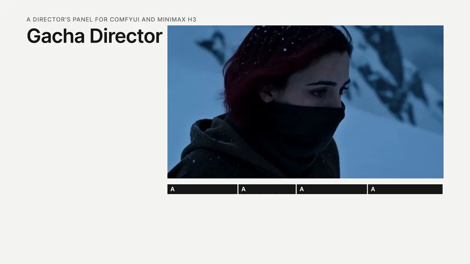

完整的功能演示（70 秒）和用它做的宣传片（15 秒）附在[最新的发布页](https://github.com/excifroge/ComfyUI-GachaDirector/releases/latest)。

> [!NOTE]
> **AI-Friendly**：仓库根目录的 [AGENTS.md](AGENTS.md) 是给你的 AI 看的交接文档。把它交给你自己的 AI，它就能讲清楚这个项目并动手修改。

<details>
<summary>目录</summary>

- [它解决什么问题](#它解决什么问题)
- [覆盖的用法](#覆盖的用法)
  - [样片](#样片)
- [安装](#安装)
- [快速开始](#快速开始)
  - [一个完整的例子：把一段实拍改成雪天](#一个完整的例子把一段实拍改成雪天)
- [节点](#节点)
- [面板](#面板)
  - [项目页](#项目页)
  - [剪辑页](#剪辑页)
  - [生成页](#生成页)
  - [后期页](#后期页)
  - [输出页](#输出页)
- [时间格](#时间格)
- [提示词是怎么拼出来的](#提示词是怎么拼出来的)
- [在节点外面接的东西](#在节点外面接的东西)
- [实测数据](#实测数据)
- [已知限制](#已知限制)
- [开发与测试](#开发与测试)
- [致谢与许可](#致谢与许可)

</details>

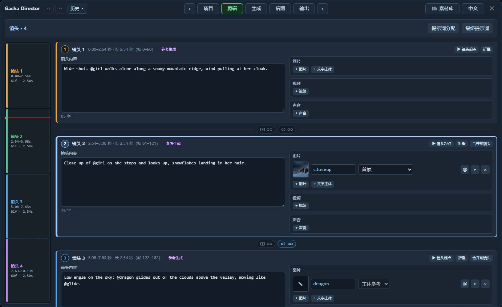

## 它解决什么问题

MiniMax H3 官方给了一组模板，每个模板是一张不同的节点图。换一种用法就要换一张图；想比较几个种子、想知道一档设置要跑多久、想把两条结果各取一段，都得自己搭。

Gacha Director 把这些收进一个节点，围绕五件事来组织：

- **分页的工作台。** 像剪辑软件那样按工作顺序分页：项目 → 剪辑 → 生成 → 后期 → 输出。
- **按镜头组织素材。** 每个镜头一张卡片：这个镜头里发生什么、用到哪些图片、视频和声音，都写在这张卡片上。素材的编号和对模型的声明在生成时自动完成，不用在提示词里手写。
- **会记账的运行预设。** 一套预设是"这一次愿意花多少"的一个命名答案。内置三套：`Draft`（草稿）、`Standard`（标准）、`Final`（成品）。每套预设记录自己的实测耗时，按片长分开统计。
- **候选 → 选片 → 成片。** 一次排队生成 N 条整片候选，每个镜头各选一条，然后按"合成"出成片。全选同一条，这条候选原样输出为成片；换候选的地方是切镜的，直接剪接，不重新生成；同一个长镜头里换候选的，只重画接缝。
- **蒙太奇还是长镜头，由你定。** 两个镜头之间是切过去，还是同一个镜头接着拍，在剪辑页设定。生成时怎么告诉模型、成片时怎么接，都跟着它走。切镜处的声音跟着画面换，还是延续切镜前的那一条，也在同一处单独设定。

面板上的说法尽量用人话：分辨率是宽 × 高，长度是秒，一张图是"这个镜头的首帧"。模型那边需要的东西（标签、声明、像素预算、被调度扭曲的 denoise）由面板换算。

节点本身不重写任何采样逻辑：运行时它把自己展开成一组 ComfyUI 官方节点，实际干活的是官方的条件节点、采样器和 VAE。

## 覆盖的用法

H3 的各种"模式"其实是几种机制的组合。Gacha Director 不让你选模式，而是让你往镜头里放素材并给每份素材选一个**用途**，用法由素材决定。镜头卡片上有一个只读的小标签（文生视频、首尾帧、参考生成……）告诉你现在的素材凑成了哪一种。

| 你放了什么（素材 · 用途） | 得到的用法 | 模型 | 展开出的官方节点 |
|---|---|---|---|
| 只有文字 | 文生视频 | fl2va | `MiniMaxH3ImageToVideo` |
| 第一个镜头的图片 ·「首帧」 | 图生视频 | fl2va | 同上，接 `first_frame` |
| 再加最后一个镜头的图片 ·「尾帧」 | 首尾帧 | fl2va | 同上，接 `first_frame` / `last_frame` |
| 只有尾帧 | 尾帧生成 | fl2va | 同上，接 `last_frame` |
| 图片 ·「中间帧」，或中间镜头的首帧、尾帧 | 多关键帧 | 两个都行 | `MiniMaxH3AddGuide` 串联 |
| 视频 ·「视频续写」 | 续写 | 两个都行 | `MiniMaxH3AddGuide` |
| 图片 ·「主体参考」 | 参考生成 | ref2va | `MiniMaxH3ReferenceToVideo` |
| 视频 ·「动作运镜参考」，声音 ·「角色声音」「声音参考」 | 动作、镜头、声线、配乐参考 | ref2va | 同上 |
| 声音 ·「镜头原声」 | 把一段声音原样放进成片 | 两个都行 | `MiniMaxH3AddGuide` |
| 镜头描述里单独一行的对白（`@名字 says: …`） | 对白：角色开口说这句话 | 两个都行 | 不加节点，对白写进提示词 |
| 源视频 ·「视频编辑」 | 视频编辑（官方做法） | ref2va | 同上，源视频是 `<Video 1>` |
| 源视频 ·「视频续写」 | 从这段参考的结尾往下接 | ref2va | 同上 |
| 源视频 ·「原画面重画」 | 低强度重绘 / 局部重画 | 两个都行 | `VAEEncode` + `LTXVConcatAVLatent`；只重画一部分时再加 `SetLatentNoiseMask` |

这些可以叠加：例如"源视频拿来修改，再加一个主体和一张尾帧"是合法的一条片子。

剪辑页「片段」里"起始方案"后面的一排按钮是这些组合的快捷入口。点一个，现有素材会被替换成那种用法需要的素材，提示词保留（对被替换素材的 @ 引用会变成普通的名字文字）；片长和宽高比也保留，只有"视频编辑"会让宽高比跟随源视频，并把片长改成源视频放得下的最长的合法长度（最长 362 帧）。例如 120 帧的源视频得到 107 帧，剩下的 13 帧用不到，时间线上方会提示还剩多少帧；想盖住整段就把长度改成 124，代价见[剪辑页](#剪辑页)的源视频一节。可以撤销。

### 样片

每一行是一种用法在 `Standard` 预设（标准模型、20 步、864×480）下跑出的一条成片，等间隔取 6 帧。种子都是 7，每种只跑了这一次，没有挑选。

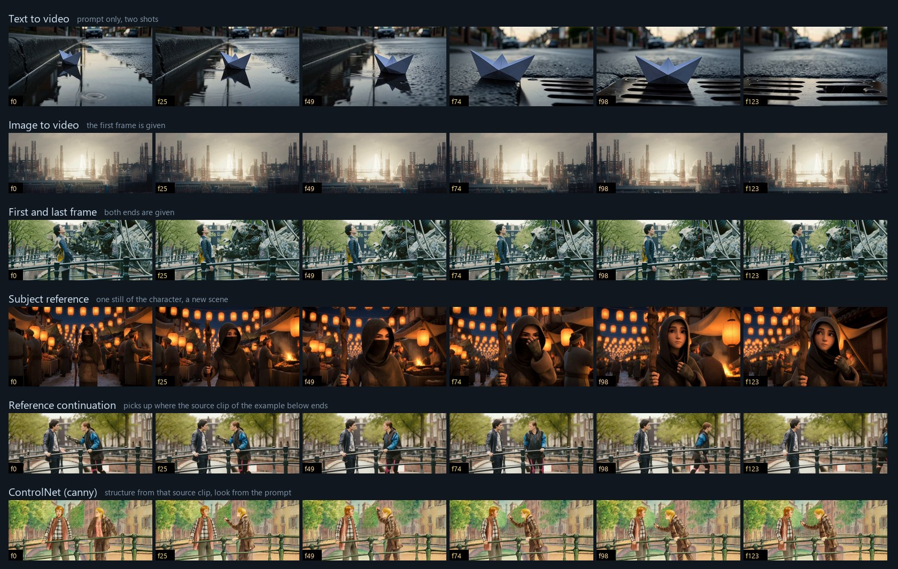

同样六条成片放在一起播放的样子（降到了 12 fps）：


"参考式续写"和"ControlNet"两行用的是[下面那个例子](#一个完整的例子把一段实拍改成雪天)里的源视频：续写从它的最后一帧接着往下演，ControlNet 用它的轮廓、画面由提示词决定。视频编辑的样片在那个例子里。

## 安装

需要 ComfyUI **0.39 或更新**（用到了 `MiniMaxH3AddGuide`、H3 的噪声遮罩和 `LTXVConcatAVLatent` 对 H3 的支持）。

1. 把本仓库放进 `ComfyUI/custom_nodes/ComfyUI-GachaDirector`。
   ```bash
   cd ComfyUI/custom_nodes
   git clone https://github.com/excifroge/ComfyUI-GachaDirector
   ```
2. 重启 ComfyUI。日志里出现 `Gacha Director v2.1.0: 10 nodes registered` 就是装好了。

没有额外的 pip 依赖，也不依赖别的自定义节点包。模型文件按 [ComfyUI 官方教程](https://docs.comfy.org/tutorials/video/minimax/minimax-h3) 准备。第一次使用人脸精修时，ComfyUI 自带的 kornia 会自动下载一个约 400 KB 的人脸检测权重。

## 快速开始

`example_workflows/` 里有两个工作流，节点和连线相同，接的模型不同，各带一段起步用的提示词：

| 工作流 | 模型 | 适合 |
|---|---|---|
| `GachaDirector_Base.json` | fl2va | 文生、图生、首尾帧、多关键帧、续写 |
| `GachaDirector_Reference.json` | ref2va | 参考生成、视频编辑、多关键帧、续写 |

打开其中一个，把四个加载器和加速 LoRA 的加载器指向你自己的模型文件，然后：

1. 点节点上的 **打开 Gacha Director**。
2. 在**剪辑**页写每个镜头里发生什么；需要素材就点镜头卡片右边的"+ 图片 / + 视频 / + 声音"，或者用「片段」里"起始方案"后面的按钮。
3. 在**项目**页选一套预设（`Draft` / `Standard` / `Final`），那里写着这套预设出的画面是多大、要跑多久。
4. 在**生成**页点"生成 N 个候选"（N 在项目页的"每批候选数"里设），或者直接用 ComfyUI 自己的运行按钮跑一条。

> [!IMPORTANT]
> `Draft` 预设用的是加速模型，也就是节点的 `model_turbo` 输入。示例工作流已经把模型经加速 LoRA 接了进去。如果你没有那个 LoRA：删掉那个 LoRA 加载器节点（`model_turbo` 留空），并且不要选 `Draft`，或者把 `Draft` 的模型改成「标准模型」。

### 一个完整的例子：把一段实拍改成雪天

源视频是一段 124 帧的实拍：开放电影《Tears of Steel》里桥上两个人对话的镜头。目标是把季节换成下雪的冬天，人物、动作和镜头都不变。

1. 打开 `GachaDirector_Reference.json`，点节点上的**打开 Gacha Director**。
2. 在**剪辑**页的「片段」里点"起始方案"后面的"视频编辑"，选源视频。片长跟着变成 124 帧，宽高比跟着源视频；源视频"源视频用途"默认是"视频编辑"，「原画面重画」是关着的，都不用动。
3. 填四处文字。要改成什么写在镜头里，要留住什么写在源视频的"保留与修改"里：

   | 位置 | 内容 |
   |---|---|
   | 整体描述 | `The target video is live-action film footage in heavy snowfall.` |
   | 镜头内容 | `The scene of <Video 1> now takes place in deep winter: thick snow is falling, the trees are bare and white, snow lies on the bridge railing, the street and the rooftops, and the light is cold and blue. The two people, their clothes, their movements and the camera are the same as in <Video 1>.` |
   | 源视频「更多设置」里的"保留与修改" | `the people, their motion and timing, the camera and the composition of <Video 1> are kept; only the season and the weather change` |
   | 环境声 | `Muffled winter air, soft wind, snow hissing on stone.` |

   拿来修改的源视频在提示词里就是 `<Video 1>`，直接这样写。"片段概述"可以留空：生成类型和"目标视频是 `<Video 1>` 的编辑版"这句开头会自动加上。
4. 点"最终提示词"，看到的就是实际送进模型的文本：

   ```text
   subject_definitions:
   <Video 1> is the source video for the target video edit.

   summary: [video editing] The target video is an edited version of <Video 1>.

   retention_analysis:
   <Video 1> (motion and camera work): fully_preserved - the people, their motion and timing, the camera and the composition of <Video 1> are kept; only the season and the weather change.

   detailed_description: The target video is live-action film footage in heavy snowfall. [Shot 1] The scene of <Video 1> now takes place in deep winter: thick snow is falling, the trees are bare and white, snow lies on the bridge railing, the street and the rooftops, and the light is cold and blue. The two people, their clothes, their movements and the camera are the same as in <Video 1>.

   overall_soundscape: Muffled winter air, soft wind, snow hissing on stone.

   non_diegetic_music: N/A
   ```

5. 在**项目**页先选 `Draft` 看方向对不对（4 步，约 2.5 分钟），对了再换 `Standard`（20 步、864×480，约 12.5 分钟）。时间是在一张 24 GB 显存的显卡上量的。

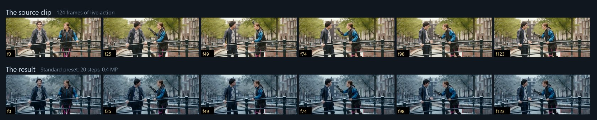

动起来的对照（左：源视频；右：成片）：


## 节点

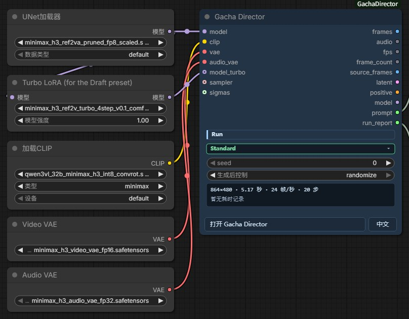

**输入**

| 名称 | 类型 | 说明 |
|---|---|---|
| `model` | MODEL | H3 的扩散模型。参考模型接 ref2va，基础模型接 fl2va。 |
| `clip` | CLIP | `CLIPLoader`，类型选 `minimax`。 |
| `vae` | VAE | H3 视频 VAE。 |
| `audio_vae` | VAE | H3 音频 VAE。 |
| `model_turbo` | MODEL，可选 | 同一个模型经过加速 LoRA 的版本（或者一个蒸馏模型）。预设的模型选"加速模型"时使用。 |
| `sampler` | SAMPLER，可选 | 接了就覆盖预设里的采样器。 |
| `sigmas` | SIGMAS，可选 | 接了就覆盖预设里的调度器和步数。 |

节点上只有四样东西：预设选择器、`seed`（连同 ComfyUI 给种子自带的"生成后控制"）、一块只读的指标（画面大小、帧数、步数、这套预设在这个片长下的实测耗时）、打开面板的按钮（旁边是界面语言的切换）。其余全在面板里。

**输出**：`frames`、`audio`、`fps`、`frame_count`、`source_frames`、`latent`、`positive`、`model`、`prompt`（实际送进模型的提示词）、`run_report`（这次运行的摘要）。

## 面板

页面上只放名称和数值。每个参数的说明在悬停提示里：鼠标在参数、按钮或标题上停半秒就会出现。

### 项目页

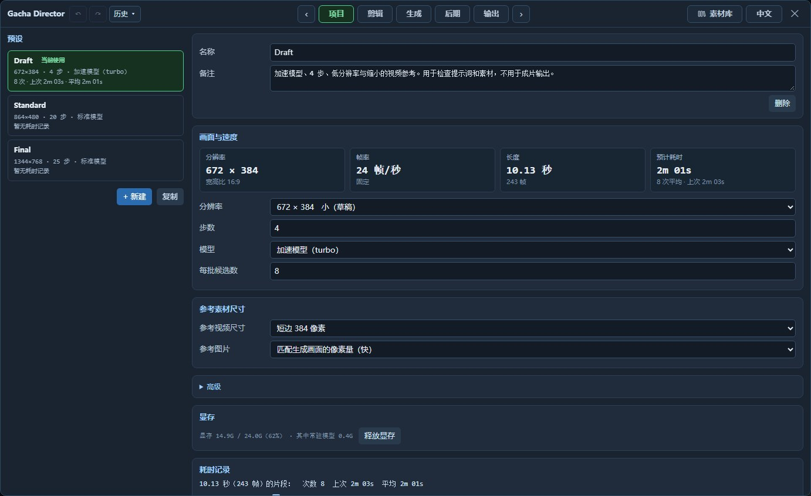

左边是预设列表，每一项写着这套预设在当前片段上出多大的画面、多少步、用哪个模型。右边是选中的那套预设，最上面四个数：**分辨率**（宽 × 高）、**帧率**（24 帧/秒，模型固定）、**长度**、**预计耗时**（这套预设在这个长度上的实测平均）。

| 设置 | 说明 |
|---|---|
| 分辨率 | 一组档位，显示成当前片段宽高比下的实际宽 × 高。预设里存的其实是像素量而不是宽高：画幅比例属于片段，所以同一套预设既能跑横屏也能跑竖屏。"标准"是官方模板的尺寸（16:9 时 864×480），"原生"是模型训练时的尺寸（1344×768）。 |
| 分辨率 ·「自定义…」 | 直接填宽和高，比如想要正方形。模型只接受 32 的倍数，填的不是时会提示实际将使用的最接近的尺寸（720 × 720 会变成 736 × 736）；宽或高不在 256 到 2048 像素之间时用红字说明，不能应用。自定义的宽高会同时把这个片段的宽高比改成对应的比例；之后再从列表里选别的档位，比例保持不变。 |
| 步数 | 官方默认 20；加速模型用 4 或 8。 |
| 模型 | 「标准模型」，或「加速模型（turbo）」（节点的 `model_turbo` 输入）。 |
| 每批候选数 | 生成页的生成按钮按一次排几条。 |
| 参考素材尺寸 | 参考视频缩到多大、参考图片缩不缩。只影响参考模型的速度，不影响成片的分辨率。参考视频每一步都要参与计算，是片段带参考视频时对速度影响最大的一项。 |
| 高级 | 自定义像素量、引导强度（CFG）、采样器、调度器、调度偏移（画面 / 声音，默认 12 / 3）、省显存。官方默认是 CFG 1、`res_multistep` / `simple`。 |

再往下是这套预设的耗时记录。候选的耗时记到**排队时**的那套预设和片长上（如果候选还在排队时刷新过页面，则按开始执行时的算），用 ComfyUI 自己的运行按钮跑的则按**开始执行时**的算；预设的参数在运行途中改过，这次就不记。参数改了，旧记录默认自动清掉（它已经不描述这套设置了）。记的是这个节点自己那一段的时间：加载器从硬盘读模型、接在它后面的节点、同一个工作流里别的导演台节点都不算在内。合成和人脸精修不计时：它们和生成一条片子不是同一种工作（实测同一条片子、同一套预设，合成约 128 秒，候选约 100 秒），记进去会把预设的耗时拉偏。

> [!NOTE]
> `Draft` 和 `Final` 出的不是同一条片子。换了画面大小，噪声就变了，同一个种子会得到不同的结果。`Draft` 用来判断"提示词和素材的方向对不对"，不是用来挑种子的。

### 剪辑页

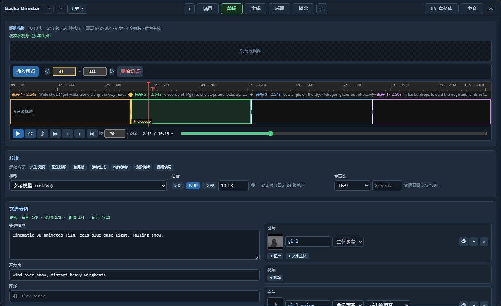

最上面是预览窗、时间线和播放条。时间线上方的一行写着这条片段的长度（秒、帧、帧率）、画面大小、步数、镜头数，以及现在的素材凑成的生成类型。下面依次是片段、共通素材、镜头。

**片段**
- **模型**：参考模型（ref2va）或基础模型（fl2va）。参考模型可以把人物、视频、声音当参考素材；基础模型的条件输入只有文字和整段的首帧、尾帧。钉在帧上的东西（中间帧的图片、"视频续写"的视频、原样放进去的声音）是另外加上去的，两个模型都能用。素材和模型对不上时页面会说明原因。
- **长度**：点 5 / 10 / 15 秒，或直接填秒数，自动对齐到模型能用的长度（所以填进去的数可能变一点，旁边写着对应的帧数）。官方节点给出的训练范围大约是 5 到 15 秒（124 到 362 帧）；更长也能填，但超出了模型学过的范围。
- **宽高比**：「源视频比例」，或指定比例。

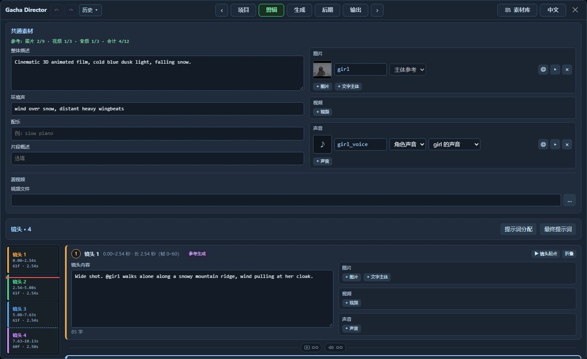

**共通素材**：所有镜头都能用的东西放这里。左边是整体描述（整段的风格和场景）、环境声、配乐、片段概述；右边是所有镜头共用的图片、参考视频和声音；最下面是源视频。只在某一个镜头出现的素材，放到那个镜头的卡片里。参考模型一条片子最多带 9 张图、3 段视频、3 段音频、合计 12 个文件，这一节顶上有一行已用数量。

**镜头**：把片子切成几段，每段一张卡片。左边写这个镜头里发生什么，右边是这个镜头自己的图片、视频和声音。它们对应提示词里的 `[Shot 1]`、`[Shot 2] At 00:02.833, …`，不是分开生成的。既没写内容、也没有自己的主体或参考的镜头不进提示词，编号只数进了提示词的。卡片左侧有一条导航，按镜头的长度分段，点一下跳到那个镜头。

每份素材有三样东西：缩略图、名字、**用途**。用途决定它对模型意味着什么：

| 素材 | 用途 | 含义 |
|---|---|---|
| 图片 | 主体参考 | 图里的人或物出现在画面里，只管长相，不固定在某一帧。带图片的主体是给参考模型看的；基础模型没有参考图通道，只用它的文字描述。 |
| | 首帧 / 尾帧 | 镜头从这张图开始 / 在这张图结束。 |
| | 中间帧 | 镜头里指定的那一帧变成这张图。 |
| | 分镜图（构图参考） | 只给模型看构图，不把画面固定成这张图（参考模型）。 |
| 视频 | 动作运镜参考 | 参考这段视频的动作和运镜（参考模型）。 |
| | 视频续写 | 取这段视频的一小段（5 / 22 / 39… 帧，可带声音）钉在镜头开头，模型从它后面接着生成。放在第一个镜头就是续写。 |
| 声音 | 角色声音 | 选中的主体用这个声音说话（参考模型）。 |
| | 声音参考 | 参考它的音色或曲风（参考模型）。 |
| | 镜头原声 | 这段声音从镜头开头原样进入成片。 |

素材行右边的小三角是"更多设置"：主体的类别、描述、简称、多张图片，素材的保留程度（完整保留、基本保留、特征迁移、弱参考），取视频的哪一段等等。

**素材库。** 顶栏右侧的"素材库"按钮打开一个浮在页面上的窗口，在任何一页都能开；它可以拖动、缩放，换页时留在原处，位置和大小记在浏览器里。

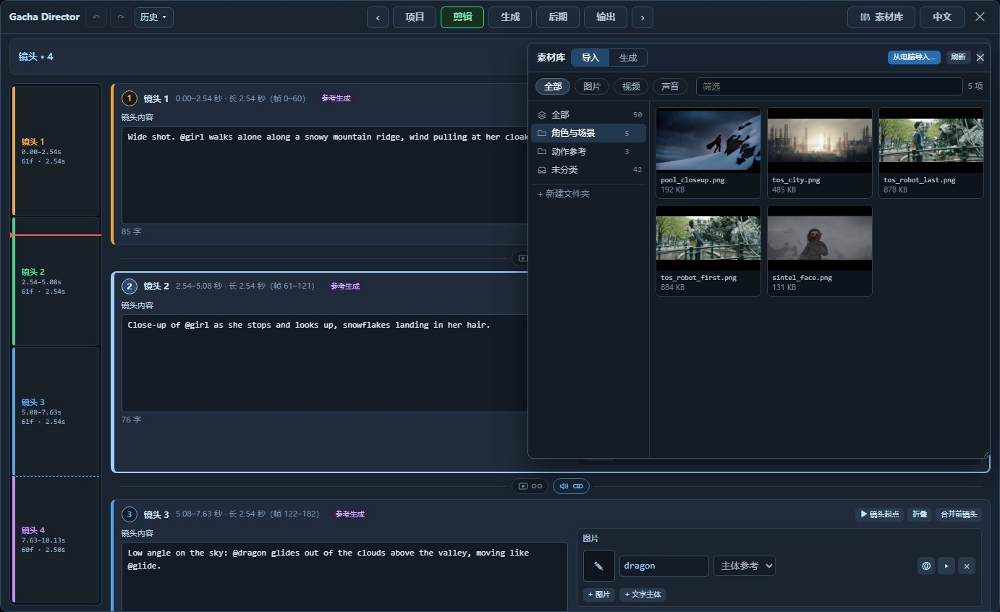

- **两大类**：*导入*是 ComfyUI 的 `input` 文件夹里的文件，*生成*是 `output` 文件夹里已经生成出来的文件（最新的在前）。两类都可以按图片 / 视频 / 声音筛选，按文件名搜索。
- **文件夹**：左侧可以自己建文件夹来分类，文件夹里还能再建文件夹；双击改名，把素材拖到文件夹上就归进去，拖到"未分类"就拿出来。文件夹只是素材库里的分类：硬盘上的文件不移动、不改名，所以别的工作流照样找得到它们。这份分类存在 ComfyUI 的用户数据里，所有工作流共用。
- **使用素材**：把素材从窗口里拖到镜头卡片的素材栏（加给这个镜头）或共通素材栏（所有镜头共用）。按住 Ctrl 或 Shift 可以多选后一起拖。素材栏里的"+ 图片 / + 视频 / + 声音"打开同一个窗口，只列出合适的种类，点一下素材就添加。
- **从电脑导入**：点窗口里的"从电脑导入…"，或者把文件直接拖进窗口；导入的素材归入当前打开的文件夹。文件也可以直接拖到镜头的素材栏、共通素材栏、源视频栏（拖进去的视频成为源视频）。文件会被复制到 `input` 文件夹，和 ComfyUI 自己的上传是同一条路；重名时 ComfyUI 会给新文件改名。拖到面板上别的位置不会发生任何事，也不会掉到后面的 ComfyUI 画布上。

"视频续写"的素材库里也能选已经生成出来的成片，所以续写可以直接接上一条结果。"视频续写"这个配方取所选视频的最后 22 帧放在第一个镜头的开头：新片的前 22 帧被钉在旧片的结尾上（很接近，但不是逐像素相同），所以 124 帧的片子里新内容是 102 帧（4.25 秒），接的时候把重叠的 22 帧剪掉。

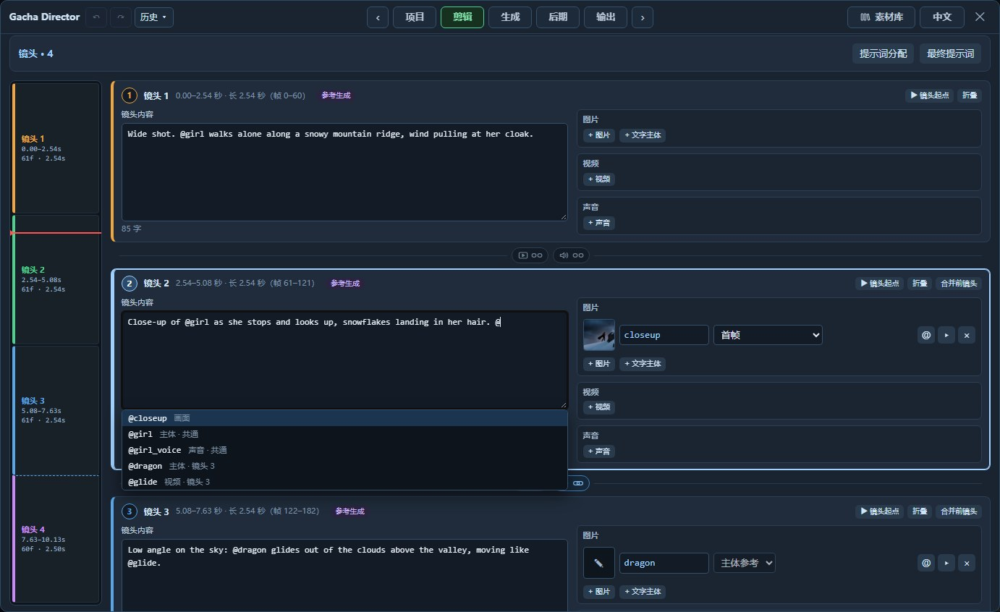

**蒙太奇还是长镜头：画面和声音各一枚链接。** 每两张镜头卡片之间有两枚链条图标，设定下面那个镜头怎样接上面那个。左边一枚管画面，右边一枚管声音；连上是亮的，断开是暗的，点一下切换。

画面：
- *断开 = 切镜（蒙太奇）*：切到另一个镜头。提示词里它是新的一段 `[Shot N] At 时间`。
- *连上 = 连续（长镜头）*：同一个镜头接着拍，中间不切；分段只是为了分开写内容、分开选片。提示词里连续的几段合成一个 `[Shot]`，各段的叙述按顺序接成一段话（对白仍然单独成行）。官方的提示词格式里只有"切镜的时间"，没有"镜头内某件事发生在第几秒"的写法，所以长镜头里各段的先后由文字顺序决定，具体落在哪一秒由模型定。

声音（只在切镜处有意义）：
- *断开 = 随画面切换*：切镜之后用新画面所选候选的声音。这是默认。
- *连上 = 延续*：切镜之后继续用切镜前的声音，画面换候选而声音不换。连续几处都连上时，声音一直沿用最早的那一条。
- 画面连上（长镜头）时，声音一定跟着画面连续，这枚链接显示为连上并锁住。

声音链接不改变生成：每条候选仍是整段的画面加声音。它只决定成片时每一帧用哪条候选的声音，所以只有切镜两侧选了**不同**候选时才听得出区别。它也不改变画面在哪一帧切。

在从零生成的片段里新插入的切点默认是切镜，在有源视频的片段里默认是连续（源视频在那里本来是连着的）。时间线上切镜是实心菱形，长镜头内的分段点是空心菱形加一条横线；左边导航里，接着上一段拍的镜头和上一格之间是虚线。

旧工作流里没有这两项设置。打开时，有源视频的片段各镜头按长镜头处理（这类片段原来就是靠重画接缝来接候选的，所以行为不变），从零生成的片段按切镜处理；声音一律随画面切换，和以前一样。

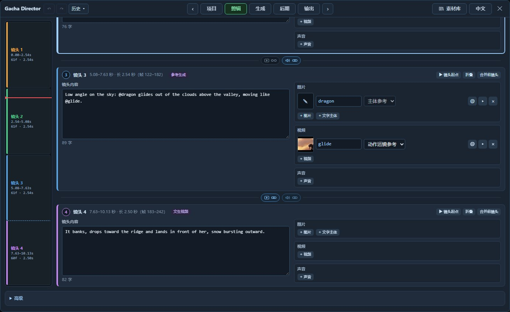

**不用手写编号。** 素材在提示词里的编号（`<Subject 1>`、`<Picture 2>`、`<Video 1>`……）和"这张图是第几个镜头的首帧"这类声明，都在生成时自动完成。想指明谁做什么，就在提示词里输入 `@`，从弹出的列表里选素材的名字（这个镜头自己的素材排在前面，上下键加回车也能选），或者点素材行上的 `@` 按钮把名字插到光标处。之后改名、换用途、移除素材，提示词里都会跟着变。属于某个镜头、但它的描述里没有点名的主体、参考视频和声音参考，生成时会自动补一句（例如"它在这个镜头里"）；首帧、尾帧这类图片本来就有自己的声明，角色的声音跟着它的主体声明。点"最终提示词"能看到拼好的全文，改了内容它会自己刷新。

钉在帧上的素材是跟着镜头走的：拖动切点之后，「首帧」仍然是那个镜头的首帧；插入或删除切点时，它们留在原来的那一帧上。时间线上有它们的标记，只读。

**源视频**（可选，在共通素材的最下面）：整段的底片。可以从输入目录选，也可以选已经生成出来的成片。"源视频用途"有四种：
- *视频编辑*（参考模型，默认）：官方的视频编辑做法，模型把它看作 `<Video 1>`。
- *视频续写* / *动作运镜参考*：同样作为 `<Video 1>` 送进去，角色不同。送进去的是源视频从起始帧开始、和片段一样长的那一段；想从别处接，就在"更多设置"里改起始帧。
- *原画面重画*：只把它当作起步的画面。

"更多设置"里的「原画面重画」（基础模型没有参考通道，选了源视频就只有这一种用法）：不从空白开始，而是在原视频的画面上加噪再重画。旁边的"改动幅度"后面显示换算出来的起始噪声比例（见[实测数据](#实测数据)）——想保住原片的构图，这个比例要明显低于 100%。只重画一部分时需要它。

源视频从起始帧算起比片段短时，不足的部分停在它的最后一帧，成片的结尾也会跟着停住（实测：短 4 帧，成片最后约 6 帧逐渐停下）。

> [!NOTE]
> 编辑视频不需要「原画面重画」。实测只把源视频拿来"修改"、从空白开始，构图、运动和运镜就都跟住了原片；再加上原画面重画（改动幅度 0.85）得到的几乎是同一条片子，只是更慢。

**局部重画**（开了「原画面重画」时才出现）：选择哪些[格](#时间格)重新生成，其余的保持原样。源视频有音轨时，保持原样的格连声音一起保留。

**对白**：H3 同时生成画面和声音，角色可以开口说话。在镜头的描述里，把一句对白单独写成一行：

```text
@girl pulls down her scarf and looks straight at the camera.
@girl says quietly: I have been looking for you.
```

`@girl` 是名字叫 girl 的那个主体，带不带图片都行；不属于任何主体的声音写成 `@voice(a warm elderly male voice) says cheerfully: Good morning!`。冒号前面是怎么说，冒号后面是说出来的话。默认按英语，别的语言在 `@girl` 或 `@voice(…)` 后面紧跟着加 `[Japanese]` 这样的标记。发给模型时它变成官方指南的写法：`<Subject 1> (S1) says quietly, <d>[English] I have been looking for you.</d>`（主体带图片时是 `<Subject 1>`；只有文字的主体，那里写的是它的描述或简称），同一个说话人在各个镜头里用同一个 `(S1)`。写成 `@girl says "…"`（没有冒号）不会被当成对白，"最终提示词"里会提醒。想让某个主体用指定的声音说话，就加一段声音，用途选"角色声音"并选上这个主体：这段声音成为它的声线参考，说的话仍然照提示词。

**高级**（页面最下面，折叠着）：
- *提示词格式*：结构化（按官方格式拼，见[提示词是怎么拼出来的](#提示词是怎么拼出来的)）或自由文本（原样发送，用 LoRA 触发词或者自己手写完整提示词时用；这时各镜头的描述不发送，素材名也不会被替换）。
- *负面提示词*：只有预设的引导强度（CFG）不等于 1 时才生效。官方模板都是 CFG 1，没有负面分支。

### 生成页

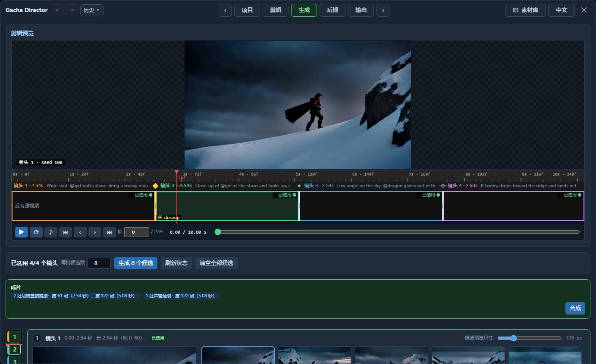

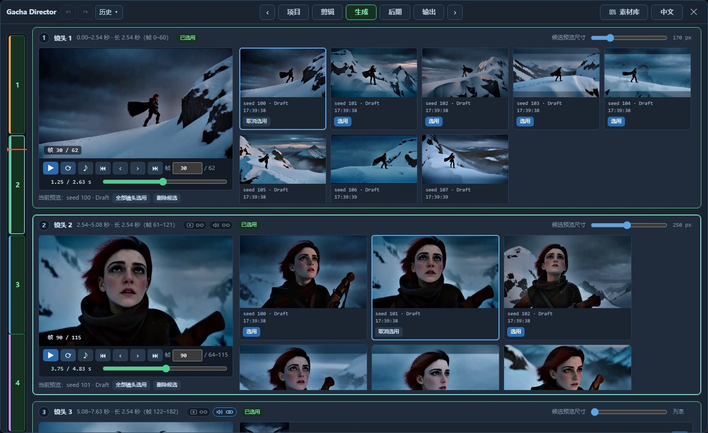

页面最上面是**剪辑预览**：按现在的选片，把各镜头选用的那一段依次播出来，不经过模型。还没有选片的镜头显示"镜头 N · 未选用"，并按它的长度空过去。长镜头里换了候选的地方在预览里是硬切，过渡要到合成时才生成。已经有成片时（按过"合成"，并且之后选片和接缝设置都没有再变），预览播的就是成片本身。预览和它下面的时间线联动：播放时时间线上的红线跟着走，在时间线的标尺上拖动，预览跟到对应的位置；点时间线上的镜头，页面跳到那个镜头的候选。声音默认关着：播放条上的 ♪ 是声音开关，面板里所有播放器共用这一个，打开后预览里每一段放的是它所属候选自己的声音。

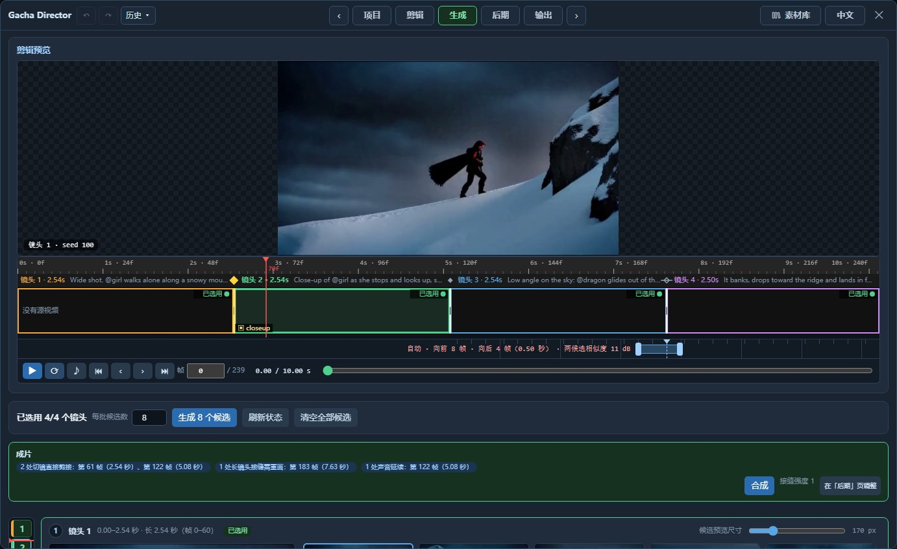

**过渡带。** 一段长镜头里前后两个分段选了不同的候选时，时间线下面多出一条带子，在那个接缝的位置画着一段条：合成时重新生成的就是这一段，其余的画面沿用所选的候选。
- 默认是**自动**：从接缝前一点开始，到接缝所在那一格的末尾为止。它的目标是至少 12 帧，实际是 12 到 21 帧，取决于接缝落在格内的哪个位置（接缝正好在格线上时，只重画它前面的 12 帧，后一条候选一帧也不重画）；靠近片头或长镜头的边界时会更短。为什么停在格线上，见[时间格](#时间格)。
- 拖条的两端可以自己定范围。两端吸附到带子上的细线（latent 帧的边界：每格 5 条，间隔是 1 帧和 4 个 4 帧），长线是格线。条旁边写着向前、向后各多少帧。
- 条变成橙色表示这个范围不太稳妥：短于 12 帧，或者右端没有停在格线上（紧挨着它的 1–2 帧保留画面会有可以量出来的变化）。橙色不是禁止，照样可以合成。
- 双击条恢复自动。范围不会越出这段长镜头；被长镜头的边界截短时，提示里会说明。
- 条旁边的"两候选相似度 N dB"是两条候选在接缝前后各 8 帧里有多接近（在缩小的画面上量的 PSNR）。读数变红（约 22 dB 以下）表示两条候选在这里差异较大，接缝修复可能失败。这个界限只是提示，没有校准过（见[实测数据](#实测数据)）。
- 两处接缝的范围叠在一起时，点接缝上方的小三角，把它的那一条放到最前。
- 在旧工作流里已经存在的接缝保持原来的做法（接缝两侧各重画一整格），直到你拖动或双击它。

1. **生成 N 个候选**：排队把整段生成 N 遍，种子递增。N 在按钮旁边的"每批候选数"里改，它和项目页预设里的是同一个设置。生成过程中页面顶部显示实时预览，不对就可以立刻中断。只运行这个节点和接在它后面的输出节点；工作流里别的导演台节点、不相干的保存节点不会跟着跑。
2. **选片**：每个镜头一块，左边是播放器，右边是所有候选在这个镜头里的那一段，各选一条。点一张卡片，它就在左边的播放器里播放；播放器下面可以把正在看的这条"全部镜头选用"，或者删掉（一条候选是整段的一次生成，删掉后它从所有镜头的候选池里消失，文件还在输出目录）。候选卡片按行宽自动换行，多了就在池子里往下滚；每个镜头标题右边有自己的"候选预览尺寸"滑块，各调各的，拖到最小变成列表。卡片和播放器播的是这条候选自己的那个镜头——从它实际切进来的那一帧到实际切出去的那一帧，不是按要求的帧号硬截（模型落切点会偏几帧，见[实测数据](#实测数据)）。卡片静止时显示镜头中间的画面，鼠标移上去从镜头开头播放。镜头块左边有一条窄导航：一格一个镜头，高度和镜头的长度成比例，颜色表示状态（已选用 / 有候选 / 没有），红线是上方时间线的当前位置；它跟着窗口的高度伸缩，点一格跳到那个镜头。
3. **成片**：每个镜头都选了候选之后，这一节出现"合成"按钮，按下去才有成片；成片是一个单独的文件，输出页会列出它，做完后这里有"查看输出"。按钮做什么取决于选片：
   - 所有镜头选的是同一条 → 把这条候选直接输出为成片，不经过模型，只重新编码一次，两三秒完成。
   - 换候选的地方都是蒙太奇 → 各段直接接上，不经过模型，几秒钟完成。接的位置不是要求的帧号，而是两条候选各自**实际**切镜头的那一帧；前一个镜头的候选切得比后一个镜头的候选早时，中间那几帧两边都不属于，去掉，所以成片可能比片段短几帧；反过来则有两条候选都对得上的帧，就在那里接，长度不变。做完之后这里会写明成片的实际长度，"接合记录"里有每个切点是怎么处理的。声音默认跟着画面在同一帧换到新候选的；声音链接连上的切点，声音继续用切镜前那条候选的（"接合记录"里写着 `the sound stays with …`）。
   - 长镜头里换了候选 → 接缝附近的一小段重新生成（范围在上面说的过渡带里设），其余部分连同声音沿用所选的候选：不再重新生成，只经过一次编解码（见[已知限制](#已知限制)）。重画范围不会越出这段长镜头，也不会碰到任何一条候选实际切镜头的地方。重画的强度在[后期页](#后期页)调。同一次里的切镜照样直接剪接。

> [!NOTE]
> 候选没有"只重新生成这一个镜头"的做法。模型每次都要算整条片子，单独重算一个镜头和重新出一条候选一样贵，而且是拿生成结果当起点再生成一次。想再来一次，就再出一条候选。（对一段**源视频**只重画其中几格是另一回事，那是剪辑页的"局部重画"。）

蒙太奇的镜头，各条候选可以随便混：镜头之间本来就是硬切。长镜头里换候选，要看两条候选在接缝处长得像不像（过渡带上的相似度读数量的就是这个）。共用源视频、或者指定了同样的首尾帧和中间帧的候选通常动作相近，可以接，接缝重画能把跳变抹平。但这不是保证：实测有一对共用源视频的候选，两个种子把同一个场景的光和色调做得很不一样，试过的范围和强度都没有接上。没有约束的文生视频，每条候选都是不同的视频，重画接缝也接不上，画面仍会在某一帧跳一下（见[实测数据](#实测数据)）。

候选记得自己是按多长的片段生成的：改了片长之后，旧候选不能再选。候选也记得生成时镜头是怎么划分的（切点在哪、哪些镜头是一段长镜头）：之后改了划分，旧候选照样可以选，但生成页会标出来并提醒你——它们画面里的切镜还在当时的位置，不会跟着变；想按现在的划分来，就重新生成候选。合成记得自己用的是哪一组选片：换了选片，旧的合成片不会再被当作成片展示。

### 后期页

成片出来之后还能做的事，以及怎么看、怎么存。

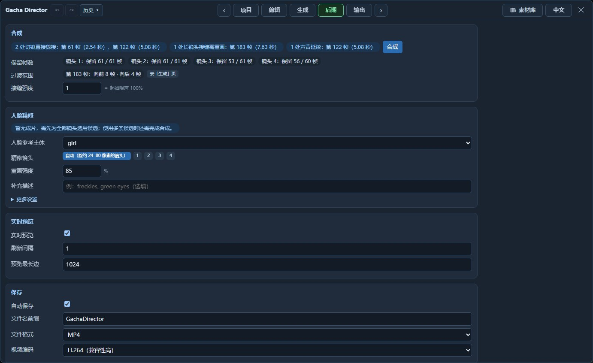

**合成**：把各镜头选用的候选接成一条。这里列出现在有几处切镜要直接剪接、几处长镜头内的接缝要重画、几处切镜的声音要延续，可以直接点"合成"（没有接缝要重画时不经过模型）。有接缝要重画时，下面一行"保留帧数"列出合成之后每个镜头里还有多少帧是你选的那条候选的画面，其余的帧落在接缝的重画范围里，会换成新生成的画面；长镜头里夹在两个接缝之间的短分段可能整段落在重画范围里，这时会用红色标"候选画面未保留"。长镜头太短、放不下要重画的范围时，那个接缝处理不了，也会用红字说明。下面两项只对长镜头内的接缝起作用（换候选的地方全是切镜时显示为灰色）：
- *过渡范围*：列出每个接缝前后各重画多少帧。范围本身在[生成页](#生成页)时间线下面的过渡带里拖动设置，这里只读。
- *接缝强度*：1（默认）是把范围内的画面从头重画；调低则更多保留在那里相接的两条候选原来的画面。重画两整格时，0.3 在一对相近的候选上同样能把接缝抹平；自动范围的 12 帧上 0.3 不如 1（见[实测数据](#实测数据)）。旁边显示换算出来的起始噪声比例。（节点的 `sigmas` 输入接了外部调度时，强度不起作用。）

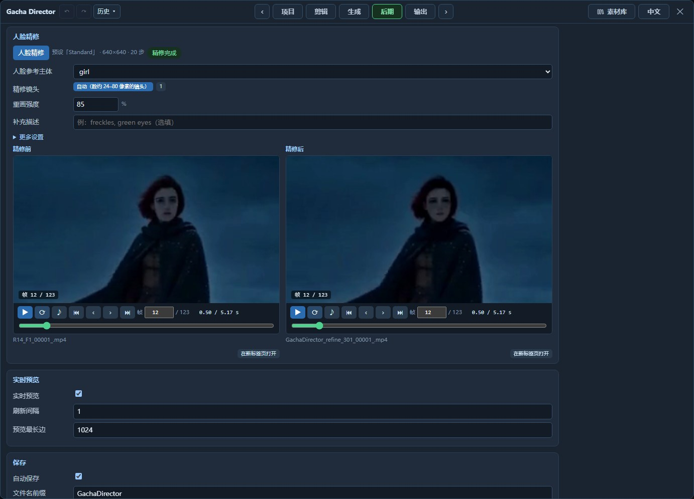

**人脸精修**：画面里比较小的脸分到的像素少，容易糊或者崩。这一步把成片里主要那张脸的周围裁出来，放大到脸有足够空间的尺寸重新生成一遍，再贴回原位。脸周围以外的像素完全不动，声音沿用成片的，精修前的成片原样保留。页面上两条并排，同步播放、同步跳帧；点一下画面，两边都放大到点的位置（图里就是放大后的样子），再点一下还原。
- *人脸参考主体*：选了素材里的人物，就会参考他 / 她的图片来重画（参考模型）。
- *精修镜头*：默认是「自动（脸约 24–80 像素的镜头）」——更小的脸贴回去装不下细节，更大的脸本来就清楚，重画只会换成另一张脸。点编号则只精修选中的镜头，不管脸多大。没找到脸的镜头不会被改；一个镜头都不符合时这次运行会失败，并在页面上说明每个镜头是因为什么被跳过的。
- *重画强度*：默认 85%。这个模型在 70% 以下几乎原样还原，所以这个数比直觉高得多（见[实测数据](#实测数据)）。
- 较长一段找不到人脸时（人物转过头去或走出画面），这段不会被贴回；几帧的短暂漏检会被桥接，照常贴回，人脸重新出现后接着处理。
- 每个镜头只处理一张脸：出现时间最长的那张。不同镜头里选中的可以是不同的人；"人脸参考主体"只决定重画时参考谁的图片，不参与选脸。所以多人的片子里，要用"精修镜头"只留下这个人当主角的镜头。
- 用的是当前预设：脸的周围按预设的像素量生成一个正方形区域（`Standard` 是 640×640）。一次精修的耗时和生成一条片子差不多。

**实时预览**和**保存**（文件名前缀、文件格式、视频编码）对这个节点的每一次运行生效，不属于某一套预设。

### 输出页

从 ComfyUI 的历史记录（最近 40 条）里读出这条片段的运行结果：直接运行出的片子、合成出的成片和人脸精修的结果，各带运行报告和当时发给模型的提示词。只是把候选剪接起来、没有重新生成的成片标的是"剪接"，不显示步数和种子（这一次没有生成任何画面）。候选不在这里列，它们在生成页。片段的内容（素材、提示词、重画范围）改过之后，旧结果会被标上"片段已在生成后改变，此结果与当前内容不符。"；只改预设或种子不算。人脸精修的结果在这里不标记；后期页会说明最后一次精修的结果是否还与片段相符。合成出的成片在这里不比较重画范围；接缝设置或选片变了，由生成页说明那条合成片已经过时。

## 时间格

H3 的视频 VAE 从第 0 帧起每 17 帧独立编码一块，剩下的 5 帧在片尾。所以一条 124 帧的片子是 7 个 17 帧的格（0–16、17–33……102–118）加上末尾 1 个 5 帧的格（119–123）。

一格在 latent 里是 5 帧：格的第一帧单独占一个，后面 16 帧每 4 帧一个（末尾的短格是 1 + 4 帧，占两个）。遮罩是按 latent 帧做的，所以**能单独保留或重画的最小单位是一个 latent 帧（4 帧；每格开头的那一个只有 1 帧），不是一格**。

格的意义在编码这一侧：每格单独编码，格内是"因果"的，后面的 latent 帧是靠着本格前面的画面编出来的，和后面的格无关。由此有一条实测出来的规律（见[实测数据](#实测数据)）：**重画的范围最好在格线上结束**。范围停在一格中间时，同一格里排在它后面、被保留下来的 latent 帧，原本是靠着"已经被换掉的前几帧"编出来的，和新画面对不上：在实测的那一对候选上，紧挨着的 1–2 帧比原候选差 3–5 dB，只伸进下一格 1 帧时接缝没有接上。范围从哪里开始则没有这个讲究。解码那一侧没有格的界限（解码器一次读 7 个 latent 帧，相邻窗口之间还要混合 5 帧），所以"保留"的意思是"不重新生成"，不是"像素不变"：重画范围附近的保留帧，两次运行之间只有约 38 dB 相同，这个差别看不出来。

时间线上的格条（"所选格"用）按整格选；它只在片段是"原画面重画"时才显示，因为只有那时才有"保持原样"可选（从零生成的片段每一格都是重画）。长镜头内接缝的重画范围按 latent 帧选，见[生成页](#生成页)的过渡带。蒙太奇的切点和格没有关系：那里不重画。

## 提示词是怎么拼出来的

结构化格式按 MiniMax 官方的两份提示词写作指南来拼：

- **基础模型**：三个字段 `integrated_multimodal_description` / `overall_soundscape` / `non_diegetic_music`；有首帧、尾帧或首尾帧时，前面加官方固定的图片对齐句。
- **参考模型，有素材要声明时**：六段 `subject_definitions` / `summary` / `retention_analysis` / `detailed_description` / `overall_soundscape` / `non_diegetic_music`。`summary` 开头的任务类型（`reference generation`、`video editing`、`video continuation`、`keyframe completion`、`audio reuse`、`audio reference`）由素材实际扮演的角色得出；任务类型后面那一两句话（面板上的"片段概述"）要你自己写；源视频拿来修改或接着拍时会自动带上官方的开头句，这时可以留空。自动补完之后仍然是空的，"最终提示词"里会提醒。
- **参考模型，没有任何要声明的素材时**：和基础模型一样是三个字段。

这是格式的框架：空着的字段不会写出来，只有配乐例外，留空时写成 `non_diegetic_music: N/A`。例如没填环境声就没有 `overall_soundscape` 这一段，"最终提示词"里会提醒官方指南把它列为必填。

**编号是自动的，规则如下。** 带图片的主体按列表顺序是 `<Subject 1>`、`<Subject 2>`……；它们的图片先占 `<Picture N>` 的编号，然后是要告诉模型的首帧、尾帧、中间帧和分镜图，按时间先后排。视频按列表顺序（源视频拿来修改、续写或借动作时，它是 `<Video 1>`）。音频先排参考视频里打开了的声音，再排单独的声音。你在提示词里写的 `@名字` 会换成对应的编号；只有文字描述的主体不占编号，`@名字` 处直接换成它的描述。基础模型里只有主体有名字可叫，而且它只能"看见"整段的第一帧和最后一帧：放在别处的图片会被固定在那一帧上，但不会出现在提示词里。

这部分由同捆的上游规划器完成（见 [NOTICE](NOTICE)）。

参考素材有官方上限：图片 9 张、视频 3 段（合计不超过 15 秒）、音频 3 段（参考视频的声音也算）、总共 12 个文件；主体最多 9 个，带不带图片都算。数量超出时页面会直接说明并拒绝运行。时长要读到文件才知道，在"最终提示词"和运行开始时检查：每段参考视频（包括源视频）只读到和片段一样长，而且最多送进去 15 秒，更长的会被截短并给出提醒；实际送进去的各段加起来超过 15 秒时运行会被拒绝。被拒绝而不是悄悄丢掉其中一个，是因为丢掉一个，后面所有的编号都会错位。

## 在节点外面接的东西

节点不加载任何模型：扩散模型由上游的加载器读入，通过 `MODEL` 输入传进来。所以凡是"给模型打补丁"的东西都接在 `model` / `model_turbo` 的上游，面板不需要知道它们：

- **LoRA、加速 LoRA**：`LoraLoaderModelOnly`。
- **Fun ControlNet Union**（官方的结构控制 / 局部重绘路线）：`ModelPatchLoader` + `Apply MiniMax H3 Fun ControlNet`，把它的输出接到 `model`（用 `Draft` 预设的话 `model_turbo` 那一路也要接）。控制视频请准备成 24 fps、从片段的第一帧开始；补丁会自己把它适配到片段的长度和画面大小。
- **FastH3**（FastVideo 的 8 步蒸馏模型）：`UNETLoader` → `ModelAttentionBackend` → `BlockSparseAttention`，接到 `model`，预设里把步数设为 8、调度偏移设为 10 / 3。

## 实测数据

以下数字来自开发时的测试（ComfyUI 0.39.0），用来说明行为，不是性能承诺。

怎么量的：两条视频之间的 PSNR 是逐帧计算再取平均；"帧间变化"是相邻两帧像素差的绝对值的平均。长镜头接缝那一组数字用 `tests/measure_seam.py` 得到（给它两条候选、合成片和接缝的帧号），时间格互不影响这一点用 `tests/measure_vae_cells.py`。除另有说明外都是草稿设置（加速 LoRA、672×384 级别、124 帧），每个数字是一次运行，没有做多个种子的统计。

**"改动幅度"不是线性的。** 模型的调度带偏移（shift）。用面板自己的调度时，偏移为 s、改动幅度（denoise）为 d，起步时的噪声比例是 s·d / (1 + (s−1)·d)（接了外部 `sigmas` 的话，改动幅度不起作用，起点由你给的 sigma 决定；这时面板不显示这个百分比，运行报告里写的是 `external sigmas`）：

| 改动幅度（偏移 12） | 起始噪声 |
|---|---|
| 0.85 | 98.6% |
| 0.70 | 96.6% |
| 0.30 | 83.7% |
| 0.15 | 67.9% |
| 0.05 | 38.7% |

所以想"保留原片的大部分"，改动幅度要设得比直觉低得多。面板在它旁边直接显示这个百分比；人脸精修的「重画强度」则直接按这个百分比来填。在基础模型上实测：0.7 得到的完全是另一条片子；0.3 保住了构图和运动，细节重画；0.15 几乎就是原片。

**同一个种子不保证得到同一条片子。** 把官方模板原样连跑两次，两条结果逐帧 PSNR 只有 19–20 dB。Gacha Director 和官方模板之间的差异在同一个量级。要保留一条结果，就保留它的文件。

**长镜头内的接缝重画（共用源视频的候选）。** 两条共用源视频的候选在格边界处拼接：直接硬切，接缝处的帧间变化是平时的 1.7 倍；接缝重画后回到平时水平。保持原样的格与所选候选相差 31–34 dB（VAE 编解码一个来回的损耗）。把重画强度从 1 调到 0.3，接缝同样被抹平，而重画的那几格更接近所选的候选。

**模型落切点不准，所以切镜按实际切点剪接。** 提示词里的切点是一个时间（`[Shot 2] At 00:02.833`），模型并不逐帧执行。两个镜头、124 帧的 8 条文生视频里，硬切正好落在要求那一帧的有 4 条，晚 1 帧的 3 条，早 1 帧的 1 条。镜头多、片子长时偏得更多：四个镜头、243 帧（约 10 秒）的 8 条草稿候选，要求的切点是第 61、122、183 帧，第一个切点晚了 0–3 帧，第二个早了 4–8 帧，第三个早了 1–9 帧；同一段用 `Standard` 预设跑了一条，三个切点分别早了 2、11、13 帧，所以这不是草稿预设的问题；三个镜头、362 帧（15 秒）的一条草稿，两个切点早了 6 帧和 18 帧。在每个切镜的开头写上 "The shot cuts."，或者照官方示例写成 "the camera cuts to …"（那 8 条里的前 4 个种子各跑一遍），切点没有更准：后两个切点仍然早 1–8 帧，不写时是早 1–9 帧。所以面板不替你加这类措辞。

用那 8 条里的四条给四个镜头各配一条不同的候选，三种接法：

| 接法 | 结果 |
|---|---|
| 按要求的帧号直接拼 | 6 次切换（应该是 3 次）：切点处夹了 3 帧、6 帧、3 帧别的镜头的画面 |
| 按两条候选各自实际的切点拼（面板现在的做法） | 正好 3 次硬切，没有夹杂帧；成片 240 帧，去掉了 3 帧两边都不属于的画面；不经过模型，冷启动的服务器上 5 秒 |
| 接缝重画（面板以前的做法） | 3 次切换，但 15 格里重画了 9 格，四个镜头选用的候选只留下 34、17、0、39 帧；切点被挪到第 62、130、194 帧；196 秒 |

找实际切点的办法：比的不是亮度，而是画面里明暗的分布——每一帧先去掉整体亮度、把对比度大体拉平（很暗、很平的画面不硬拉），再看它和前一帧有多不像（同一个画面约为 0，两个无关的画面约为 1）。这样闪电、爆炸把一个镜头打亮时变化很小，换了镜头才大。切点那一帧量出来是 0.28–1.21，是整条片子平时帧间变化的 4–800 倍（面板的门槛是 5 倍；全程剧烈运动的片子"平时的变化"本身就大，切镜可能还不到它的 5 倍，所以门槛最高只到 0.5）。另外要求切点两侧各 16 帧里，紧挨切点的 8 帧和再往外的 8 帧都至少有 6 帧和另一侧不一样，用来排除闪光和半秒以内的一阵亮光（它们过后画面会回到原样，切镜不会）。最后，切点前后各 4 帧作为两组来比：两组之间的差别要比各组内部的波动大一倍以上——闪烁的光、一直在进行的大动作过不了这一条。（靠近片头片尾，或紧挨着片段里设定的很短的镜头时，按能取到的帧算。）

换了三个更难的题材各测 4 条草稿。昏暗的铁匠铺（四个镜头里都是同一个人，连续两个特写，每条里还有两三处锤击、火花和工件快速出画，最大是平时变化的 34 倍）：12 个切点全部找对，离要求的帧 −2 到 +4 帧。雷暴夜景（闪电反复把画面打亮，暗镜头里还会照出原来看不见的景物，最大一次是平时变化的 105 倍）：12 个切点全部找对，包括一处闪电刚结束、紧接着一个叠化式切镜的地方。同一套雷暴片如果按亮度差来找（上一版的做法），12 个里只有 5 个准，其余偏 1 到 22 帧。高速动作（手持追逐、带运动模糊的脚步特写、爆炸、甩镜）：12 个切点全部找对。这类镜头里模型有时会在镜头内部自己跳一下（没让它切的地方），跳的幅度和真切镜一样大；两处变化差不多大（相差 15% 以内）时，取离要求的帧更近的那个——实测遇到两次，真切镜离要求的帧 1 帧和 4 帧，跳的那处离 7 帧和 17 帧。以上都是草稿尺寸；雷暴和动作两套再用 Standard 预设各出 2 条，12 个切点也全部找对。

模型给的不是硬切（叠化、甩镜）时可能找不到，那个切点就按要求的帧号接。

**长镜头不会被切开。** 四段 243 帧的片子，前三段设成一个长镜头、第四段是切镜（草稿预设，两个种子）：两条都只在第四段开头切了一次（比要求的晚 7 帧和 11 帧），前三段是一个不切的镜头，动作的先后按文字来。四段全设成一个长镜头的两条，整条没有切。也就是说，把连续的几段写成一个 `[Shot]` 是有效的；各段具体落在第几秒，面板控制不了。

**长镜头里换候选，候选不相近就接不上。** 上面那两条"一个长镜头"的候选是各不相同的两段视频（文生视频，不同的种子）。前一半用第一条、后一半用第二条，接缝在第 122 帧：重画强度 1 时，重画的那三格延续了第一条的画面，跳变被挪到重画范围的末尾（第 153 帧，帧间变化是平时的 25 倍）；强度 0.3 时两边各自保持原样，跳变留在第 122 帧。两种都没接上。这一步只对本来就相近的候选有用。

**过渡范围：重画多少帧、停在哪里。** 用 `tests/measure_seam_range.py` 在一对相近的候选上量的：[完整例子](#一个完整的例子把一段实拍改成雪天)里那条编辑的两个种子，草稿设置，124 帧，过渡带上的相似度读数约 33 dB。前 68 帧用第一条，之后用第二条，只改变重新生成的范围；强度都是 1。"跳变"是合成片在接缝附近最大的一次帧间变化，除以两条候选自己在那一帧的变化——候选自己的运动约为 1 倍，明显大于 1 才是接缝在跳。"保留帧的代价"是范围后面紧挨着的保留帧，比"什么都不重画、只过一次编解码"的同一帧离所选候选远了多少。第 68 帧正好在格线上。

| 重新生成的帧 | 帧数 | 跳变 | 保留帧的代价 |
|---|---|---|---|
| 不重画，直接硬切 | 0 | 3.0 倍 | – |
| 不重画，只过一次编解码 | 0 | 2.4 倍 | – |
| 64–67 | 4 | 1.6 倍 | 0.4 dB |
| 60–67 | 8 | 1.5 倍 | 0.5 dB |
| 56–67（自动范围） | 12 | 1.3 倍 | 0.0 dB |
| 52–67 | 16 | 1.4 倍 | 0.1 dB |
| 64–68（伸进下一格 1 帧） | 5 | 2.0 倍 | 4.5 dB |
| 56–68（伸进下一格 1 帧） | 13 | 2.1 倍 | 4.8 dB |
| 60–72（停在格中间） | 13 | 1.2 倍 | 3.6 dB |
| 56–76（停在格中间） | 21 | 1.1 倍 | 3.6 dB |
| 60–84（到下一格的末尾） | 25 | 1.1 倍 | 1.6 dB |
| 51–84（以前的做法：两侧各一整格） | 34 | 1.3 倍 | 1.6 dB |

从这张表读出来的：
- 范围在格线上结束（上面以 67 结尾的四行），后面的保留帧几乎没有代价（0–0.5 dB）；停在格中间是 3.6 dB；只伸进下一格 1 帧时跳变还在（2 倍）。把下一格整格也重画（60–84）跳变最小，代价是 1.6 dB，并且第二条候选多了 17 帧不是它自己的画面。
- 4 帧、8 帧也有用，但不如 12 帧；16 帧没有更好。自动范围的"至少 12 帧、停在格线上"就是按这张表定的。自动范围那一行另外换了两个种子（1.27 倍、1.25 倍，代价 0.4、0.1 dB），又把两条候选对调接了一次（1.18 倍，0.5 dB）。
- 同样的 12 帧，强度 0.3 是 1.5 倍，不如强度 1。
- 接缝在格中间（第 62 帧；硬切 4.4 倍，只过编解码 3.6 倍）：只重画它所在的那 4 帧（60–63）是 2.1 倍；56–67（12 帧，到这一格的末尾）是 1.3 倍，代价 0.9 dB；以前的做法（34–84，51 帧）是 1.4 倍，代价 1.9 dB。接缝在第 70 帧（刚进一格）：64–84（21 帧）是 1.3 倍，代价 1.6 dB。

这些都是这一对候选上的结果，除了注明的以外每个数字一次运行；12 帧是现在的默认做法，不是量出来的普遍下限。接缝处的声音没有量。

**差异大的一对，试过的范围和强度都没有接上。** 另一对候选同样是一个源视频、一句提示词、两个种子，动作更大，而且两个种子把场景的光和色调做得很不一样：过渡带上的相似度读数约 19 dB。接缝同样在第 68 帧：硬切 2.1 倍，只过编解码 2.0 倍；停在格线上的 8、12、16 帧都是 2.0 倍，跳变原地不动；两侧共 13 帧是 1.8 倍；25 帧和 34 帧是 1.9 倍，跳变被挪到了范围的末尾（第 85 帧）；强度 0.3 配 25 帧、34 帧是 1.9 倍、1.8 倍，跳变留在接缝上。所以过渡带上才显示相似度。读数变红的界限（22 dB）只是夹在这两个实测点之间，没有校准：现在只知道约 33 dB 的这一对接上了，约 19 dB 的这一对没有。

**对白是照着说的。** 两条草稿生成：文生视频里一位老面包师说一句话；参考生成里同一个角色在两个镜头里各说一句。用本地的语音识别把成片的声音听写出来，三句话和提示词里写的一字不差，第二个镜头的那句也落在第二个镜头的时间里。声线参考也试了两次（一段偏高的声音、一段低沉的声音，各给同一个角色）：台词仍然一字不差，没有照搬参考音频里的话；成片里说话声的基频跟着参考走（参考 232 Hz → 成片 235 Hz；参考 131 Hz → 成片 142 Hz；不放参考的三条在 157–198 Hz）。音色听起来像不像，这里没有办法量。

**参考视频的尺寸决定速度。** 同样的画面大小和步数，参考视频短边 512 时每步约 15 秒，256 时约 6 秒。

**人脸精修对几十像素的脸有效，对更小和更大的脸没有用。** 一段 864×480 的全身远景（`Standard` 预设，124 帧，脸约 38 像素，中间有一段转头背对镜头），用同一套预设在四个强度下各精修一次：

| 重画强度 | 结果 |
|---|---|
| 50% | 和精修前几乎没有区别 |
| 70% | 糊成一团的五官被理顺了一些 |
| 85% | 眼睛、鼻子、嘴重画清楚，转头时的侧脸也干净；发型、头的朝向和光线没有变 |
| 93% | 脸最清楚，但头发和脸周围的背景也跟着变了 |

另一条 672×384 的草稿成片上有两种别的大小：远景里约 14 像素的脸，85% 下看不出五官上的收益，区域里别的东西（衣服的颜色）反而变了；特写里约 160 像素的脸，50% 下没有区别，85% 下被换成了另一张更写实的脸。所以自动模式只处理约 24–80 像素的脸：24 和 80 这两个界限本身没有逐点测过，是在"14 像素没用、38 像素有用、160 像素有害"这三个实测点之间取的。耗时：那段 124 帧的片子生成用了 359 秒，四次精修各 349–370 秒。

**整段再生成一遍：同尺寸没有用，放大有用但很贵。** 还是那段 864×480 的远景（各一条，起始噪声都是 85%）。按原尺寸再生成一遍（394 秒）：构图和动作没变，细节换了一批，脸和原来一样糊。先放大到 1344×768 再生成一遍（2035 秒，期间机器还在做别的）：构图和动作保住了，脸和衣服的细节明显清楚，但每一处细节都是重画的，和原片并不相同。作为对照，同一个种子直接按 1344×768 生成（1613 秒）得到的是另一条构图完全不同的片子。在这次对照里，保住构图的只有"先用小尺寸挑、再放大重画"这一种做法，代价是再付一次大尺寸生成的时间。

**人脸检测。** 检测器是 kornia 自带的 YuNet。按 RGB 通道顺序把画面喂给它时，远景里的小脸找不到，雪地上的岩石和云却被当成脸（得分 0.7）；换成它训练时用的 BGR 顺序之后，同一批画面里 14 像素的脸得分 0.9。在 8 条 4 个镜头的草稿候选上：特写镜头的脸在 89–93% 的帧里被找到；远景镜头的小脸有 4 条在 98% 以上的帧里被找到，另外 4 条在 2–48% 的帧里；没有人脸的两个镜头（一条龙）里，检测器在 0–36% 的帧里把龙头当成了脸。判断一个镜头有没有脸，看的是同一张脸出现的帧数够不够四成：那两个镜头在 8 条候选里都没有够，没有一个被误处理。

**不点名，模型也认素材；点名最稳。** 一个只属于第 2 个镜头的主体（一张狗的图片），三种写法各跑两个种子（草稿预设）：在镜头描述里用 `@名字` 点名；不点名，由面板自动补一句"它在这个镜头里"；既不点名、也不属于任何镜头，只在开头声明。六条成片的第 2 个镜头里都有狗。点名的两条都是一只和参考图一样的黑白花狗；自动补句的两条也是那只狗，其中一条多出了第二只动物；只声明的两条里一条毛色对，一条偏了。每种只有两条，说明不了比例，只能说明三种写法都起作用，想让模型分清"谁在做什么"就点名。


## 已知限制

- **钉住不等于逐像素不变。** 钉在帧上的图片是条件约束；保持原样的格经过一次 VAE 编解码。和原片很接近，但不是原片的拷贝。
- **切点的时间是模型自己定的。** 两个镜头的短片基本准到一帧；镜头多、片子长时会偏到十几帧（见[实测数据](#实测数据)）。需要卡准时间的切点（比如对音乐），目前只能多抽几条挑，或者拆成几个节点分别生成、在剪辑软件里拼。
- **剪接成片可能比片段短几帧。** 同一个切点上，前一个镜头的候选切得比后一个镜头的候选早时，中间那几帧两边都不属于，会被去掉。成片的实际长度写在生成页；之后的人脸精修按实际长度来。
- **剪接成片的声音在切镜处会有音量落差。** 每个镜头的声音来自它自己选的那条候选，而模型每条候选的整体音量不一样。实测一条用了 4 条候选的 10 秒剪接片：三个切点前后的音量差了 +15、−9、−5 分贝，都是换了声音来源造成的。面板不做响度匹配（各镜头的轻重本来就该不同，按镜头拉平会毁掉声音的层次）。介意的话有两条路：把那几处切镜的声音链接连上，整段就只用一条候选的声音，不再换源（同一条片子三处都连上之后，切点前后是 −1、+18、−2 分贝；那个 +18 是这条候选自己的声音在那里起了一个事件，单独听这条候选时同一位置是 +15）；或者在剪辑软件里换上一条完整的声音。延续的声音是另一条候选的，和画面对不上口型、对不上动作的时刻，所以它适合环境声和配乐，不适合对白。
- **找切点靠的是画面突变。** 模型给的是叠化、甩镜，或者两个镜头长得很像时，可能找不到实际切点，那一处就按要求的帧号接，有可能夹进几帧别的镜头的画面。紧挨着切点的一阵闪电、爆炸闪光仍有可能把找到的切点带偏几帧（实测的 12 处没有出现）；两个都没有任何画面内容的画面之间的硬切（纯黑切纯白）看不出来。"接合记录"里会写 `no cut found`。目前没有手动指定切点的地方。
- **长镜头里各段发生在第几秒不可控。** 官方的提示词格式没有镜头内的时间写法；面板只保证顺序。
- **长镜头里换候选，只对接缝处长得像的候选有用。** 共用源视频或同样的首尾帧通常能做到，但不保证（见[实测数据](#实测数据)）。差异大的候选重画接缝也接不上；这时让这段长镜头的各段选同一条候选。想只换后半段，可以手动做出相近的候选：在剪辑页把选中的那条候选选作源视频（文件列表里有已生成的片段），「源视频用途」选「原画面重画」，再在「局部重画」里把重画范围设成「所选格」，填分段点之后的范围（例如 `f122-242`，或直接点时间线上的格条），其余不变，然后照常生成候选。实测（草稿，两个种子，从第 119 帧起重画）：前 119 帧和原候选一致（经过一次编解码，PSNR 38 dB），新旧交界处的帧间变化是平时的 1.0 倍（没有跳变），后半段是两段不同的新画面，没有多出切镜；每条 163–175 秒（从零生成约 2 分钟）。新候选的前半段就是原来那条，给这段长镜头的各段都选它即可；做完把源视频清掉、重画范围改回「完整片段」，才回到从零生成。面板没有把这做成一步操作。自动范围下一个接缝重画 12 到 21 帧；把范围拖得很宽，或者在旧工作流里沿用每侧一整格的做法（34 到 51 帧）时，长镜头里很短的分段可能整段被重画。
- **过渡范围是只看画面定的。** 接缝处的声音没有量过；过渡带上相似度读数变红的界限（约 22 dB）夹在两个实测点之间，没有校准，不是"低于它就接不上"的意思。
- **Fun ControlNet 和 FastH3 没有做进面板**，接法见上文。
- **没有"整段精修"按钮。** 同尺寸再生成一遍没有收益；放大后再生成有效，但耗时等于按大尺寸重新生成一条（见[实测数据](#实测数据)）。想这样做可以手动来：把成片选作源视频，「源视频用途」选「原画面重画」，在更多设置里把改动幅度设为 0.32（即 85% 起始噪声），换一套大尺寸的预设再生成。
- **人脸精修的适用范围很窄。** 它只对中远景里几十像素的脸有用（见[实测数据](#实测数据)），耗时和重新生成一条差不多，而且结果受起始噪声影响很大：低了没有变化，高了连脸周围的背景一起变。
- **人脸精修每个镜头只处理一张脸**（出现时间最长的那张），它不认人：选了"人脸参考主体"，每个被精修的镜头里的那张脸都会照这个人的图片重画。脸要在镜头的四成以上的帧里被认出来才会处理（低于这个比例的大多是误认）。检测器把动物或怪物的脸也当脸；遇到这些情况，在"精修镜头"里把那个镜头去掉。
- 一个节点是一条片子（一个 5 到 15 秒的生成窗口）。更长的内容用续写来接：下一个节点里加一段视频，用途选"视频续写"，选上一个节点存下来的文件。
- 输出页读的是 ComfyUI 自己的历史记录，重启 ComfyUI 之后历史清空，列表也就空了；文件还在输出目录里。
- 实时预览和预设的耗时只跟随这个浏览器页面自己排队的运行。从别的浏览器或用 API 排队的运行在这里没有实时预览，也不计时；成片照常保存，普通运行会列在输出页。生成途中刷新页面或切换工作流标签页，预览稍后会接上（实测十几秒内），但这一次运行不计时。
- 只在一种环境上测过：Windows 11，一块 24 GB 显存的显卡。别的系统和显存更小的显卡没有实测。

## 开发与测试

```bash
# 在 ComfyUI 根目录下，用 ComfyUI 自己的 Python
python custom_nodes/ComfyUI-GachaDirector/tests/test_grid.py
python custom_nodes/ComfyUI-GachaDirector/tests/test_schema.py
python custom_nodes/ComfyUI-GachaDirector/tests/test_widget_order.py
python custom_nodes/ComfyUI-GachaDirector/tests/test_expand.py
python custom_nodes/ComfyUI-GachaDirector/tests/test_splice.py
```

面板要在不请求服务器的情况下显示格、画面大小、问题列表，所以文档的规则在 JavaScript 里有一份镜像。两边是否一致由对照测试保证；另外几条分别测人脸精修的跟踪和裁贴、跨候选剪接时切点的规划（`test_cuts.py`，上面的 `test_splice.py` 测的是剪接节点对画面和声音的处理）、面板怎么判断一条正在跑的生成属不属于这条片段、面板里素材和提示词的对应关系（后三条需要 Node 20 以上；以下命令都在节点包的目录里运行）：

```bash
python tests/test_faces.py
python tests/test_cuts.py
python tests/make_parity_fixtures.py
node --experimental-default-type=module tests/parity.mjs
node --experimental-default-type=module tests/tracker.mjs
node --experimental-default-type=module tests/material.mjs
```

剪辑页还有一条在真浏览器里跑的流程测试（输入 `@`、键盘选名字、改用途、改名、插入和合并切点、移除素材、查看最终提示词）。它用无界面的 Edge 或 Chrome，需要 ComfyUI 正在运行，不生成任何东西：

```bash
node --experimental-websocket tests/shot.mjs tests/ui_edit_flow.mjs --lang zh
```

示例工作流是生成出来的：`python templates/make_workflows.py`。

`tests/measure_vae_cells.py` 和 `tests/measure_seam.py` 不是测试，是量出[实测数据](#实测数据)里那些数字用的脚本：前者需要 H3 的视频 VAE 文件（在 CPU 上跑），后者只需要三条视频文件。

## 致谢与许可

Gacha Director 是在此前几个 MiniMax H3 的 Director 项目的基础上做出来的。感谢它们的作者：

| 项目 | 许可证 | 本包从它那里得到的 |
|---|---|---|
| [ComfyUI-MiniMaxH3-Director](https://github.com/seesee75-commits/ComfyUI-MiniMaxH3-Director)，seesee75 及贡献者 | GPL-3.0 | 提示词规划器和实时预览，原样放在 `vendor/` 里；帧率对齐和参考视频尺寸的算法 |
| [ComfyUI-MiniMax-H3-Motion-Director](https://github.com/j955229/ComfyUI-MiniMax-H3-Motion-Director)，其贡献者 | GPL-3.0 | 节点上的启动按钮、全页覆盖层和页签栏。思路：分页面的流程、素材库、把镜头轨画成源视频的胶片条 |
| [ComfyUI_MiniMaxH3_Director](https://github.com/AIMixer/ComfyUI_MiniMaxH3_Director)，AIMixer | Apache-2.0 | 时间线的一部分：帧与像素的换算、标尺、切点标记 |
| [ComfyUI-MiniMaxH3-Director](https://github.com/Thefrizzy1/ComfyUI-MiniMaxH3-Director)，the_frizzy1 | Apache-2.0 | 扩展的骨架、DOM 辅助函数和显存交接。思路：在条件节点前面放一个纯粹的编译模块 |
| LTX Director，WhatDreamsCost | GPL-3.0 | 提示词规划器一脉的源头 |

帧网格和像素预算的算法照 [ComfyUI](https://github.com/Comfy-Org/ComfyUI)（GPL-3.0）里的写法重述。哪个文件来自哪个项目、对应哪个提交，逐项列在 [NOTICE](NOTICE)。

**许可证：GPL-3.0。** 包里含有 GPL-3.0 的代码，所以整个包按这个许可证发布；Apache-2.0 的部分保留各自的许可证文本，在 `LICENSES/` 里。

截图和样片里的画面来自两部开放电影：《Sintel》（© Blender Foundation，CC BY 3.0，durian.blender.org）和《Tears of Steel》（(CC) Blender Foundation，CC BY 3.0，mango.blender.org；只用了画面，没有用它的声音），其余是用 MiniMax H3 生成的。三种语言的 README 各用自己语言的面板截图。
