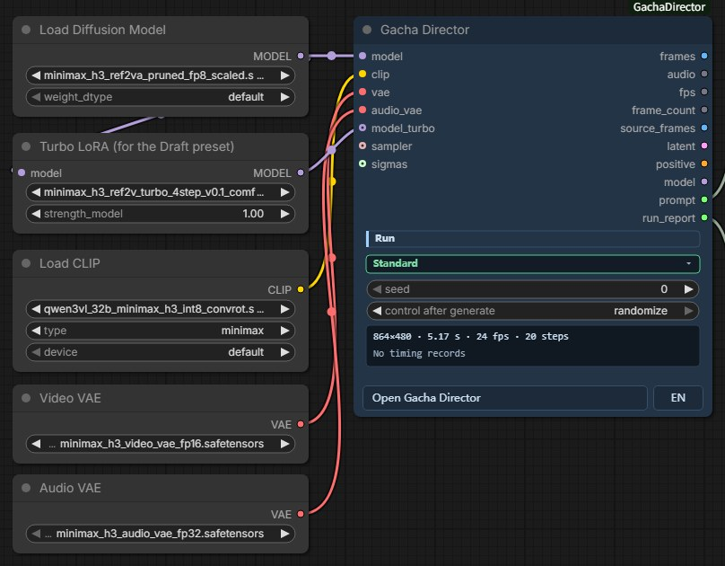
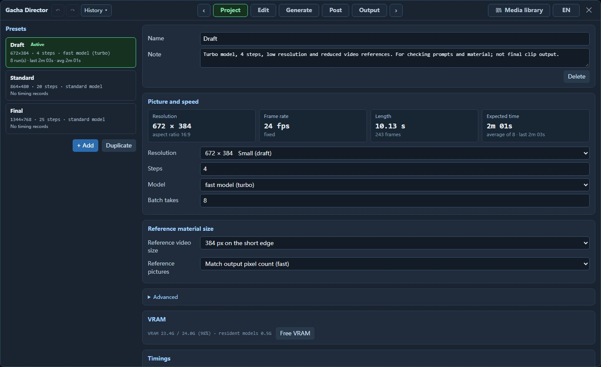
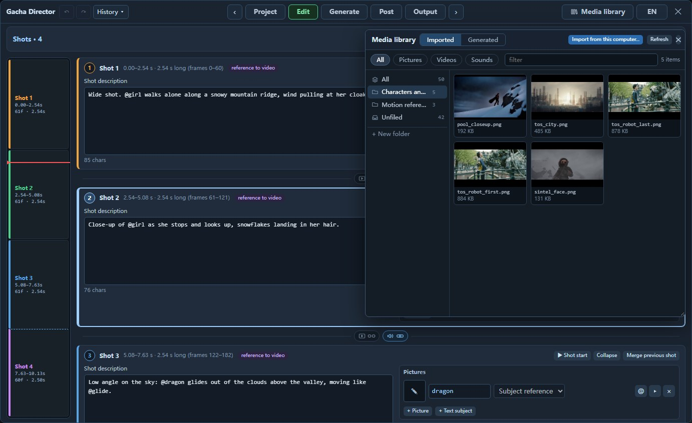
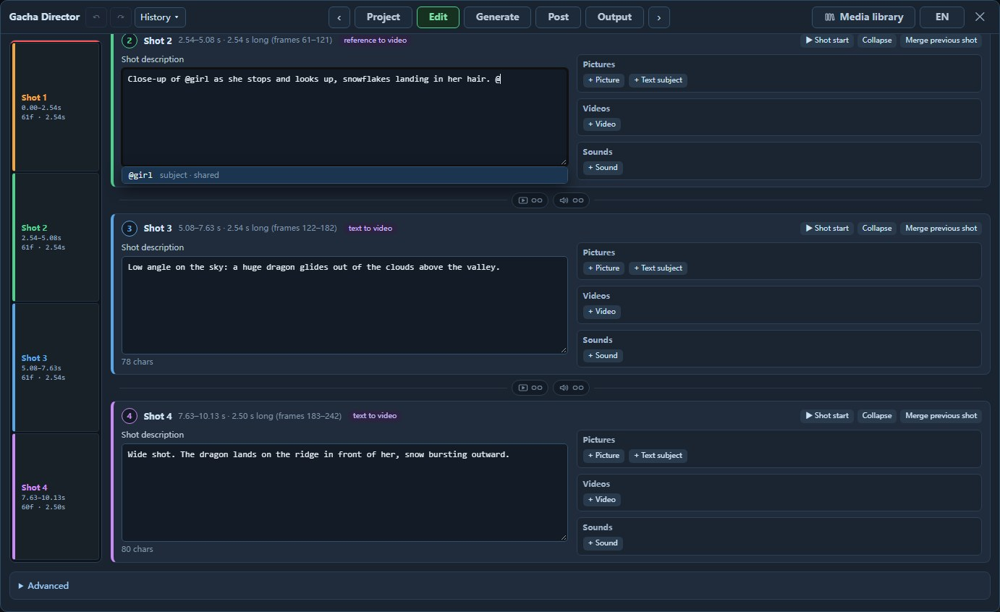
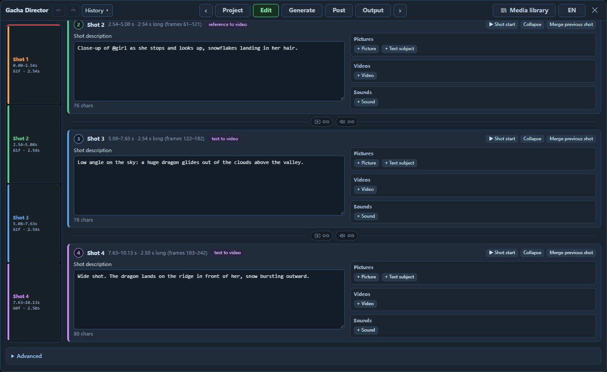
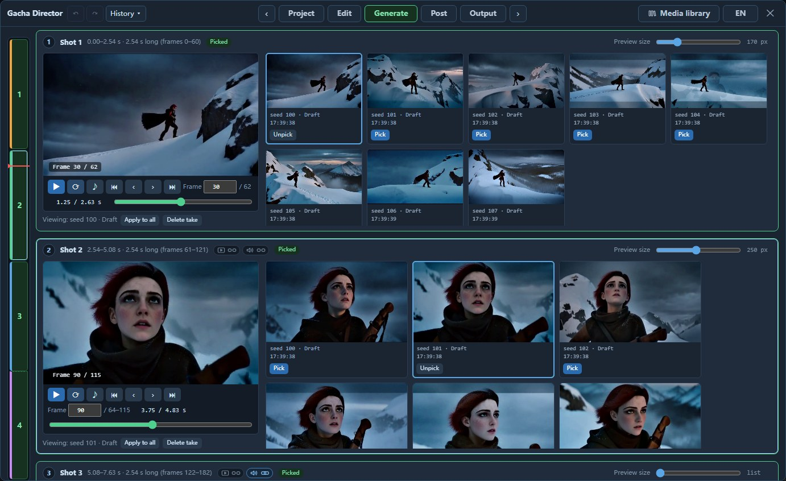
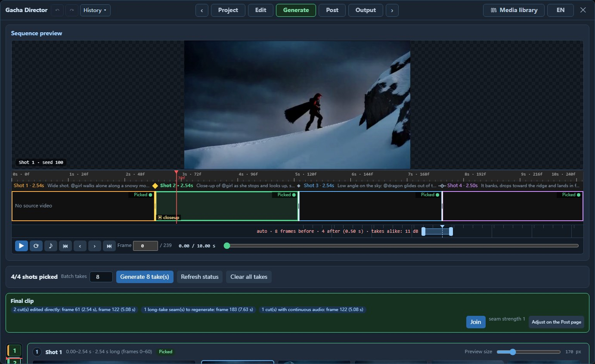
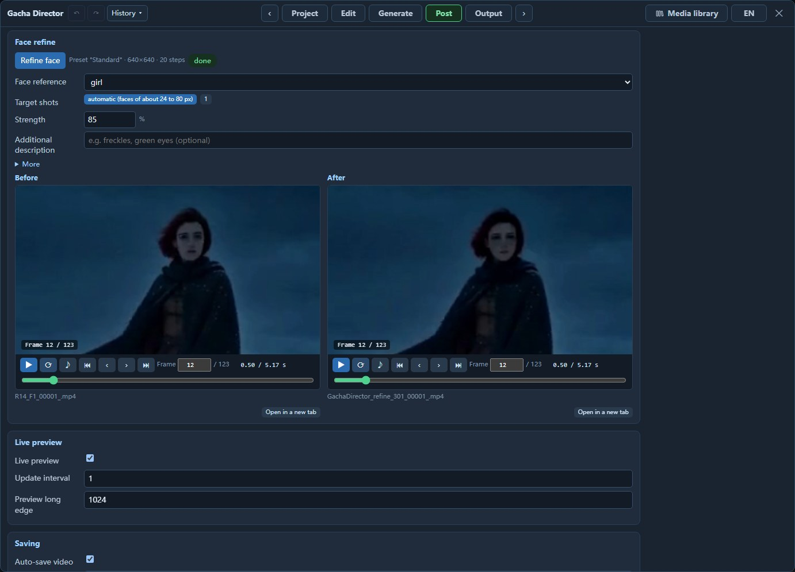

# Gacha Director User Guide

English | [日本語](GUIDE_JA.md) | [中文](GUIDE_ZH.md) · [Back to README](../README.md)

Each Gacha Director node produces one video clip: plan shots, generate takes in batches, pick a take per shot, and join the selections.

Contents: [Quick start](#quick-start) · [Example: turn live-action footage into a winter scene](#example-turn-live-action-footage-into-a-winter-scene) · [Node](#node) · [Project](#project) · [Edit](#edit) · [Generate](#generate) · [Post](#post) · [Output](#output) · [Workflow overview](#workflow-overview) · [Optional model connections](#optional-model-connections) · [Known limitations](#known-limitations)

## Quick start

Two example workflows are included in `example_workflows/`:

- [GachaDirector_Base.json](../example_workflows/GachaDirector_Base.json) (base model, fl2va): text-to-video, image-to-video, first/last frames, multiple keyframes, and continuation.
- [GachaDirector_Reference.json](../example_workflows/GachaDirector_Reference.json) (reference model, ref2va): subject, video, and audio references, plus video editing.

For your first run, open the base workflow:

1. Select files in the model, text encoder, video VAE, and audio VAE loaders. Select the file in the acceleration LoRA loader too; delete that loader if you do not have the LoRA.
2. Click **Open Gacha Director** on the node. Leave the two example shots and their prompts unchanged for now.
3. On **Project**, confirm that the preset is `Standard`.
4. On **Generate**, set **Batch takes** to 2 and click **Generate 2 take(s)**. Each take contains the entire clip.
5. When generation finishes, click **Pick** for your preferred take under each shot, then **Join** and **View output**.

> [!IMPORTANT]
> `Draft` uses the accelerated model supplied by the acceleration LoRA loader through `model_turbo`. If you delete that loader, use only `Standard` and `Final`.

Save the ComfyUI workflow to keep your shots, media references, and picks; generated video files are stored in ComfyUI's `output` folder.

The example prompts are in English; the panel does not translate your input.


## Example: turn live-action footage into a winter scene

Turn footage of two people talking on a bridge into a snowy winter scene while retaining the people, movement, and camera work.

1. Open the reference workflow and click **Open Gacha Director**.
2. On **Edit**, under **Clip**, click **Video edit** in **Starting setup** and select the source video.
3. Fill in the table below. **Overall description** and **Ambient sound** are under **Shared material**, **Shot description** is on the shot card, and **Keep/change description** is under the source video's **More** settings.

   | Field | Content |
   |---|---|
   | Overall description | `The target video is live-action film footage in heavy snowfall.` |
   | Shot description | `The scene of <Video 1> now takes place in deep winter: thick snow is falling, the trees are bare and white, snow lies on the bridge railing, the street and the rooftops, and the light is cold and blue. The two people, their clothes, their movements and the camera are the same as in <Video 1>.` |
   | Keep/change description | `the people, their motion and timing, the camera and the composition of <Video 1> are kept; only the season and the weather change` |
   | Ambient sound | `Muffled winter air, soft wind, snow hissing on stone.` |

   The source video is called `<Video 1>` in the prompt.
4. Generate takes on **Generate**, **Pick** your preferred take, click **Join**, and view the final clip on **Output**.


## Node



**Inputs**: connect the H3 model, text encoder, video VAE, and audio VAE to `model`, `clip`, `vae`, and `audio_vae`; set the `CLIPLoader` type to `minimax`. Connect the accelerated model to the optional `model_turbo` input.

**Outputs**: `frames`, `audio`, and `fps` can feed a downstream video output node. The panel can also save the final clip directly.

## Project



- Choose `Draft`, `Standard`, or `Final`; adjust resolution, steps, model, and **Batch takes**, or create a preset.
- Estimated time is based on previous runs and is blank before the first run.
- Use `Draft` to check the direction of your prompts and media. Changing resolution requires new takes.

## Edit


### Divide the clip into shots

- Set the model type, duration, and aspect ratio under **Clip**. The model type must match the loaded model; when switching types, change the model file in the loader too.
- Choose 5 / 10 / 15 seconds or enter a duration; the value is automatically adjusted to a supported clip length.
- Move the playhead and click **Insert cut** to add a shot, drag the boundary to adjust its duration, or click **Delete cut** to merge shots. Each segment has a shot card.
- **Starting setup** configures workflows such as text-to-video, image-to-video, reference generation, and video editing. It replaces existing media and keeps your text.

### Add media



- Click **+ Picture / + Video / + Sound** on a shot card, or drag files onto the shot from **Media library** in the top bar. The library lets you import files, reuse generated results, and organize assets into folders.
- Put media for one shot on its card; put media used across shots under **Shared material** above, along with the overall description, ambient sound, music, and source video.
- Set **Use of material** for each asset; see the [workflow overview](#workflow-overview) for the available uses.
- Type `@` in the shot description and select a media name to specify who does what.



### Write dialogue

Put each spoken line on its own line, with delivery before the colon and dialogue after it. First add a subject named `girl`, then write:

```text
@girl pulls down her scarf and looks straight at the camera.
@girl says quietly: I have been looking for you.
```

- The default language is English. For another language, add a tag after the name: `@girl[Japanese] says: …`.
- For a voice with no associated subject: `@voice(a warm elderly male voice) says: Good morning!`.
- To specify a voice, add an audio clip, set its use to **Character voice**, and choose the subject.

### Cuts or a long take



The two links between cards toggle on click; a highlighted link is connected.

- The left link controls picture: disconnected means a cut; connected continues the same long take.
- The right link controls audio at cuts: disconnected switches audio with the picture; connected keeps the pre-cut take's audio. Audio cannot be set independently within a long take.

### Edit or continue an existing video

- Add the video under **Source video** at the bottom of **Shared material**, then choose **Source usage**. Video editing requires the reference model.
- Describe changes in the shot description and what to retain in **Keep/change description**, under the source video's **More** settings.
- To redraw only part of the video, enable **Source frames** under **Source redraw**, then set a range under **Partial redraw**; click **Redraw selected shot** to redraw only the current shot.
- To continue a finished clip, click **Video continuation** in **Starting setup** and select the clip from **Generated** in the media library. When joining the old and new clips, trim the repeated section from the start of the new clip.

## Generate



- Set **Batch takes** and click the generate button. Generate another batch for more choices.
- Click a take card to preview it and **Pick** to select it for a shot; **Apply to all** uses the same take for every shot.
- **Sequence preview** at the top plays your picks; click ♪ to enable audio. Long-take seam repairs appear only after joining.
- Once all shots have picks, click **Join** to create a separate final clip file. Join again after changing picks.
- Switching takes at a cut uses a direct edit; switching within a long take regenerates the seam.


### Seams within a long take



When adjacent segments of a long take use different takes, a **seam range strip** below the timeline shows the area to regenerate when joining. The range is automatic by default; drag either end to adjust it and double-click to reset. A red similarity warning means the takes differ substantially at the seam and may fail to join smoothly; choose a closer match or use one take throughout.


## Post



- **Joining**: review cuts and seams, adjust **Seam strength**, and join again.
- **Face refine**: small faces in medium and wide shots can look blurry. Join the final clip first, then click **Refine face**; automatic mode selects suitable shots, or specify **Target shots**. Compare the results side by side.
- **Saving**: set the file name prefix, file format, and video codec.

## Output

- Browse results from direct node runs, joining, and face refinement; takes are on **Generate**.
- Click **Open in a new tab** to play a result; **Submitted prompt** shows the text used for that run.
- Restarting ComfyUI clears this list; files remain in the `output` folder.

## Workflow overview

The media you add and its use determine the generation workflow; labels on shot cards show the current workflow. Uses can be combined, such as video editing with a subject reference and last frame.

| What you add | Result | Model |
|---|---|---|
| Shot description only | Text-to-video | Base |
| Picture on the first shot · **First frame** | Image-to-video | Base |
| Add a picture on the last shot · **Last frame** | First/last frames | Base |
| Picture · **Intermediate frame** | Multiple keyframes | Either |
| Video · **Video continuation** | Continue from the video clip | Either |
| Picture · **Subject reference** or **Storyboard frame (composition reference)** | Subject or composition reference | Reference |
| Video · **Motion/camera reference** | Motion and camera reference | Reference |
| Audio · **Character voice** or **Sound reference** | Voice or audio style reference | Reference |
| Audio · **Original audio** | Use the original audio in the final clip | Either |
| Source video · **Video edit** | Edit the source video's content | Reference |
| Source video · **Source redraw** | Redraw all or part of the video | Either |


## Optional model connections

Connect these nodes upstream of `model` / `model_turbo`:

- **LoRA and acceleration LoRA**: `LoraLoaderModelOnly`.
- **Fun ControlNet Union**: `ModelPatchLoader` + `Apply MiniMax H3 Fun ControlNet`, with the output connected to `model` (and to `model_turbo` when using `Draft`). Use a 24 fps control video aligned with the clip's first frame.
- **FastH3**: `UNETLoader` → `ModelAttentionBackend` → `BlockSparseAttention`, connected to `model`; set the preset's steps to 8 and schedule shifts to 10 / 3.

## Known limitations

- Each node produces one clip, typically 5–15 seconds; use continuation for longer sequences.
- Reference limits across all shots and shared media: 9 pictures, 3 videos, 3 audio clips, and 12 files in total; reference videos must total no more than 15 seconds.
- Each take is generated as a complete clip; use **Partial redraw** for local changes to existing video.
- The model determines cut timing, which may drift; precise event timing within a long take cannot be specified.
- Dissolves, whip pans, or similar-looking shots may affect cut detection; check joins and the actual clip length after joining.
- Visually dissimilar takes within a long take may not join smoothly.
- Changing takes at a cut may cause volume differences; carrying audio across the cut may cause lip-sync mismatches.
- Face refinement handles one main face per shot and suits small faces in medium and wide shots.
- Verified environment: Windows 11 with one 24 GB VRAM GPU; other environments have not been verified.
