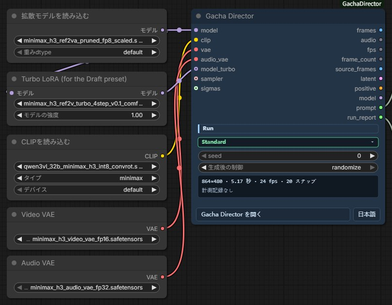
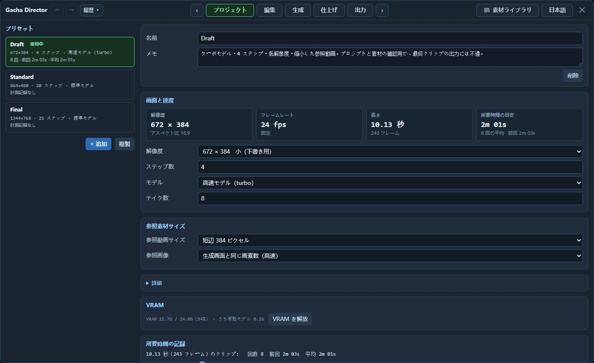
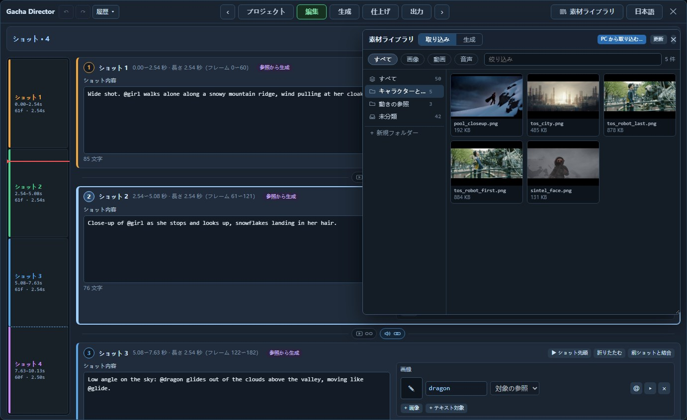
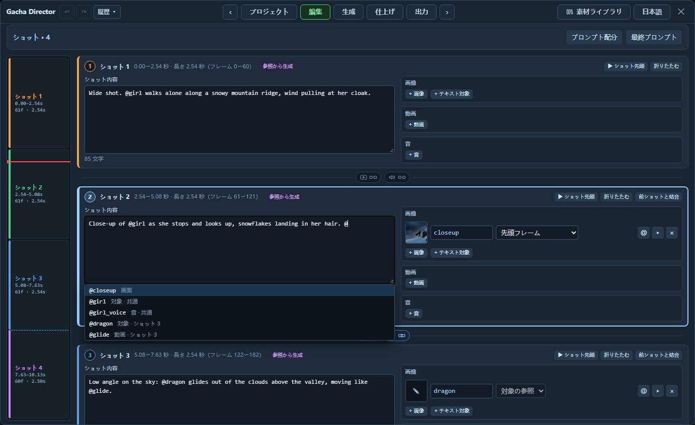
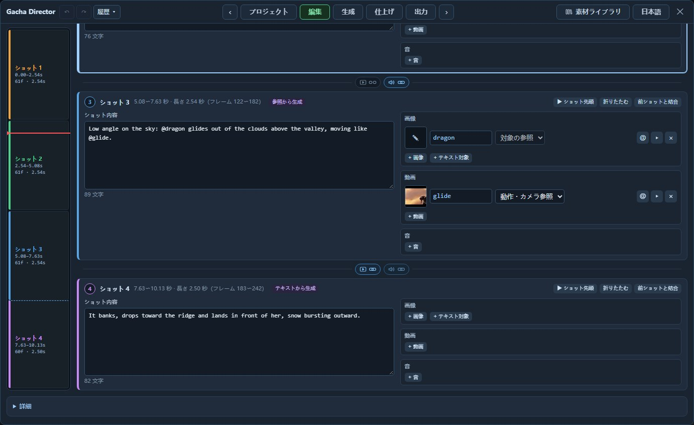
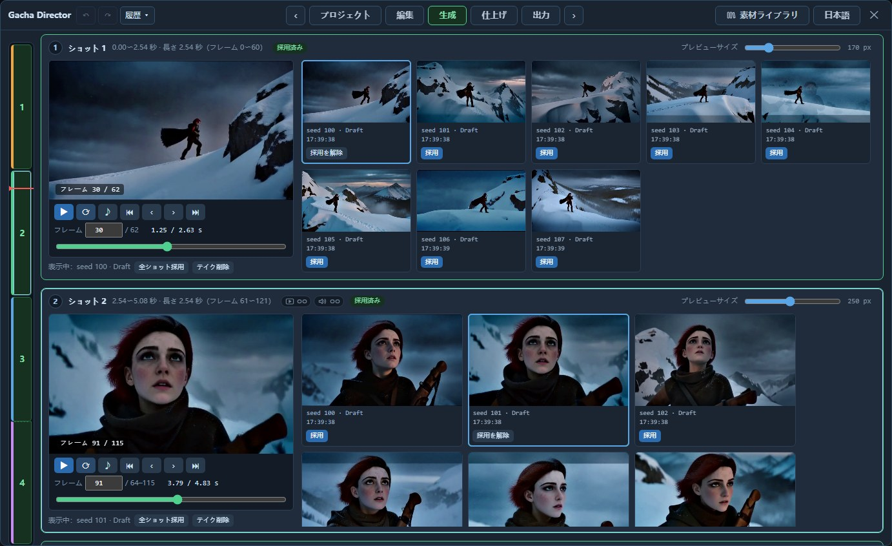
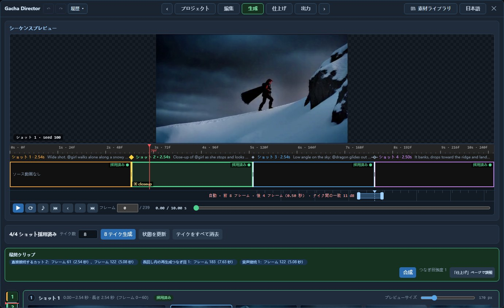
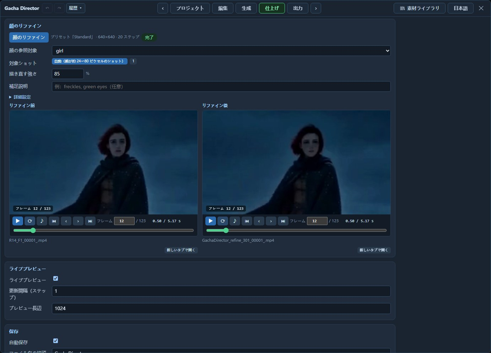

# Gacha Director ユーザーガイド

[English](GUIDE.md) | 日本語 | [中文](GUIDE_ZH.md) · [READMEに戻る](../README_JA.md)

各Gacha Directorノードでは、ショット構成、テイクの一括生成・採用、合成を経て一本の動画を制作します。

目次：[クイックスタート](#クイックスタート) · [例：実写映像を雪景色に変える](#例実写映像を雪景色に変える) · [ノード](#ノード) · [プロジェクト](#プロジェクト) · [編集](#編集) · [生成](#生成) · [仕上げ](#仕上げ) · [出力](#出力) · [用途一覧](#用途一覧) · [オプションのモデル接続](#オプションのモデル接続) · [既知の制約](#既知の制約)

## クイックスタート

`example_workflows/` に2つのサンプルワークフローがあります。

- [GachaDirector_Base.json](../example_workflows/GachaDirector_Base.json)（ベースモデル fl2va）：テキスト・画像からの動画生成、先頭・最終フレーム、複数キーフレーム、続きの生成に使います。
- [GachaDirector_Reference.json](../example_workflows/GachaDirector_Reference.json)（参照モデル ref2va）：被写体・動画・音声の参照や動画編集に使います。

初回はベースモデルのワークフローを開き、次の手順で試します。

1. モデル、テキストエンコーダー、映像VAE、音声VAEの各ローダーでファイルを選びます。高速化LoRAのローダーでもファイルを選び、LoRAがない場合はそのローダーを削除します。
2. ノードの **Gacha Director を開く** をクリックします。設定済みの2ショットとプロンプトは、まずそのまま使います。
3. 「プロジェクト」でプリセットが `Standard` になっていることを確認します。
4. 「生成」で **2 テイク生成** をクリックします。各テイクには動画全体が含まれます。
5. 生成が終わったら各ショットで気に入ったテイクの **採用** をクリックし、**合成**、**出力を表示** の順に進みます。

> [!IMPORTANT]
> `Draft` は、高速化LoRAのローダーから `model_turbo` に接続した高速化モデルを使います。そのローダーを削除した場合は、`Standard` と `Final` のみを使います。

ComfyUIのワークフローを保存すると、ショット、素材の参照情報、採用状態も保存され、生成した動画ファイルはComfyUIの `output` フォルダーに保存されます。

サンプルのプロンプトは英語で、パネルは入力内容を翻訳しません。


## 例：実写映像を雪景色に変える

橋の上で2人が会話する実写映像を、人物・動作・カメラワークを保ちながら雪の降る冬の風景に変えます。

1. 参照モデルのワークフローを開き、**Gacha Director を開く** をクリックします。
2. 「編集」の「クリップ」で、**開始方法** の **動画編集** をクリックし、ソース動画を選びます。
3. 下の表の内容を入力します。「全体の説明」と「環境音」は共通素材、「ショット内容」はショットカード、「保持・変更内容」はソース動画の **詳細設定** にあります。

   | 入力欄 | 内容 |
   |---|---|
   | 全体の説明 | `The target video is live-action film footage in heavy snowfall.` |
   | ショット内容 | `The scene of <Video 1> now takes place in deep winter: thick snow is falling, the trees are bare and white, snow lies on the bridge railing, the street and the rooftops, and the light is cold and blue. The two people, their clothes, their movements and the camera are the same as in <Video 1>.` |
   | 保持・変更内容 | `the people, their motion and timing, the camera and the composition of <Video 1> are kept; only the season and the weather change` |
   | 環境音 | `Muffled winter air, soft wind, snow hissing on stone.` |

   プロンプトではソース動画を `<Video 1>` と表記します。
4. 「生成」でテイクを生成して気に入ったものを **採用** し、**合成** した動画を「出力」で確認します。


## ノード



**入力**：H3モデル、テキストエンコーダー、映像VAE、音声VAEをそれぞれ `model`、`clip`、`vae`、`audio_vae` に接続し、`CLIPLoader` のタイプを `minimax` にします。高速化モデルは任意入力の `model_turbo` に接続します。

**出力**：`frames`、`audio`、`fps` を後段の動画出力ノードに接続できます。パネルから直接動画を保存することもできます。

## プロジェクト



- `Draft`、`Standard`、`Final` を選び、解像度・ステップ数・モデル・**テイク数** を変更するか、プリセットを新規作成します。
- 所要時間の目安は過去の実行記録から表示され、初回実行前は空欄です。
- `Draft` でプロンプトや素材の方向性を確認します。解像度を変更したら、テイクを生成し直します。

## 編集


### ショットを分ける

- 「クリップ」でモデルの種類、長さ、アスペクト比を設定します。モデルの種類は読み込んだモデルと一致させ、種類を変更する際はローダーのモデルファイルも変更します。
- 長さは5 / 10 / 15秒から選ぶか直接入力でき、対応する動画の長さに自動調整されます。
- タイムラインで再生ヘッドを移動し、**カット点を挿入** でショットを追加、境界のドラッグで長さを調整、**カット点を削除** でショットを結合します。各区間にショットカードが対応します。
- **開始方法** からテキスト・画像からの動画生成、参照生成、動画編集などを設定できます。既存の素材は置き換わり、テキストは残ります。

### 素材を追加する



- カード右側の **+ 画像 / + 動画 / + 音** をクリックするか、上部の **素材ライブラリ** からショットにファイルをドラッグします。ライブラリではファイルの読み込み、生成済みの素材の再利用、フォルダーでの分類ができます。
- 一つのショットだけで使う素材はそのカードに、全ショットで使う素材は上部の「共通素材」に配置し、全体の説明・環境音・BGM・ソース動画も共通素材で設定します。
- 素材ごとに **素材の使い方** を選びます（選択肢は[用途一覧](#用途一覧)を参照）。
- ショット内容に `@` を入力してリストから素材名を選び、誰が何をするかを指定します。



### セリフを書く

セリフは一行ずつ書き、コロンの前に話し方、後ろにセリフを記述します。まず被写体を登録して `girl` と名付け、次のように書きます。

```text
@girl pulls down her scarf and looks straight at the camera.
@girl says quietly: I have been looking for you.
```

- 言語の既定値は英語です。ほかの言語では名前の後ろにタグを付けます：`@girl[Japanese] says: …`。
- 被写体に紐付けない音声は、`@voice(a warm elderly male voice) says: Good morning!` のように書きます。
- 声を指定するには音声を追加し、使い方を **登場人物の声** にして対象を選びます。

### カットか長回しか



カード間の2つのリンクはクリックで切り替え、点灯しているときは接続されています。

- 左側は映像を指定し、切断するとカット、接続すると同じ長回しの続きになります。
- 右側はカット位置の音声を指定し、切断すると映像とともにテイクが切り替わり、接続するとカット前のテイクの音声を継続します。長回し内では音声だけを設定できません。

### 既存動画を編集する・続きを生成する

- 「共通素材」下部の **ソース動画** に動画を追加し、**ソース用途** を選びます。動画編集には参照モデルを使います。
- 変更内容はショット内容に、残す要素はソース動画の **詳細設定** にある **保持・変更内容** に記述します。
- 一部だけ描き直す場合は **ソース再描画** の **ソースフレーム使用** を有効にして **部分再描画** で範囲を指定し、現在のショットだけなら **選択ショット再描画** をクリックします。
- 完成した動画の続きを生成するには、**開始方法** の **動画の続き** をクリックし、素材ライブラリの「生成」から動画を選びます。元の動画とつなぐ際は、新しい動画の冒頭の重複部分をカットします。

## 生成



- **テイク数** を設定して生成ボタンをクリックします。選択肢を増やしたい場合は、もう一度生成します。
- テイクのカードをクリックしてプレビューし、各ショットで **採用** をクリックします。**全ショット採用** では同じテイクを全ショットに使います。
- 上部の **シーケンスプレビュー** で採用結果を再生し、♪で音声を有効にします。長回しのつなぎ目は合成後に処理結果を確認できます。
- 全ショットのテイクを採用したら **合成** をクリックし、完成した動画を別ファイルに出力します。採用を変更したら合成し直します。
- カット位置でテイクを変更した場合は直接接続し、長回し内ではつなぎ目を再生成します。


### 長回しのつなぎ目



長回しの隣接区間で異なるテイクを採用すると、タイムライン下に **つなぎ目の範囲バー** が表示され、合成時に再生成する範囲を示します。既定では自動設定され、両端のドラッグで調整、ダブルクリックで元に戻せます。つなぎ目の映像の差が大きいと赤い警告が表示され、うまくつながらない場合があるため、近い映像のテイクを選ぶか長回し全体で同じテイクを使います。


## 仕上げ



- **合成**：直接接続するカットと再生成するつなぎ目を確認し、**つなぎ目強度** を調整して合成し直します。
- **顔のリファイン**：ミドルショットやロングショットの小さな顔は不鮮明になりがちです。先に動画を合成して **顔のリファイン** をクリックし、自動で対象ショットを選ぶか、**対象ショット** で指定します。完了後は前後を並べて比較できます。
- **保存**：ファイル名の接頭辞、ファイル形式、映像コーデックを設定します。

## 出力

- ノードから直接実行した結果、合成、顔のリファインの結果を確認でき、テイクは「生成」で確認します。
- **新しいタブで開く** で再生し、**送信プロンプト** でその実行に使ったテキストを確認します。
- ComfyUIを再起動すると一覧は消えますが、ファイルは `output` フォルダーに残ります。

## 用途一覧

追加した素材と使い方で生成方法が決まり、現在の用途はショットカードのラベルに表示されます。動画編集に被写体参照や最終フレームを加えるなど、組み合わせて使えます。

| 追加するもの | 用途 | モデル |
|---|---|---|
| ショット内容のみ | テキストから動画生成 | ベース |
| 最初のショットに画像 · **先頭フレーム** | 画像から動画生成 | ベース |
| 最後のショットにも画像 · **最終フレーム** | 先頭・最終フレーム | ベース |
| 画像 · **中間フレーム** | 複数キーフレーム | どちらも可 |
| 動画 · **動画の続き** | 動画から続きを生成 | どちらも可 |
| 画像 · **対象の参照** または **絵コンテ（構図参照）** | 被写体・構図参照 | 参照 |
| 動画 · **動作・カメラ参照** | 動作・カメラワーク参照 | 参照 |
| 音声 · **登場人物の声** または **音声参照** | 声・音声のスタイル参照 | 参照 |
| 音声 · **ショット内の原音** | 元の音声を完成動画に使用 | どちらも可 |
| ソース動画 · **動画編集** | ソース動画の内容を編集 | 参照 |
| ソース動画 · **ソース再描画** | 全体または一部を描き直す | どちらも可 |


## オプションのモデル接続

以下のノードは `model` / `model_turbo` の前段に接続します。

- **LoRA・高速化LoRA**：`LoraLoaderModelOnly`。
- **Fun ControlNet Union**：`ModelPatchLoader` + `Apply MiniMax H3 Fun ControlNet` の出力を `model` に接続します（`Draft` では `model_turbo` 側にも接続します）。制御動画は24 fpsで用意し、クリップの先頭フレームに合わせます。
- **FastH3**：`UNETLoader` → `ModelAttentionBackend` → `BlockSparseAttention` を `model` に接続し、プリセットのステップ数を8、スケジュールのシフトを10 / 3に設定します。
- **高速化**：`ModelAttentionBackend`（表示名 Model Attention Backend、実験的なノード）。バックエンドは `comfy kitchen attention` を選びます。生成を高速化でき、通常は映像の変化もわずかです。int8-convrotモデルでは現在このバックエンドを使わないでください。エラーになります。`Draft` では `model_turbo` 側にも接続します。

## 既知の制約

- 各ノードで通常5–15秒の動画を制作し、長い映像は続きの生成でつなぎます。
- ショットと共通素材を合わせた参照素材の上限は、画像9枚・動画3本・音声3本、合計12ファイルで、参照動画の合計時間は15秒以内です。参照音声は1本あたり2～15秒とし、15秒を超える場合は先頭の15秒だけを使います。
- 各テイクは動画全体を生成し、既存動画の一部を変更する場合は **部分再描画** を使います。
- カットのタイミングはモデルが決めるためずれることがあり、長回し内の各動作の正確な時刻も指定できません。
- ディゾルブ、ウィップパン、似た映像ではカット検出がうまくいかない場合があるため、合成後につなぎ目と実際の動画の長さを確認します。
- 長回し内で映像の差が大きいテイクは、うまくつながらない場合があります。
- カット位置でテイクを変更すると音量差が出る場合があり、カット前の音声を継続すると口の動きと音声が合わなくなることがあります。
- 顔のリファインは各ショットの主要な顔一つを処理し、ミドルショットやロングショットの小さな顔に適しています。
- 動作確認済み環境はWindows 11・VRAM 24 GBのGPU 1枚で、それ以外の環境は未検証です。
